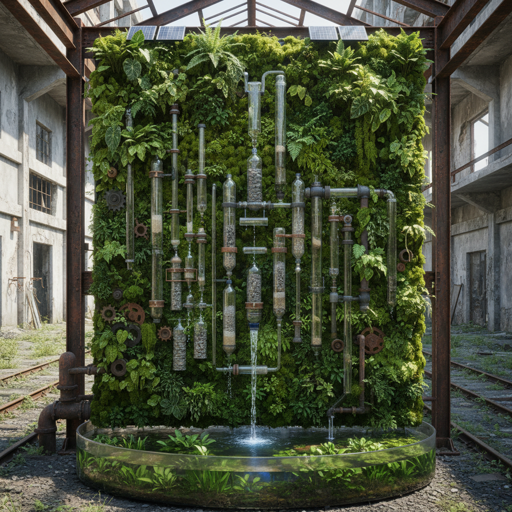

# Eco-Art 生态艺术

> **时期：** 1990年代–至今  
> **关键词：** 生态系统、可持续材料、环境修复、跨物种协作、气候意识

## 概述

生态艺术（Eco-Art）是一种以生态系统为核心关注的艺术实践，超越了早期大地艺术对景观的审美利用。生态艺术家们与科学家合作，用活的生态系统作为媒介——种植、堆肥、水体净化、栖息地恢复——创造既是艺术作品又是真实环境修复行动的项目。

## 风格特征

- **活系统**：使用植物、微生物、水体等活的材料
- **修复性**：作品本身具有环境修复功能
- **长时间**：项目跨越季节甚至数十年
- **跨学科**：与生态学、生物学、水文学合作
- **场域特定**：深度回应特定生态环境

## 代表人物与作品

- Agnes Denes《麦田——对抗》（1982）
- Mel Chin《Revival Field》重金属修复
- Aviva Rahmani《Ghost Nets》湿地恢复
- Olafur Eliasson《Ice Watch》气候装置

## 概念图

