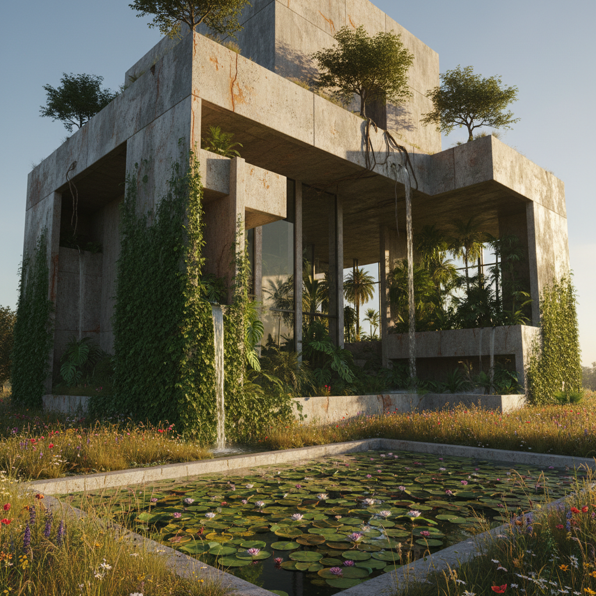

# Eco-Brutalism Art 生态粗野主义艺术

> "Eco-Brutalism is the marriage of concrete and chlorophyll — massive raw structures that do not apologize for their materiality but invite nature to colonize them, buildings where exposed concrete becomes a substrate for moss and lichen, where drainage channels become streams, where the brutal honesty of structure meets the unstoppable force of growth, an architecture that accepts decay and succession as design partners rather than enemies, that finds beauty in the slow green conquest of the built environment, and that asks what happens when we stop fighting nature and start designing for its inevitable return." — Unknown

## 概述

生态粗野主义（Eco-Brutalism）是2010年代末至2020年代兴起的一种建筑和视觉美学，将粗野主义建筑（Brutalism）的原始混凝土美学与生态设计和自然元素结合。生态粗野主义不是简单地在混凝土建筑上种植物，而是一种更深层的设计哲学——接受建筑的物质性和自然的生长力之间的对话，让两者共存而非对抗。

生态粗野主义的视觉特征包括：裸露的混凝土表面上生长的苔藓和藤蔓、建筑结构中整合的水系统和植物、工业材料与有机形态的并置、以及对"废墟美学"的积极拥抱——将建筑的老化和自然的入侵视为美而非衰败。这种美学在社交媒体上（特别是Instagram和Pinterest）有广泛的传播，也影响了室内设计、产品设计和视觉艺术。

## 核心特征

| 特征 | 描述 |
|------|------|
| 混凝土 | 裸露的混凝土 |
| 植物 | 植物的入侵和生长 |
| 共存 | 建筑与自然的共存 |
| 衰变 | 接受衰变和老化 |
| 原始 | 材料的原始性 |
| 力量 | 结构的力量感 |

## 视觉特征

- **混凝土**：裸露的灰色混凝土
- **苔藓**：苔藓和地衣的覆盖
- **藤蔓**：攀爬的藤蔓植物
- **水**：水的流动和积聚
- **裂缝**：裂缝中的生长
- **光影**：强烈的光影对比

## 代表作品

| 作品 | 艺术家/建筑师 | 年代 | 意义 |
|------|--------|------|------|
| *Barbican Conservatory* | Chamberlin, Powell & Bon | 1984 | 粗野主义中的温室 |
| *Eco-brutalist concepts* | Various | 2020年代 | 概念设计 |
| *Abandoned brutalism photography* | Various | 2010年代 | 废墟摄影 |
| *Green concrete research* | Various | 2020年代 | 生态混凝土研究 |
| *Overgrown architecture* | Various | 当代 | 被自然接管的建筑 |

## 历史时间线

| 时期 | 事件 |
|------|------|
| 1950-70年代 | 粗野主义建筑的高峰 |
| 2010年代 | 粗野主义的审美复兴 |
| 2018 | 生态粗野主义概念的流行 |
| 2020年代 | 社交媒体上的传播 |
| 当代 | 从美学到实践的转化 |

## 中国语境

生态粗野主义在中国有独特的现实语境。中国拥有大量的粗野主义建筑遗产——从1950-70年代的工业建筑到改革开放初期的公共建筑——这些建筑正在经历自然的"入侵"和时间的"改造"。中国的一些建筑师和设计师在探索如何将这些老旧的混凝土建筑转化为生态友好的空间，而非简单地拆除重建。中国的"城市更新"项目中有一些案例体现了生态粗野主义的精神——保留建筑的原始结构，同时引入植物和生态系统。中国传统园林中"假山"和"枯山水"的美学也与生态粗野主义有某种共鸣——对自然力量和时间痕迹的尊重。

## AI生成概念图

## 与其他风格的关系

- **Brutalism** → 粗野主义
- **Solarpunk** → 太阳朋克
- **Ruin Aesthetics** → 废墟美学
- **Green Architecture** → 绿色建筑
- **Wabi-Sabi** → 侘寂美学
- **Industrial Design** → 工业设计

---

*浮光艺志 | Chronicle of Artistry*
