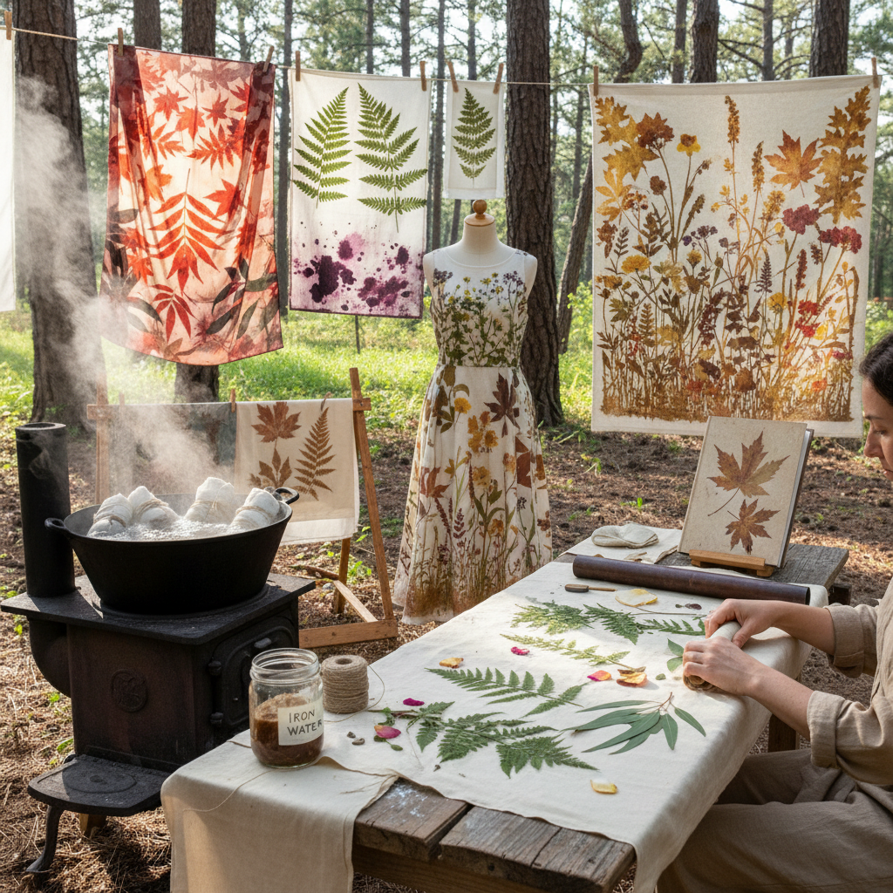

# Eco Printing 生态印花

> "Eco printing is nature's own lithography — leaves, flowers, and bark placed on fabric or paper, bundled tight, then steamed or simmered until the plants release their pigments directly into the fibers, leaving ghost impressions as unique as the botanical specimens themselves." — Unknown

## 概述

生态印花（Eco Printing）是一种利用植物材料（叶子、花朵、树皮、果实等）的天然色素直接在织物或纸张上留下印记的可持续染色技法。这种技法由澳大利亚纺织艺术家India Flint在2000年代初系统化推广，但其原理——植物色素转移——在世界各地的传统染色中早已存在。

生态印花的基本过程：将新鲜或干燥的植物材料放置在预处理过的织物或纸张上，紧密卷绕或折叠，用绳子捆扎，然后通过蒸煮（steaming）或浸泡（simmering）使植物色素转移到纤维上。预处理（mordanting）使用明矾、铁、铜等媒染剂来增强色牢度和改变色彩。不同的植物产生不同的颜色和图案——桉树叶产生红橙色，枫叶产生绿色和棕色，玫瑰花瓣产生粉色等。

## 核心特征

| 特征 | 描述 |
|------|------|
| 植物 | 使用植物材料 |
| 天然 | 天然色素 |
| 可持续 | 环保可持续 |
| 独特 | 每件作品独一无二 |
| 蒸煮 | 蒸煮转移色素 |
| 媒染 | 使用媒染剂 |

## 视觉特征

- **植物形态**：清晰的叶脉和花瓣印记
- **自然色彩**：泥土色调和植物色彩
- **有机**：有机的、不规则的图案
- **柔和**：柔和的色彩过渡
- **独特**：每件作品不可复制
- **质朴**：质朴自然的美感

## 代表作品

| 作品 | 艺术家 | 年代 | 意义 |
|------|--------|------|------|
| *Eco-printed textiles* | India Flint | 2000s | 生态印花的系统化 |
| *Botanical contact prints* | Various | 当代 | 植物接触印花 |
| *Eco-printed garments* | Various | 当代 | 生态印花服装 |
| *Bundle dye art* | Various | 当代 | 捆扎染色艺术 |
| *Eco-printed paper art* | Various | 当代 | 生态印花纸艺 |

## 历史时间线

| 时期 | 事件 |
|------|------|
| 古代 | 传统植物染色的起源 |
| 传统 | 各地民间植物印染 |
| 2000年代 | India Flint系统化推广 |
| 2010年代 | 全球可持续时尚中的流行 |
| 当代 | 生态印花的艺术化发展 |

## 中国语境

生态印花在中国的可持续时尚和手工艺领域有快速的发展。中国丰富的植物资源为生态印花提供了独特的材料——银杏叶、荷叶、茶叶、桑叶等中国特色植物都可以用于生态印花。中国的手工染色工作室和自然教育机构开设生态印花课程。中国的一些可持续时尚品牌将生态印花与中国传统植物染色（草木染）结合，创作具有中国特色的生态印花作品。

## AI生成概念图

## 与其他风格的关系

- **Natural Dyeing** → 天然染色
- **Botanical Art** → 植物艺术
- **Sustainable Fashion** → 可持续时尚
- **Textile Art** → 纺织艺术
- **Contact Printing** → 接触印刷
- **Resist Dyeing** → 防染技法

---

*浮光艺志 | Chronicle of Artistry*
