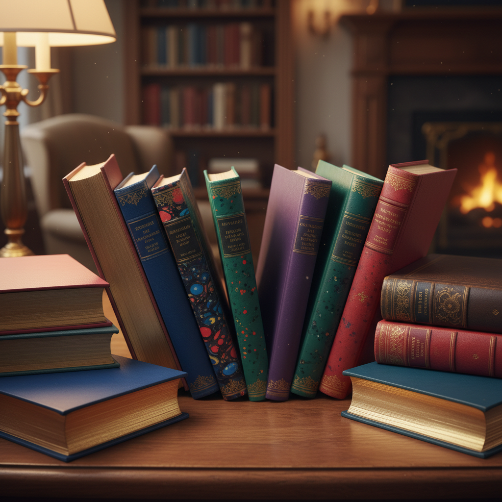

# Edge Painting Art 书口染色艺术

> "Edge painting transforms the closed book into a canvas — when the pages are fanned or pressed together, the gilt or colored edges become a surface for decoration that is invisible when the book is open and reading. From simple gold gilding to elaborate painted landscapes, the book edge is a secret gallery revealed only to those who know to look at the book as an object, not just a text." — Unknown

## 概述

书口染色艺术（Edge Painting Art）是一种在书籍切口（天头、地脚和前口）上进行装饰的书籍装帧技法——包括镀金（gilding）、染色、喷洒和绘画等多种方式。书口装饰既有保护功能（防止灰尘和湿气进入书页）也有装饰功能，是精装书籍的重要装帧元素。

书口染色艺术的实践包括：1）书口镀金（Gilt Edges）——在书口涂布金箔；2）书口染色——用颜料染色书口；3）书口喷洒——喷洒彩色墨点装饰；4）书口绘画——在书口绘制图案或风景；5）前口绘画（Fore-edge Painting）——在扇开的前口上绘画；6）渐变染色——创造渐变色彩效果；7）当代书口装饰——将传统技法与现代设计结合的创作。

## 核心特征

| 特征 | 描述 |
|------|------|
| 书口 | 在书籍切口上装饰 |
| 保护 | 保护书页的功能 |
| 隐藏 | 合上书才可见 |
| 金箔 | 传统的镀金装饰 |
| 色彩 | 多种色彩选择 |
| 精装 | 精装书的标志 |

## 视觉特征

- **金色**：经典的镀金光泽
- **色彩**：鲜艳的染色效果
- **隐藏**：合书时才显现
- **整体**：书籍整体的装饰
- **精致**：精致的手工品质
- **惊喜**：打开时的视觉惊喜

## 代表作品

| 作品 | 艺术家/文化 | 年代 | 意义 |
|------|-------------|------|------|
| *Medieval gilt manuscripts* | 欧洲 | 中世纪 | 中世纪镀金手抄本 |
| *Victorian gilt books* | 英国 | 19世纪 | 维多利亚镀金书籍 |
| *Fore-edge paintings* | 英国 | 17-19世纪 | 前口绘画 |
| *Contemporary edge painting* | 国际 | 当代 | 当代书口染色 |
| *Sprinkled edges* | 欧洲 | 17-19世纪 | 喷洒装饰书口 |

## 历史时间线

| 时期 | 事件 |
|------|------|
| 古代 | 早期书口保护的使用 |
| 中世纪 | 书口镀金的发展 |
| 17世纪 | 前口绘画的出现 |
| 19世纪 | 书口装饰的多样化 |
| 当代 | 书口染色的创意复兴 |

## 中国语境

书口染色在中国的书籍装帧中有一定的应用。中国的传统线装书以切口整齐为美——虽然不常进行书口装饰，但现代精装书中书口染色越来越常见。中国当代的书籍设计中，书口染色作为一种高端的装帧工艺——在限量版和艺术书中使用。中国的独立出版和文创产业中，书口喷色和染色——作为一种独特的设计元素受到欢迎。中国的设计教育中，书口装饰作为书籍装帧的组成部分——在相关课程中介绍。中国的一些精品印刷厂——提供书口镀金和染色服务。中国的笔记本和手账市场中，书口染色——作为一种流行的装饰方式。

## AI生成概念图

## 与其他风格的关系

- **Fore-edge Painting** → 前口绘画
- **Gilding** → 镀金
- **Bookbinding** → 书籍装帧
- **Book Arts** → 书籍艺术
- **Marbling** → 大理石纹
- **Calligraphy** → 书法

---

*浮光艺志 | Chronicle of Artistry*
