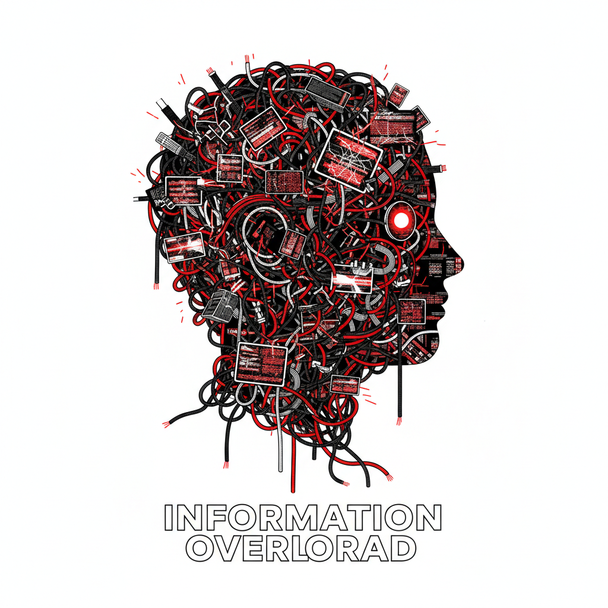

# Editorial Illustration 编辑插画



> **"一张图说清一篇文章的核心——报纸杂志上最有力量的视觉评论。"**

## 概述

| 维度 | 描述 |
|------|------|
| 时期 | 1800s–至今 |
| 别名 | Editorial Illustration, Magazine Illustration, 杂志插画 |
| 核心色彩 | 无固定——服务于内容和出版物调性 |
| 关键元素 | 概念性、隐喻、视觉评论、与文字互补、独特风格 |
| 代表人物 | Brad Holland, Christoph Niemann, Noma Bar, Emiliano Ponzi |
| 关联风格 | Conceptual Art, Graphic Design, Political Cartoon, Poster Art |

---

## 历史脉络

| 年份 | 事件 |
|------|------|
| 1800s | 报纸插画——新闻事件的视觉记录 |
| 1920s | 杂志黄金时代——Norman Rockwell, J.C. Leyendecker |
| 1960s | 概念性编辑插画兴起——Push Pin Studio |
| 1980s | 《纽约时报》Op-Ed插画——视觉评论 |
| 2000s | 数字工具——风格多样化爆发 |
| 2020s | 社交媒体时代的编辑插画——新平台新形式 |

### 核心哲学

编辑插画的精神是**"不是装饰文章——是用视觉说出文字说不出的话"**：
- 概念 = 核心（"一张好的编辑插画不需要文字就能传达观点"）
- 隐喻 = 力量（"直接说太无聊——用隐喻让读者自己'发现'"）
- 独立 = 价值（"插画不是文字的附庸——是独立的视觉评论"）
- 风格 = 签名（"每个编辑插画家都有自己不可替代的视觉语言"）
- "编辑插画是视觉新闻——用画笔做记者做不到的事"

---

## 视觉语法

### 色彩系统

```
无固定规则——取决于出版物和内容

常见策略：
  限定调色板 — 2-4色为主
  高对比 — 吸引注意力
  象征色 — 红=危险、蓝=忧郁
  出版物调性 — 匹配杂志风格

经典组合：
  黑+红 — 政治、紧张
  蓝+黄 — 科技、乐观
  单色 — 严肃、深度
  全彩 — 叙事、丰富

质感：
  多样 — 每个艺术家不同
  手绘 — 铅笔、水彩、墨
  数字 — 矢量、平面
  混合 — 拼贴、照片+绘画
```

### 标志性元素

| 类别 | 元素 |
|------|------|
| 概念 | 隐喻、象征、双关、视觉谜题 |
| 构图 | 简洁、有力、一目了然 |
| 风格 | 高度个人化、可识别 |
| 功能 | 吸引注意、传达观点、引发思考 |
| 平台 | 报纸、杂志、网站、社交媒体 |
| 态度 | 智慧、批判、独立、概念性 |

---

## 与千禧怀旧的关系

### 从纸媒到数字
- 传统：报纸杂志的全页插画
- 现在：网站头图、社交媒体、Newsletter
- "媒介变了——但'用一张图说清一个概念'的需求没变"
- 编辑插画 = 信息过载时代的"视觉摘要"

### 独立插画家的崛起
- Instagram/Behance = 编辑插画家的作品集
- 直接与品牌合作——不再依赖出版社
- "每个编辑插画家都是一个'视觉评论员'"

---

## 中国语境

- 中国杂志插画的发展（《三联生活周刊》等）
- 中国编辑插画师的国际化
- 中国社交媒体上的视觉评论
- 中国品牌对编辑插画风格的需求

---

## 设计应用

| 场景 | 应用方式 |
|------|----------|
| 出版 | 杂志封面+内页+专栏+书籍 |
| 品牌 | 年报+白皮书+博客+Newsletter |
| 社交 | Instagram+公众号+信息图 |
| 广告 | 概念性广告+海报+户外 |

---

## 相关风格

← [Storybook Illustration 故事书插画](storybook-illustration.md) | [Mid-Century Illustration 世纪中叶插画](mid-century-illustration.md) →

↑ [返回千禧怀旧目录](README.md) | [返回总目录](../README.md)
