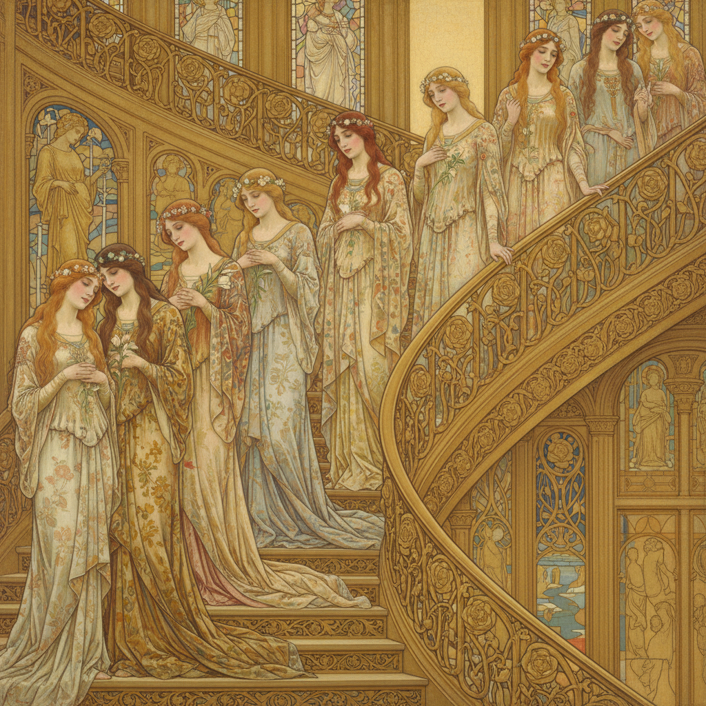

# Edward Burne-Jones 伯恩-琼斯

> "I mean by a picture a beautiful romantic dream of something that never was, never will be." — Edward Burne-Jones

## 概述

爱德华·伯恩-琼斯（Edward Burne-Jones，1833–1898）是英国画家和设计师，前拉斐尔派第二代的核心人物。他以描绘中世纪传说和古典神话的梦幻场景闻名——修长优雅的人物、流动的衣褶、忧郁的表情和装饰性的构图，创造了一个远离工业时代的理想化美的世界。

## 核心特征

| 特征 | 描述 |
|------|------|
| 中世纪梦境 | 亚瑟王传说和古典神话 |
| 修长人物 | 优雅而忧郁的理想化身体 |
| 流动衣褶 | 如雕塑般的织物表现 |
| 装饰构图 | 平面化的装饰性画面 |
| 忧郁之美 | 沉思的、不属于现世的表情 |
| 跨媒介 | 绘画、彩窗、挂毯、书籍 |

## 代表作品

| 作品 | 年代 | 意义 |
|------|------|------|
| *The Last Sleep of Arthur in Avalon* | 1881–98 | 未完成的巨幅杰作 |
| *The Golden Stairs* | 1880 | 装饰性构图的极致 |
| *King Cophetua and the Beggar Maid* | 1884 | 中世纪浪漫的经典 |
| *The Briar Rose* series | 1885–90 | 睡美人的梦幻叙事 |

## AI生成概念图

## 与其他风格的关系

- **Pre-Raphaelite** → 前拉斐尔派第二代领袖
- **William Morris** → 艺术与工艺运动的合作者
- **Art Nouveau** → 直接影响了新艺术运动
- **Symbolism** → 与欧洲象征主义共鸣
