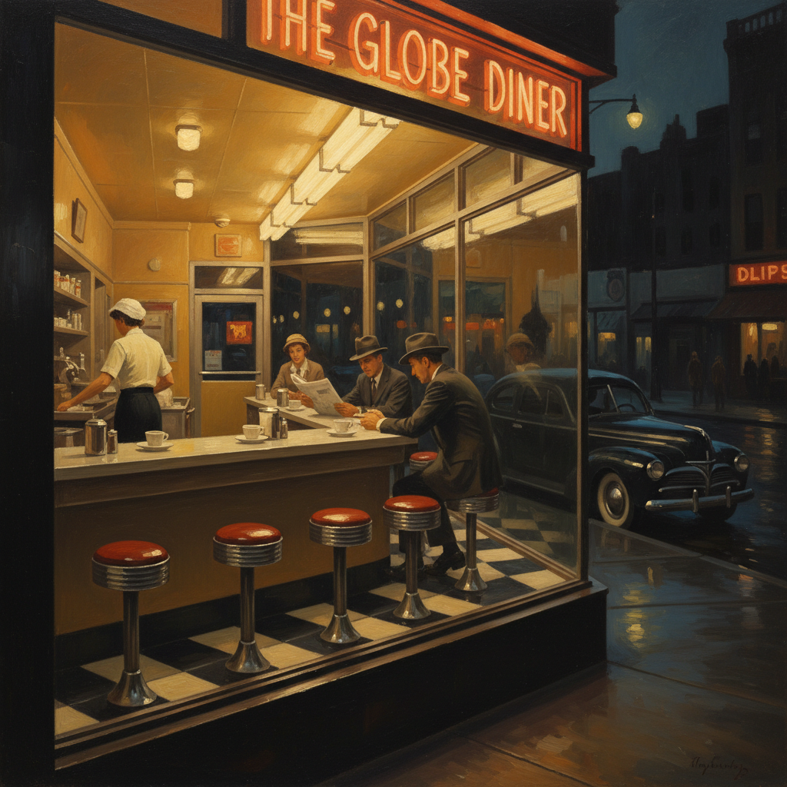

# Edward Hopper 爱德华·霍珀

> **流派**: 美国现实主义 · 现代主义  
> **时期**: 1882–1967 美国  
> **关键词**: 都市孤独、戏剧光影、美国风景、沉默叙事

## 概述

爱德华·霍珀是20世纪美国最重要的画家之一。他以描绘美国城市和乡村中的孤独感著称——空旷的加油站、深夜的餐厅、独坐窗边的人物。他的作品像电影定格画面，充满叙事张力却永远不揭示故事的全貌。

## 视觉特征

- **戏剧光影**: 强烈的阳光或人工灯光切割空间
- **孤独人物**: 人物常独处或虽在一起却互不交流
- **建筑框架**: 窗户、门廊、墙壁构成画面的几何骨架
- **空旷空间**: 大面积的墙面、天空、道路强化孤寂感
- **电影感构图**: 像摄影机取景般的视角选择

## 代表作品

- 《夜鹰》(1942)
- 《晨阳》(1952)
- 《加油站》(1940)
- 《海边的房间》(1951)

## 历史影响

霍珀定义了"美国孤独"的视觉形象，深刻影响了电影（希区柯克、文德斯）、摄影和当代插画。他证明了日常场景可以承载深刻的心理内容。

## 相关风格

- [Norman Rockwell 诺曼·洛克威尔](norman-rockwell.md)
- [Andrew Wyeth 安德鲁·怀斯](andrew-wyeth.md)
- [Film Noir 黑色电影](film-noir.md)
