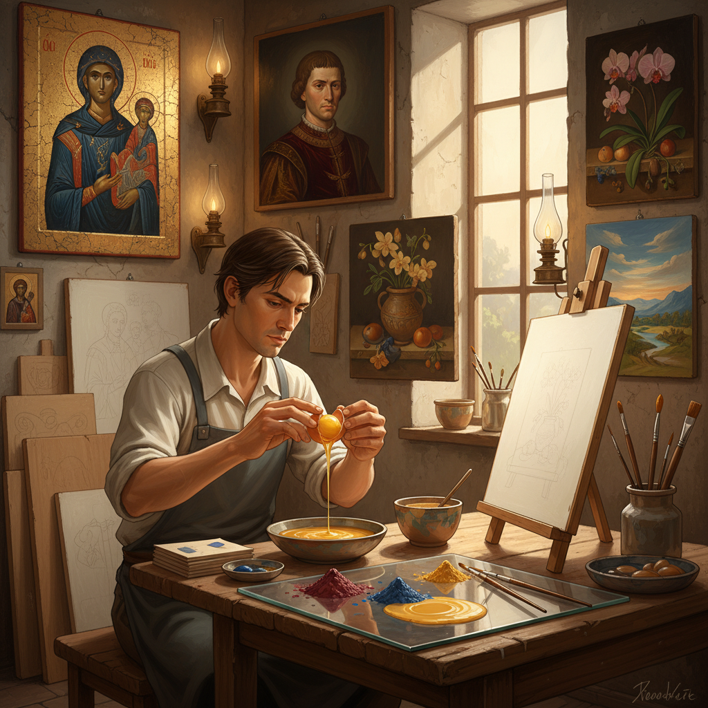

# Egg Tempera 蛋黄蛋彩

> "Egg tempera is alchemy in its simplest form — crack an egg, separate the yolk, mix it with earth ground to powder, and you hold in your brush a medium that has outlasted empires, its colors as fresh after six centuries as the day they were laid down." — Unknown

## 概述

蛋黄蛋彩（Egg Tempera）是蛋彩画（tempera painting）中最经典、最纯粹的形式——专指以蛋黄为唯一粘合剂的绘画技法。艺术家将蛋黄从蛋白中分离，刺破蛋黄膜取出纯蛋黄液，然后与颜料粉末和少量水混合，即成为可以作画的颜料。蛋黄蛋彩是中世纪和早期文艺复兴绘画的标准媒介。

蛋黄蛋彩与其他蛋彩形式（如全蛋蛋彩、蛋黄加油的混合蛋彩）的区别在于：纯蛋黄蛋彩干燥最快、色彩最明亮、表面最哑光。蛋黄蛋彩的工作方式是"积累式"的——每一笔都很薄，需要通过数十甚至数百层的叠加来建立色彩的深度和丰富度。这种方式要求极大的耐心和计划性，但能产生独特的内在发光感。

## 核心特征

| 特征 | 描述 |
|------|------|
| 蛋黄 | 纯蛋黄为粘合剂 |
| 速干 | 几秒钟干燥 |
| 薄层 | 极薄的层次叠加 |
| 明亮 | 色彩明亮清澈 |
| 哑光 | 柔和的哑光表面 |
| 永久 | 极其耐久永久 |

## 视觉特征

- **发光**：内在的发光感
- **明亮**：明亮清澈的色彩
- **精细**：精细的笔触
- **哑光**：柔和的哑光
- **层次**：丰富的层次感
- **古典**：古典的质感

## 代表作品

| 作品 | 艺术家 | 年代 | 意义 |
|------|--------|------|------|
| *The Annunciation* | Fra Angelico | 1440s | 蛋黄蛋彩杰作 |
| *Primavera* | Botticelli | 1482 | 文艺复兴蛋彩画 |
| *Christina's World* | Andrew Wyeth | 1948 | 现代蛋黄蛋彩代表 |
| *Icon paintings* | Various | 中世纪 | 圣像画传统 |
| *Contemporary egg tempera* | Various | 当代 | 当代蛋黄蛋彩 |

## 历史时间线

| 时期 | 事件 |
|------|------|
| 古代 | 蛋黄作为颜料粘合剂的早期使用 |
| 拜占庭 | 圣像画中的蛋黄蛋彩标准化 |
| 13-15世纪 | 欧洲绘画的主导媒介 |
| 15世纪 | 油画兴起，蛋黄蛋彩衰落 |
| 20世纪 | Andrew Wyeth等人的复兴 |
| 当代 | 蛋黄蛋彩的全球复兴运动 |

## 中国语境

蛋黄蛋彩在中国的美术教育和创作中正在获得关注。中国的一些美术院校开设蛋黄蛋彩工作坊和课程。中国的画家对蛋黄蛋彩的"自制颜料、天然材料"特点感兴趣——这与中国传统绘画对材料品质的重视有共鸣。蛋黄蛋彩的"薄层叠加"技法与中国工笔画的"三矾九染"有相似之处。一些中国当代画家尝试将蛋黄蛋彩与中国传统绘画元素结合。

## AI生成概念图

## 与其他风格的关系

- **Tempera Painting** → 蛋彩画
- **Oil Painting** → 油画
- **Fresco** → 湿壁画
- **Icon Painting** → 圣像画
- **Casein Painting** → 酪蛋白画
- **Gesso** → 石膏底

---

*浮光艺志 | Chronicle of Artistry*
