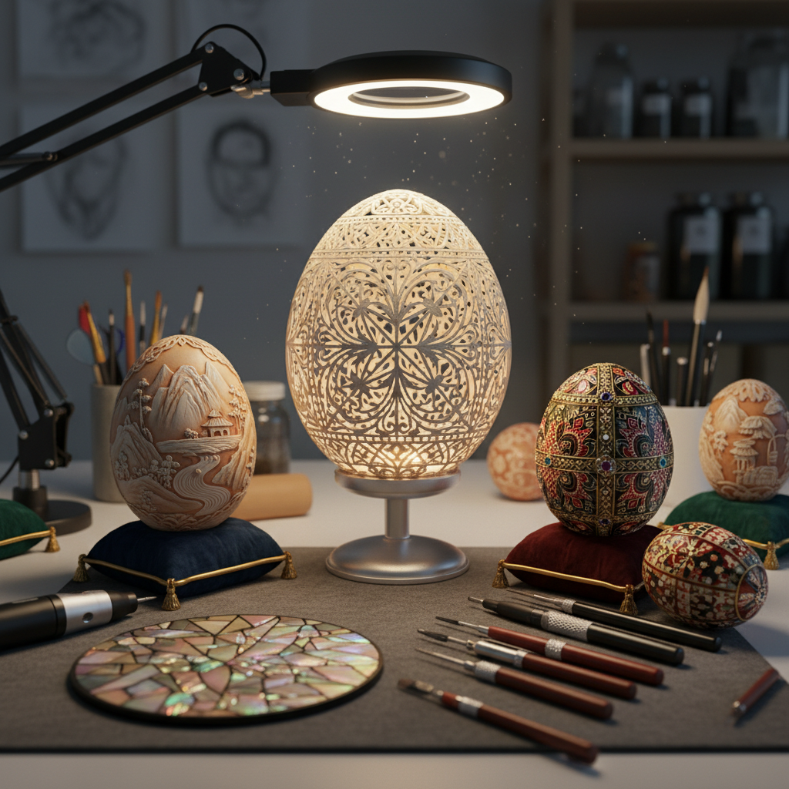

# Eggshell Art 蛋壳艺术

> "An eggshell is nature's most perfect container — thin enough to let a chick break free, strong enough to protect it until that moment arrives. When an artist takes up an eggshell, they work with this paradox: carving into something that should shatter at a touch, finding strength in fragility, creating permanence from what was designed to be temporary." — Unknown

## 概述

蛋壳艺术（Eggshell Art）是以蛋壳为主要材料或创作载体的艺术形式——包括在蛋壳上雕刻、绘画、镶嵌，以及将碎蛋壳作为马赛克材料使用。蛋壳艺术利用蛋壳的天然曲面、半透明性和脆弱性，创造出精致而令人惊叹的作品。

蛋壳艺术的实践包括：1）蛋雕——在完整蛋壳上进行精细雕刻，创造镂空图案；2）蛋壳绘画——在蛋壳表面进行彩绘（如乌克兰的Pysanky）；3）蛋壳镶嵌——将碎蛋壳作为马赛克材料镶嵌在漆器或其他表面上；4）蛋壳珠宝——用蛋壳碎片制作首饰；5）法贝热彩蛋——用贵金属和宝石装饰的奢华蛋形艺术品；6）蛋壳漆艺——将蛋壳碎片嵌入漆面的东亚传统工艺。

## 核心特征

| 特征 | 描述 |
|------|------|
| 脆弱 | 极度脆弱的材料 |
| 精细 | 需要极高精细度 |
| 曲面 | 天然的曲面形态 |
| 半透明 | 蛋壳的半透明性 |
| 有机 | 天然有机材料 |
| 耐心 | 需要极大耐心 |

## 视觉特征

- **白色**：蛋壳的天然白色
- **镂空**：精细的镂空图案
- **光影**：光线穿透的效果
- **曲线**：蛋形的优美曲线
- **精密**：极其精密的细节
- **对比**：实体与空洞的对比

## 代表作品

| 作品 | 艺术家 | 年代 | 意义 |
|------|--------|------|------|
| *Fabergé Eggs* | Peter Carl Fabergé | 1885-1917 | 奢华蛋形艺术 |
| *Pysanky* | 乌克兰传统 | 古代至今 | 蜡染蛋壳绘画 |
| *Carved ostrich eggs* | Various | 当代 | 鸵鸟蛋雕刻 |
| *Eggshell lacquer* | 越南/日本传统 | 古代至今 | 蛋壳漆艺 |
| *Eggshell mosaics* | Various | 当代 | 蛋壳马赛克 |

## 历史时间线

| 时期 | 事件 |
|------|------|
| 6万年前 | 南非发现最早的装饰蛋壳 |
| 古代 | 乌克兰Pysanky传统 |
| 1885 | 法贝热彩蛋的诞生 |
| 20世纪 | 蛋雕作为独立艺术形式 |
| 当代 | 精密蛋雕与激光技术 |

## 中国语境

蛋壳艺术在中国有独特的文化传统。中国的蛋雕艺术历史悠久——早在明清时期就有在蛋壳上雕刻的记载。中国蛋雕以其精细的镂空技法著称，能在薄如纸的蛋壳上雕出山水、人物、花鸟等复杂图案。中国传统漆器中的"蛋壳镶嵌"工艺——将碎蛋壳嵌入漆面形成冰裂纹效果——是一种独特的装饰技法。中国当代的蛋雕艺术家将传统技法与现代题材结合，创作出融合中国书法、剪纸图案和当代设计的蛋雕作品。中国的蛋雕已被列入多地非物质文化遗产名录。

## AI生成概念图

## 与其他风格的关系

- **Miniature Art** → 微型艺术
- **Lacquer Art** → 漆艺术
- **Mosaic Art** → 马赛克艺术
- **Carving Art** → 雕刻艺术
- **Paper Cutting Art** → 剪纸艺术
- **Jewelry Art** → 首饰艺术

---

*浮光艺志 | Chronicle of Artistry*
