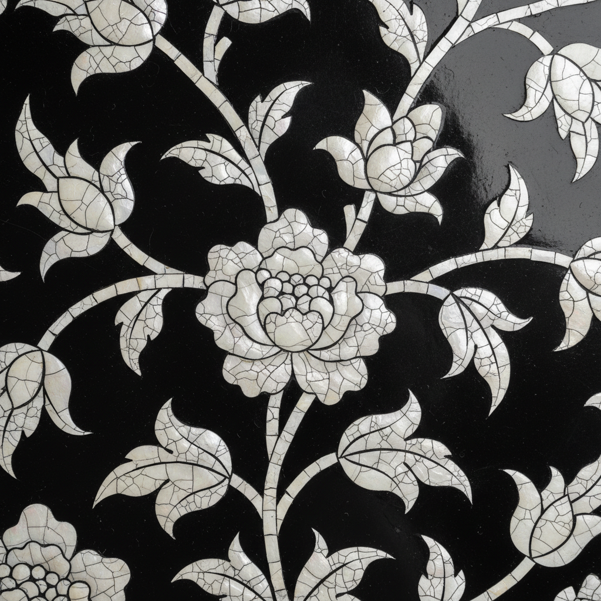

# Eggshell Mosaic Art 蛋壳镶嵌艺术

> "Eggshell mosaic transforms the most fragile of materials into something permanent — crushed eggshell fragments are arranged on a surface like tiny tiles, their natural crazed pattern of fine cracks creating a texture reminiscent of ancient crackle-glazed ceramics. The humble eggshell, usually discarded without thought, becomes a medium of surprising beauty when its pearlescent inner surface catches light through a web of delicate fractures." — Unknown

## 概述

蛋壳镶嵌艺术（Eggshell Mosaic Art）是一种使用碎蛋壳片作为镶嵌材料，在各种表面上创造装饰图案的工艺——利用蛋壳的天然裂纹纹理和珍珠般的光泽创造独特的视觉效果。蛋壳镶嵌在东亚漆艺中有悠久的传统（称为"卵壳"或"蛋壳漆"），也在当代工艺中作为独立的装饰技法被广泛应用。

蛋壳镶嵌艺术的实践包括：1）漆器蛋壳——在漆器表面镶嵌蛋壳；2）平面镶嵌——在平面上排列蛋壳碎片；3）图案镶嵌——用蛋壳碎片拼出图案；4）渐变效果——利用不同颜色的蛋壳创造渐变；5）混合媒介——蛋壳与其他材料的组合；6）当代蛋壳艺术——将传统技法与现代设计结合的创作。

## 核心特征

| 特征 | 描述 |
|------|------|
| 脆弱 | 脆弱材料的永恒化 |
| 裂纹 | 天然的裂纹纹理 |
| 光泽 | 珍珠般的光泽 |
| 环保 | 废弃材料的再利用 |
| 精细 | 极其精细的操作 |
| 独特 | 独特的视觉效果 |

## 视觉特征

- **裂纹**：天然的冰裂纹效果
- **光泽**：珍珠般的柔和光泽
- **纹理**：细密的马赛克纹理
- **对比**：蛋壳与底色的对比
- **精细**：极其精细的碎片排列
- **古朴**：类似古陶瓷的开片效果

## 代表作品

| 作品 | 艺术家/文化 | 年代 | 意义 |
|------|-------------|------|------|
| *Vietnamese eggshell lacquer* | 越南 | 20世纪至今 | 越南蛋壳漆画 |
| *Japanese rankaku* | 日本 | 传统 | 日本卵壳漆器 |
| *Korean najeon with eggshell* | 韩国 | 传统 | 韩国蛋壳漆器 |
| *Chinese eggshell lacquer* | 中国 | 传统 | 中国蛋壳漆器 |
| *Contemporary eggshell art* | 当代 | 当代 | 当代蛋壳艺术 |

## 历史时间线

| 时期 | 事件 |
|------|------|
| 古代 | 蛋壳镶嵌在东亚漆艺中的起源 |
| 中世纪 | 日本和韩国的蛋壳漆器发展 |
| 20世纪初 | 越南蛋壳漆画的兴起 |
| 20世纪中 | 蛋壳镶嵌作为独立工艺的发展 |
| 当代 | 蛋壳镶嵌的全球传播和创新 |

## 中国语境

蛋壳镶嵌艺术在中国有悠久的传统。中国漆艺中的"蛋壳镶嵌"是重要的装饰技法——将碎蛋壳镶嵌在漆面上创造冰裂纹效果。中国福州的脱胎漆器中有精美的蛋壳镶嵌作品——利用蛋壳的白色与黑漆的对比创造图案。中国的漆画艺术中，蛋壳是重要的材料之一——用于表现雪景、月光和白色物体。中国当代的一些工艺美术家专门研究蛋壳镶嵌——将其发展为独立的艺术表达形式。中国的手工艺教育中，蛋壳镶嵌作为一种环保和创意的工艺被教授——因为材料易得且效果独特。中国的一些设计师将蛋壳镶嵌应用于现代产品设计——在家具、首饰和装饰品中创造独特的纹理效果。

## AI生成概念图

## 与其他风格的关系

- **Urushi** → 漆艺
- **Mosaic** → 马赛克艺术
- **Lacquerware** → 漆器
- **Mixed Media** → 混合媒介
- **Sustainable Art** → 可持续艺术
- **Decorative Art** → 装饰艺术

---

*浮光艺志 | Chronicle of Artistry*
