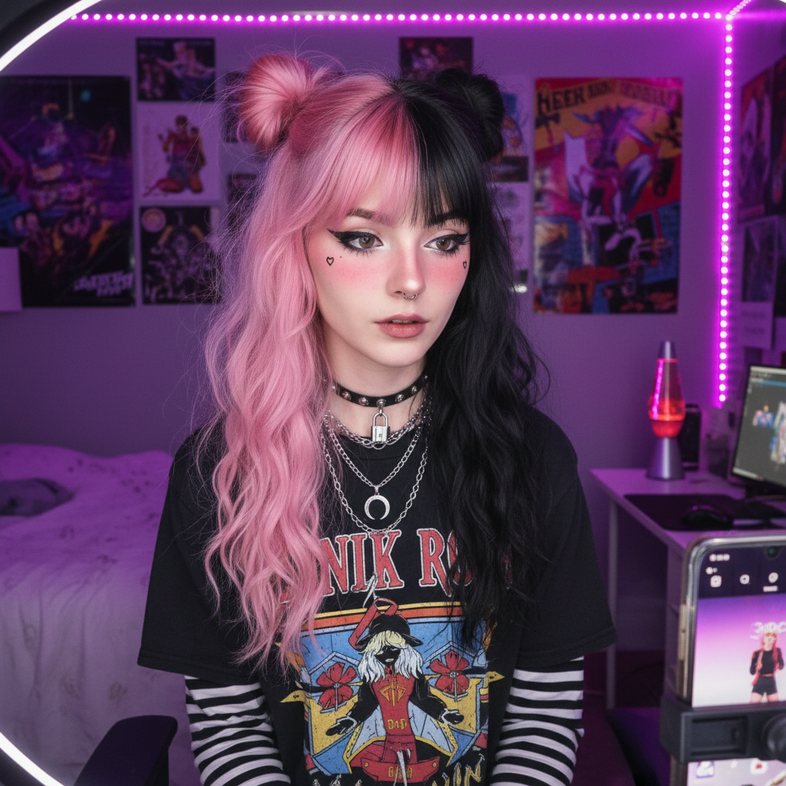
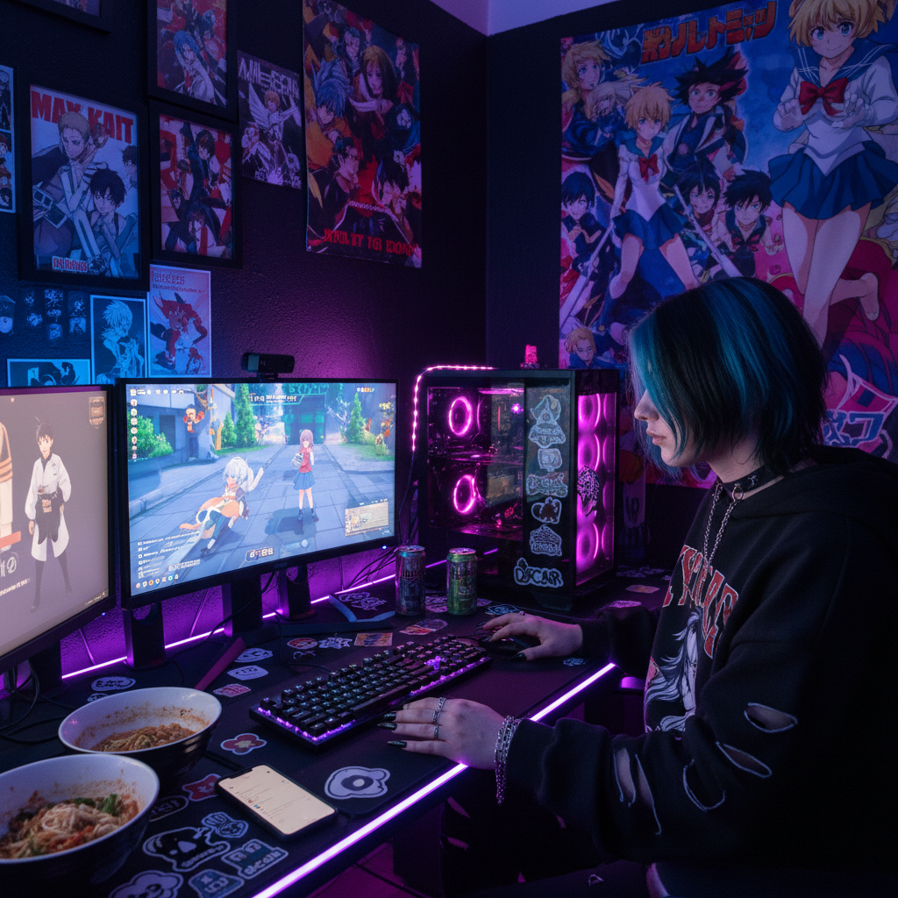

# E-Girl / E-Boy 电子女孩/电子男孩





> **"TikTok 时代的数字原住民亚文化——Emo 遇见动漫遇见游戏。"**

## 概述

| 维度 | 描述 |
|------|------|
| 时期 | 2018–至今 |
| 别名 | E-girl, E-boy, Soft Grunge 2.0, TikTok Alt |
| 核心色彩 | 黑色 + 粉色/蓝色条纹染发、腮红鼻尖 |
| 关键元素 | 条纹长袖内搭、链条配饰、心形腮红、动漫元素 |
| 代表人物 | Belle Delphine, Corpse Husband, Billie Eilish 早期 |
| 关联风格 | Emo, Scene, Animecore, Pastel Goth, Hyperpop |

---

## 历史脉络

### 前史：从 Emo 到 E-Girl 的基因传递

E-Girl/E-Boy 并非凭空出现。它是多种千禧年亚文化在 TikTok 时代的重组与再生：

**Emo (2003–2012)**：斜刘海、黑色眼线、情感表达 → E-Girl 继承了"用外表表达内心"的逻辑
**Scene (2006–2013)**：霓虹色头发、MySpace 自拍角度 → E-Girl 继承了彩色头发和自拍文化
**Tumblr Grunge (2013–2016)**：黑色+格子+Doc Martens → E-Girl 继承了"soft grunge"的混搭
**Animecore**：动漫元素融入日常 → E-Girl 继承了二次元审美
**Egirl 原始含义（2009）**：最初是贬义词，指"在网上寻求男性关注的女孩"

### 2018–2019：TikTok 的催化

2018年 TikTok 在全球爆发，E-Girl/E-Boy 美学随之诞生。关键转折点：

- **2018年末**：TikTok 上出现 "E-Girl Factory" 变装视频——普通女孩通过化妆变成 E-Girl
- **2019年初**：#egirl 标签在 TikTok 累积超过 10 亿播放
- **2019年中**：Belle Delphine 的"洗澡水"事件将 E-Girl 推入主流讨论
- **2019年末**：E-Girl 被《纽约时报》等主流媒体报道

### 2020–2021：疫情加速

COVID-19 封城期间，E-Girl/E-Boy 美学爆发：
- 居家隔离 → 更多时间用于自我装扮和内容创作
- 线上社交成为主要社交方式 → "为镜头而存在"的美学更有意义
- 游戏文化爆发 → E-Boy 与游戏主播文化深度绑定
- Discord 社群 → E-Girl/E-Boy 的社交基础设施

### 2022–至今：主流化与分化

E-Girl/E-Boy 已经从亚文化变成了主流时尚选项之一：
- 快时尚品牌（SHEIN、Romwe）大量生产 E-Girl 风格服装
- 美妆品牌推出"E-Girl 妆容"教程
- 风格开始分化为多个子类型

---

## 视觉语法

### 色彩系统

```
基底：黑色 + 白色（条纹长袖的经典配色）

发色（最重要的身份标识）：
  - 黑色 + 粉色挑染 — 最经典 E-Girl
  - 黑色 + 蓝色挑染 — 第二常见
  - 分区染色（左右不同色）— 进阶版
  - 全头粉色/蓝色/紫色 — 更极端版本

妆容色：
  - 粉色腮红（涂在鼻尖和脸颊）— E-Girl 标志
  - 黑色眼线（翼形或心形）
  - 假雀斑（用眼线笔点上）

配饰色：
  - 银色链条
  - 黑色皮革
```

### E-Girl 标志性元素

| 类别 | 元素 | 来源 |
|------|------|------|
| 上衣 | 黑白条纹长袖 + 短袖T恤叠穿 | 90s grunge 层叠穿法 |
| 配饰 | 银色链条项链（多层） | Mall Goth / Punk |
| 妆容 | 鼻尖腮红 + 假雀斑 | 动漫角色的"害羞脸" |
| 妆容 | 心形/星形眼线 | Harajuku + 创意妆 |
| 发型 | 双马尾/双丸子头 + 挑染 | 动漫 + Scene |
| 眼妆 | 浓重黑色眼线 + 下眼睑装饰 | Emo + 动漫 |
| 服装 | 格子裙 + 过膝袜 + 厚底鞋 | 日本校服 + Punk |
| 文化 | 动漫周边、游戏手柄、LED灯带房间 | Otaku + Gamer |

### E-Boy 标志性元素

| 类别 | 元素 | 来源 |
|------|------|------|
| 发型 | 中分帘发（curtain bangs） | 90s Leonardo DiCaprio |
| 上衣 | 条纹长袖 + 宽松T恤叠穿 | Skater + Grunge |
| 配饰 | 银色链条、戒指堆叠 | Punk / Mall Goth |
| 下装 | 宽松工装裤或黑色直筒裤 | Skater |
| 指甲 | 黑色指甲油 | Emo / Goth |
| 文化 | 滑板、游戏、Lo-fi 音乐 | Skater + Gamer |

---

## 与千禧怀旧的关系

E-Girl/E-Boy 是千禧年亚文化在 Z 世代身上的**直接转世**：

| 千禧原型 | E-Girl/E-Boy 版本 | 变化 |
|----------|-------------------|------|
| MySpace 自拍 | TikTok 变装视频 | 平台迁移 |
| Emo 斜刘海 | E-Girl 帘发/挑染 | 更多色彩 |
| Scene 霓虹发 | E-Girl 分区染色 | 更精致 |
| Hot Topic 购物 | SHEIN/Dolls Kill 网购 | 线上化 |
| MSN 签名 | Discord 状态 | 平台迁移 |
| 动漫论坛签名档 | TikTok 动漫cosplay | 视频化 |

### 关键区别

E-Girl/E-Boy 与千禧年亚文化的核心区别在于**媒介**：
- Emo/Scene 是**线下优先**的——你需要去演出现场、去 Hot Topic
- E-Girl/E-Boy 是**线上优先**的——你可以完全在卧室里成为 E-Girl
- 这种"卧室亚文化"是后疫情时代的产物

---

## 中国语境

在中国，E-Girl/E-Boy 的对应概念是**"亚逼"**（亚文化逼格）：

### 本土化表达
- **"亚逼"穿搭**：小红书和抖音上的中国版 E-Girl
- **JK制服改造**：日本校服裙 + 链条配饰 + 厚底鞋
- **"辣妹"风格**：更偏向性感方向的中国 E-Girl
- **"原宿风"**：更偏向日系可爱方向

### 平台差异
- **抖音**：E-Girl 变装视频、妆容教程
- **小红书**：穿搭分享、配饰推荐
- **B站**：动漫cosplay、游戏直播
- **淘宝**：大量"暗黑少女""辣妹"风格店铺

---

## 设计应用

| 场景 | 应用方式 |
|------|----------|
| 社交媒体 | 粉色+黑色配色、心形图标、像素化元素 |
| 游戏UI | 霓虹色+暗色背景、动漫风角色 |
| 音乐封面 | 故障效果+粉色调+动漫元素 |
| 品牌设计 | 适合面向Z世代的潮牌、美妆、游戏产品 |

---

## 延伸阅读

- Aesthetics Wiki: [E-Girl](https://aesthetics.fandom.com/wiki/E-Girl)
- 《纽约时报》"What Is an E-Girl?" (2019)
- TikTok #egirl 标签演变分析

---

## 相关风格

← [Emo 情绪核](emo.md) | [Animecore 动漫核](animecore.md) →

↑ [返回千禧怀旧目录](README.md) | [返回总目录](../README.md)
