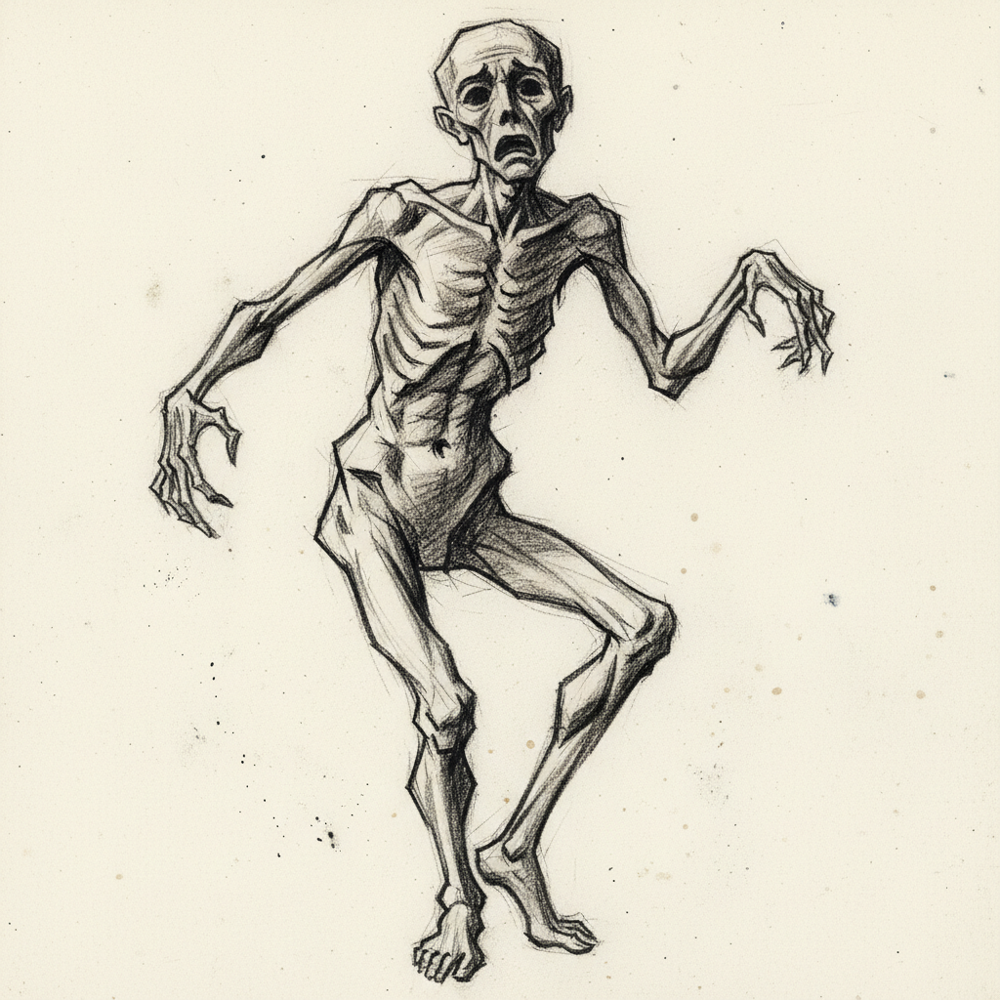

# Egon Schiele 埃贡·席勒

> **流派**: 表现主义 · 维也纳分离派  
> **时期**: 1890–1918 奥地利  
> **关键词**: 扭曲人体、锐利线条、情色张力、心理深度

## 概述

埃贡·席勒是20世纪初奥地利最具争议性和影响力的画家之一。他以极度坦率的人体描绘、扭曲的姿态和锐利的轮廓线闻名，作品充满心理张力和存在主义焦虑。年仅28岁便因西班牙流感去世，却留下了超过3000幅作品。

## 视觉特征

- **扭曲人体**: 夸张的骨节、不自然的姿态传达内在情感
- **锐利轮廓线**: 用粗犷有力的线条勾勒形体，线条本身即表达
- **裸露与坦率**: 直面人体的脆弱与欲望，毫不回避
- **留白背景**: 大量作品以空白纸面为背景，聚焦人物本身
- **枯瘦美学**: 瘦削的身体、突出的关节，带有病态之美

## 代表作品

- 《自画像》系列 (1910–1918)
- 《拥抱》(1917)
- 《死亡与少女》(1915)
- 《斜倚的女人》(1917)

## 历史影响

席勒将人体绘画从学院派的理想化中解放出来，直接影响了后来的表现主义、新表现主义以及当代人体艺术。他对心理状态的视觉化表达，预示了弗洛伊德精神分析在视觉艺术中的渗透。

## 相关风格

- [Gustav Klimt 古斯塔夫·克里姆特](klimt.md)
- [Francis Bacon 弗朗西斯·培根](francis-bacon.md)
- [Lucian Freud 卢西安·弗洛伊德](lucian-freud.md)
