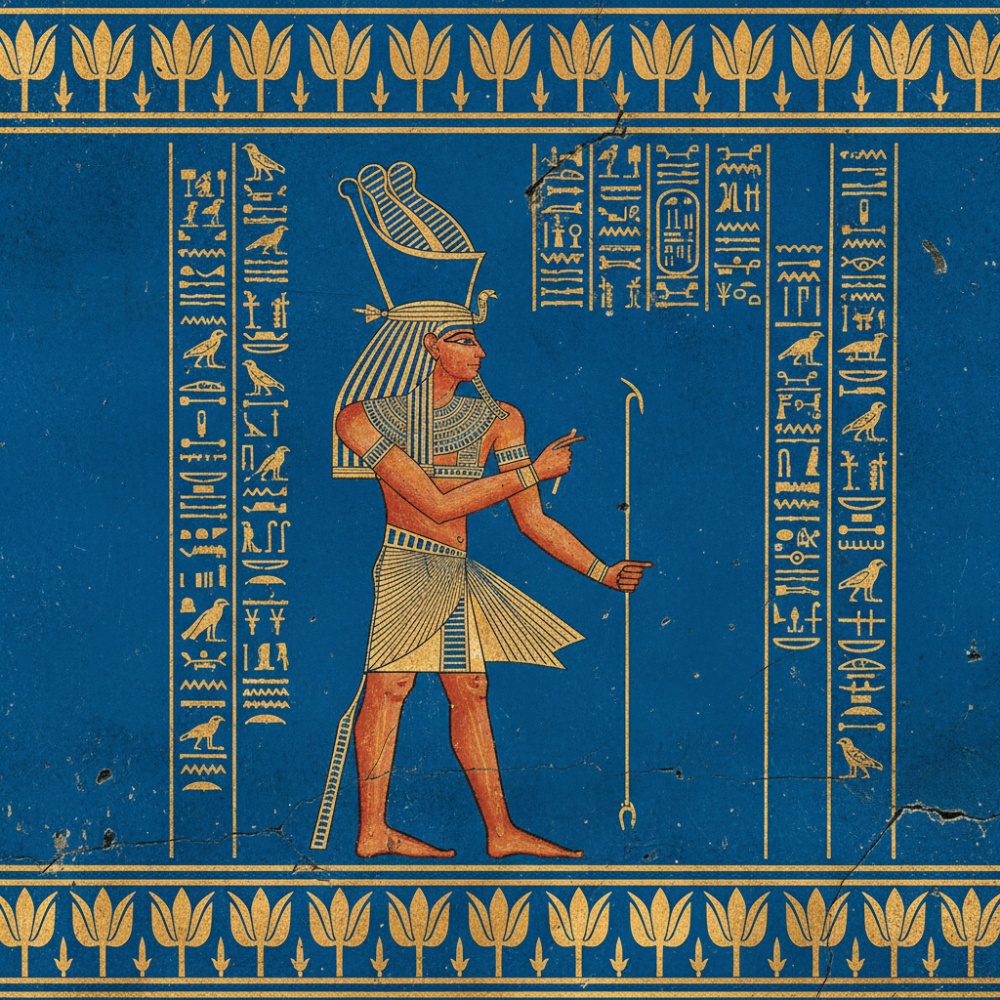

# 古埃及艺术 · Egyptian Art

> "我们为永恒而创造，每一笔都是对来世的承诺。" —— 古埃及铭文

## 概述

古埃及艺术（Egyptian Art）是人类历史上持续时间最长的艺术传统之一，从公元前3100年统一王国建立到公元前30年罗马征服，跨越三千余年而保持惊人的风格连贯性。古埃及艺术服务于宗教信仰和来世观念，以严格的正面律（frontality）、等级透视和程式化的人物表现为核心特征。从金字塔到神庙浮雕，从木乃伊面具到纸莎草画，古埃及艺术创造了人类文明中最具辨识度的视觉语言。

## 核心特征

| 特征 | 描述 |
|------|------|
| 时期 | 约前3100年–前30年 |
| 地域 | 尼罗河流域（今埃及、苏丹北部） |
| 媒介 | 石雕、壁画、纸莎草画、金银工艺、陶器 |
| 核心理念 | 以永恒不变的形式保障死者的来世生活 |
| 色彩 | 赭石红、群青蓝、翠绿、金色、黑色、白色 |

## 视觉特征

- **正面律**：人物头部侧面、眼睛正面、肩部正面、腿部侧面
- **等级透视**：人物大小反映社会地位而非空间距离
- **带状构图**：场景分层排列在水平带状区域中
- **程式化表现**：理想化的人体比例，青年永驻
- **象形文字整合**：文字与图像共享同一视觉系统

## 代表作品

| 作品 | 地点/时期 | 年代 | 类型 |
|------|-----------|------|------|
| 纳尔迈调色板 | 希拉孔波利斯 | 约前3100 | 浮雕 |
| 吉萨金字塔群 | 吉萨 | 约前2560 | 建筑 |
| 图坦卡蒙黄金面具 | 帝王谷 | 约前1323 | 金工 |
| 纳芙蒂蒂胸像 | 阿玛尔纳 | 约前1345 | 彩绘石灰岩 |
| 《死者之书》纸莎草画 | 各地 | 新王国时期 | 纸莎草画 |

## 发展时间线

| 时期 | 事件 |
|------|------|
| 前3100 | 上下埃及统一，艺术规范确立 |
| 前2686-2181 | 古王国，金字塔时代 |
| 前2055-1650 | 中王国，文学与艺术繁荣 |
| 前1550-1069 | 新王国，帝王谷壁画巅峰 |
| 前1353-1336 | 阿玛尔纳时期，短暂的自然主义革命 |
| 前332-30 | 托勒密时期，希腊化影响 |
| 前30 | 罗马征服，古埃及艺术传统终结 |

## 中国语境

古埃及艺术与中国古代艺术有深层的结构性平行。两者都发展出了以文字为核心的视觉文化（象形文字与甲骨文）；都以来世信仰驱动大规模墓葬艺术（金字塔与秦始皇陵）；都在数千年中保持了惊人的风格连贯性。中国考古学界与埃及学的交流日益密切，两大古文明的比较研究是世界考古学的重要议题。

## AI 概念图

*AI 生成概念图：古埃及艺术风格*

## 关联词条

- [[byzantine-art]] - 拜占庭艺术
- [[persian-miniature-art]] - 波斯细密画
- [[mayan-art]] - 玛雅艺术

---

*浮光艺志 · Chronicle of Artistry*
