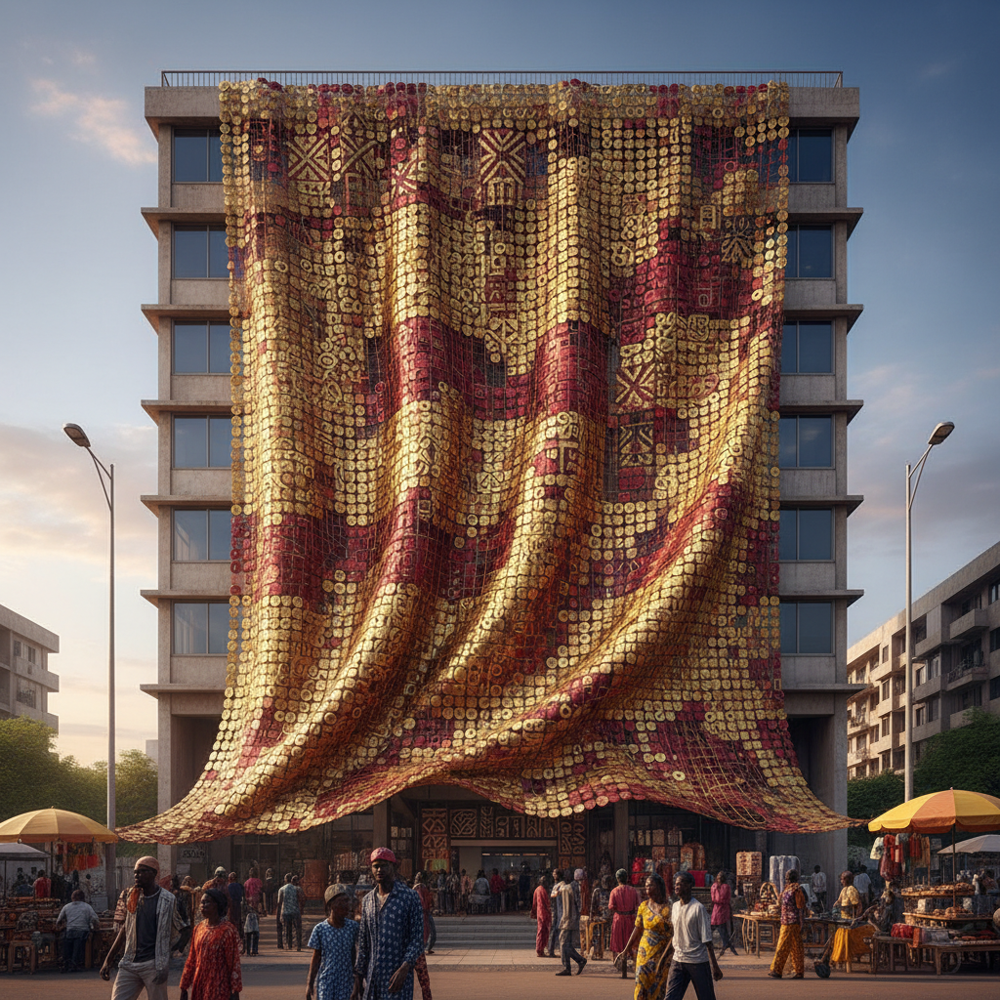

# El Anatsui 埃尔·阿纳祖伊

> **流派**: 当代雕塑 · 非洲当代艺术  
> **时期**: 1944–至今 加纳/尼日利亚  
> **关键词**: 瓶盖织物、回收材料、非洲纺织传统、流动雕塑

## 概述

埃尔·阿纳祖伊是非洲当代艺术最具国际影响力的艺术家之一。他用数千个回收的酒瓶铝盖和铜线编织成巨大的金属"织物"，悬挂在建筑外墙上如同闪烁的挂毯。这些作品既引用了非洲传统肯特布(Kente cloth)的编织传统，也暗示了殖民贸易史——酒精曾是奴隶贸易的货币。

## 视觉特征

- **金属织物**: 数千个压扁的瓶盖用铜线连接成巨幅布面
- **闪烁色彩**: 金色、红色、银色的铝片在光线下闪耀
- **流动悬垂**: 作品如布料般悬挂，随风轻微摆动
- **巨大尺度**: 常覆盖整面建筑外墙
- **不规则边缘**: 拒绝固定形状，每次展示形态不同

## 代表作品

- 《大地的皮肤》(Earth's Skin, 2007)
- 《重力与恩典》(Gravity and Grace, 2010)
- 威尼斯双年展外墙装置 (2007, 终身成就金狮奖)
- 《破碎的桥》(Broken Bridge, 2012)

## 历史影响

阿纳祖伊将非洲艺术从"民族工艺"的刻板印象中解放出来，证明了非洲当代艺术可以在全球语境中具有同等的复杂性和力量。他的回收材料美学也启发了全球可持续艺术实践。

## 相关风格

- [African Contemporary Art 非洲当代艺术](african-contemporary-art.md)
- [Textile Art 纺织艺术](textile-art.md)
- [Installation Art 装置艺术](installation-art.md)
