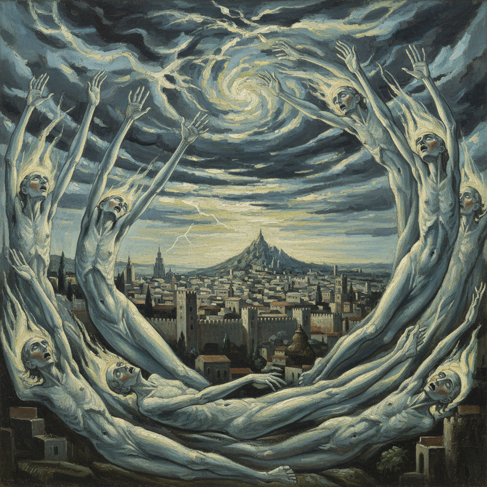

# El Greco 埃尔·格列柯

> "I paint because the spirits whisper madly inside my head." — El Greco (attributed)

## 概述

埃尔·格列柯（El Greco，"希腊人"，本名 Doménikos Theotokópoulos，1541–1614）是出生于克里特岛、活跃于西班牙托莱多的画家。他融合了拜占庭圣像画的精神性、威尼斯画派的色彩和矫饰主义的变形，创造了一种前所未有的、极度个人化的视觉语言——拉长的人体、冷冽的色彩、扭曲的空间和神秘的光芒。

格列柯在死后被遗忘了近三百年，直到20世纪初被表现主义和现代主义重新发现——他们在这位16世纪画家身上看到了自己的先驱。

## 核心特征

| 特征 | 描述 |
|------|------|
| 拉长变形 | 人体被极度拉长——如火焰般向上升腾 |
| 冷冽色彩 | 银灰、冰蓝、柠檬黄的冷色调 |
| 精神狂喜 | 宗教狂喜和神秘主义的视觉化 |
| 扭曲空间 | 不合理的透视和压缩的空间 |
| 内发光 | 人物自身发出冷冽的光芒 |
| 拜占庭遗产 | 克里特圣像画传统的现代化 |

## 视觉特征

- **人体**：极度拉长的、火焰般的人体
- **色彩**：银灰、冰蓝、柠檬黄、深红的冷色调
- **光线**：人物自身发出的冷冽内光
- **空间**：压缩的、不合理的空间
- **天空**：暴风雨般的、戏剧性的天空
- **笔触**：流动的、有方向性的笔触

## 代表作品

| 作品 | 年代 | 意义 |
|------|------|------|
| *The Burial of the Count of Orgaz* | 1586-88 | 天上与人间的双重世界 |
| *View of Toledo* | c.1596-1600 | 西方最早的纯风景画之一 |
| *The Opening of the Fifth Seal* | 1608-14 | 毕加索《亚维农少女》的灵感来源 |
| *The Disrobing of Christ* | 1577-79 | 托莱多的第一幅杰作 |
| *Laocoön* | c.1610-14 | 唯一的神话题材 |

## 真实作品（公共领域）

| 作品 | 来源 |
|------|------|
| *View of Toledo* | [Met Museum](https://www.metmuseum.org/art/collection/search/436575) |
| *The Burial of the Count of Orgaz* | [Wikimedia](https://commons.wikimedia.org/wiki/File:El_Greco_-_The_Burial_of_the_Count_of_Orgaz.JPG) |

> ⚠️ 本条目优先使用真实作品。

## AI生成概念图

## 与其他风格的关系

- **Mannerism** → 矫饰主义的极端个人化
- **Byzantine Art** → 克里特圣像画的现代延续
- **Expressionism** → 20世纪表现主义的先驱
- **Cubism** → 毕加索从格列柯获得灵感
- **Venetian School** → 在威尼斯学习提香和丁托列托

---

*浮光艺志 | Chronicle of Artistry*
