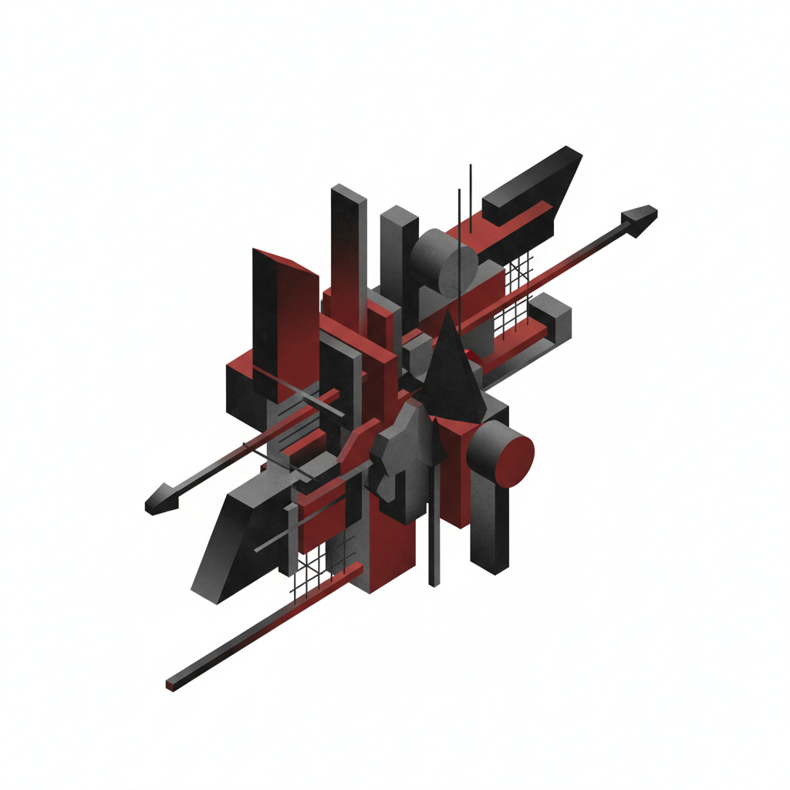

# El Lissitzky Art 利西茨基艺术

> "The sun as expression of old world energy is torn down from the heavens by modern man, who by virtue of his technological superiority creates his own energy source." — El Lissitzky

## 概述

利西茨基艺术（El Lissitzky Art）是20世纪初俄罗斯先锋派艺术家拉扎尔·马尔科维奇·利西茨基（Lazar Markovich Lissitzky, 1890-1941），即"埃尔·利西茨基"（El Lissitzky）创立的"普罗恩"（Proun）艺术风格。利西茨基是连接俄罗斯先锋派与西欧现代主义的关键桥梁——他将马列维奇的至上主义理念发展为一种介于绑画与建筑之间的新形式，并通过国际交流将俄罗斯构成主义的思想传播到包豪斯和荷兰风格派。

利西茨基最具原创性的贡献是他的"普罗恩"（Proun，"为新艺术而肯定"的俄语缩写）系列——这些作品以轴测投影的方式将几何形体悬浮在无重力的空间中，创造了一种介于二维绑画和三维建筑之间的"中转站"。他同时是杰出的平面设计师、展览设计师和摄影师——他的书籍设计和展览空间设计对20世纪视觉传达产生了深远影响。

利西茨基艺术的核心要素包括：1）普罗恩——介于绑画与建筑之间的新形式；2）轴测空间——轴测投影创造的多维空间；3）国际桥梁——连接俄罗斯与西欧先锋派；4）展览设计——革命性的展览空间设计；5）平面设计——现代书籍和海报设计；6）摄影蒙太奇——照片蒙太奇的创新；7）总体艺术——艺术、建筑、设计的统一。

## 核心特征

| 特征 | 描述 |
|------|------|
| 普罗恩 | 介于绑画与建筑间新形式 |
| 轴测空间 | 轴测投影多维空间 |
| 国际桥梁 | 连接俄罗斯与西欧先锋派 |
| 展览设计 | 革命性展览空间设计 |
| 平面设计 | 现代书籍海报设计 |
| 总体艺术 | 艺术建筑设计统一 |

## 视觉特征

- **轴测几何**：轴测投影的几何体
- **无重力空间**：漂浮在空间中的形体
- **红黑灰**：红色、黑色、灰色的配色
- **建筑感**：如建筑模型般的空间感
- **动态平衡**：倾斜中的精确平衡
- **多维视角**：同时呈现多个视角

## 代表作品

| 作品 | 年代 | 意义 |
|------|------|------|
| *用红楔子打白军* (Beat the Whites with the Red Wedge) | 1919 | 政治海报经典 |
| *普罗恩系列* (Proun) | 1919-1927 | 核心艺术贡献 |
| *普罗恩房间* (Proun Room) | 1923 | 展览空间革命 |
| *关于两个方块的故事* (About Two Squares) | 1922 | 书籍设计 |
| *抽象柜* (Abstract Cabinet) | 1927-1928 | 展览设计 |
| *苏联建设杂志* (USSR in Construction) | 1930年代 | 摄影蒙太奇 |

## 历史时间线

| 时期 | 事件 |
|------|------|
| 1890年 | 出生于斯摩棱斯克省 |
| 1909-1914年 | 在德国达姆施塔特学习建筑 |
| 1919年 | 在维捷布斯克加入马列维奇 |
| 1919-1921年 | 创作普罗恩系列 |
| 1921-1925年 | 在西欧活动，连接国际先锋派 |
| 1925-1941年 | 回到苏联，从事设计工作 |
| 1941年 | 在莫斯科去世 |

## 中国语境

利西茨基在中国设计教育和当代艺术理论中有着重要的地位。他的《用红楔子打白军》是中国美术史教材中最常引用的政治海报之一——它展示了如何用纯粹的几何形式传达强烈的政治信息。利西茨基的普罗恩概念——介于绑画与建筑之间的"中转站"——对中国当代跨媒介艺术实践有重要的理论参考价值。他的展览设计理念——将展览空间本身作为艺术作品——影响了中国当代美术馆和展览的空间设计。利西茨基作为国际先锋派运动的桥梁人物，他的经历也为理解艺术的国际传播和跨文化交流提供了重要的历史案例。

## 概念图

## 与其他风格的关系

- **Suprematism** → 至上主义（马列维奇）
- **Constructivism** → 构成主义
- **Bauhaus** → 包豪斯
- **De Stijl** → 风格派
- **Rodchenko** → 罗德钦科（构成主义同道）
- **International Style** → 国际主义风格

---

*浮光艺志 | Chronicle of Artistry*
