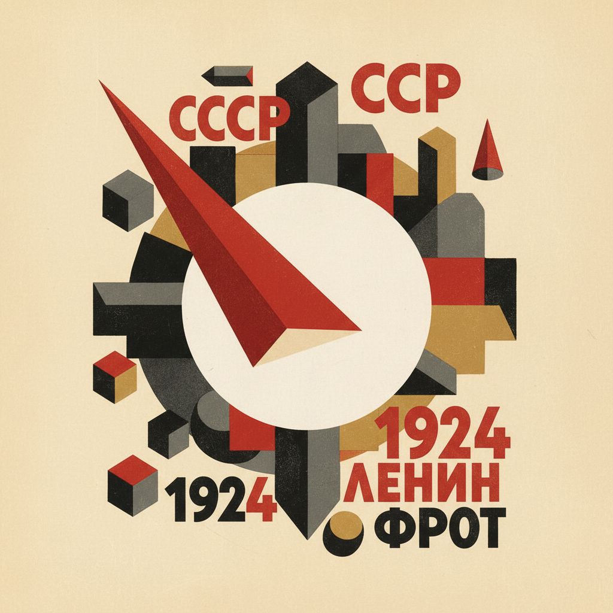

# El Lissitzky 利西茨基

> "The artist constructs a new symbol with his brush. This symbol is not a recognizable form of anything already finished." — El Lissitzky

## 概述

埃尔·利西茨基（El Lissitzky，1890–1941）是俄国构成主义和至上主义的关键人物，也是20世纪最具影响力的平面设计师之一。他创造的"Proun"系列——介于绘画与建筑之间的几何构成——以及革命性的排版设计，深刻影响了包豪斯、De Stijl和整个现代平面设计。

## 核心特征

| 特征 | 描述 |
|------|------|
| Proun | 绘画与建筑之间的几何实验 |
| 轴测投影 | 无消失点的空间表达 |
| 红黑白 | 革命三色的极简配色 |
| 排版革命 | 文字作为视觉元素 |
| 展览设计 | 空间装置的先驱 |
| 照片蒙太奇 | 摄影与图形的融合 |

## 代表作品

| 作品 | 年代 | 意义 |
|------|------|------|
| *Beat the Whites with the Red Wedge* | 1919 | 政治海报的经典 |
| *Proun 19D* | 1922 | 几何空间实验的代表 |
| *USSR Russische Ausstellung* | 1929 | 展览海报设计的里程碑 |
| *Abstract Cabinet* | 1927–28 | 互动展览空间的先驱 |

## AI生成概念图

## 与其他风格的关系

- **Suprematism** → 从马列维奇的至上主义出发
- **Constructivism** → 构成主义的国际传播者
- **Bauhaus** → 直接影响包豪斯教学
- **De Stijl** → 与蒙德里安的风格派对话
