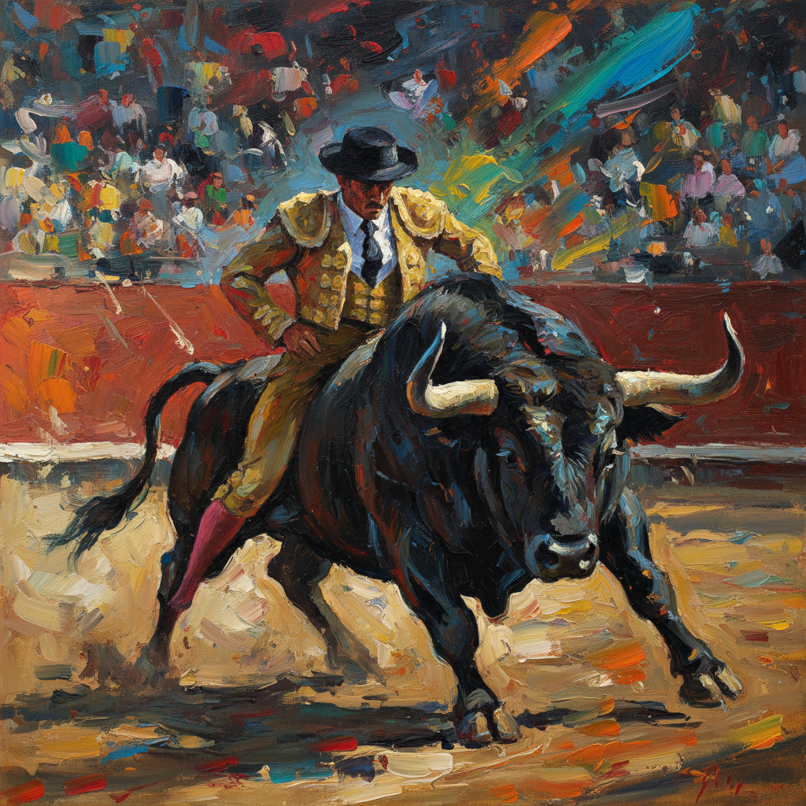

# Elaine de Kooning 伊莱恩·德库宁

> **时期：** 1918–1989  
> **关键词：** 抽象表现主义肖像、运动捕捉、斗牛系列、艺术评论

## 概述

Elaine de Kooning 是画家和艺术评论家，以将抽象表现主义的能量和笔触自由应用于肖像画和运动主题而闻名。她拒绝在抽象和具象之间做选择，认为两者可以共存于同一画面。她的斗牛系列和肯尼迪总统肖像展示了她捕捉运动和人物精神的非凡能力。

## 风格特征

- **抽象表现主义肖像**：以狂放的笔触捕捉人物的精神而非外貌
- **运动的瞬间**：斗牛、篮球等运动主题中的动态能量
- **快速执行**：保持第一笔的即兴性和紧迫感
- **色彩的情感性**：色彩选择基于情感反应而非观察
- **评论家的眼光**：作为艺术评论家的智识深度渗透到创作中

## 代表作品

- *Bullfight*系列（1957–1960）
- *John F. Kennedy*（1963）
- *Bacchus*系列（1976–1983）
- *Basketball Players*（1980s）

## 历史意义

Elaine de Kooning 证明了抽象表现主义不必放弃人物和叙事。她作为画家和评论家的双重身份使她成为纽约画派最具智识深度的成员之一，也是最早为该运动撰写理论文章的实践者。

## 概念图

