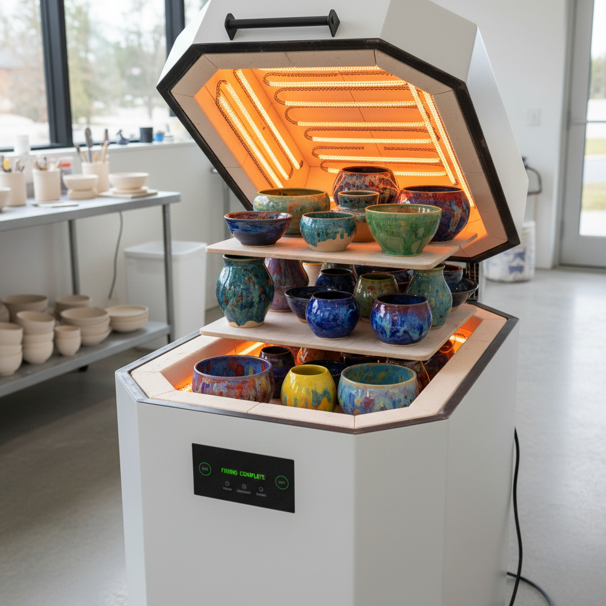

# Electric Kiln Art 电窑艺术

> "The electric kiln is fire domesticated to the studio apartment — clean, quiet, programmable, fitting against a wall like a large appliance, heating elements glowing orange behind peepholes, no flame, no smoke, no chimney, just radiant heat climbing steadily to temperature while the potter sleeps, democratizing ceramics by removing every barrier except imagination, the kiln that made every kitchen table a potential pottery studio." — Unknown

## 概述

电窑艺术（Electric Kiln Art）是一种以电力为能源、通过电阻丝加热的窑炉烧制陶瓷的艺术形式。电窑是当代陶艺中最普及的窑型——它安静、清洁、可编程、不需要烟囱，可以放置在任何有电源的空间。电窑的默认气氛是氧化气氛，产生明亮、可预测的釉色效果。电窑的普及极大地降低了陶艺创作的门槛，使陶瓷艺术走进了千家万户。

电窑艺术的核心要素包括：1）电力加热——通过电阻丝产生热量；2）氧化气氛——默认的氧化烧制环境；3）可编程——精确的温度程序控制；4）清洁安静——无烟无焰无噪音；5）空间友好——不需要烟囱和通风；6）可重复——高度可重复的烧制结果；7）普及性——最容易获得的窑型。

## 核心特征

| 特征 | 描述 |
|------|------|
| 电力加热 | 电阻丝辐射加热 |
| 氧化气氛 | 默认氧化环境 |
| 可编程 | 精确温度程序 |
| 清洁安静 | 无烟无焰 |
| 高度可重复 | 极高的重复性 |
| 普及性 | 最容易获得 |

## 视觉特征

- **明亮色彩**：氧化气氛的明亮釉色
- **均匀效果**：极其均匀的烧制效果
- **精确控制**：精确控制的色彩
- **清晰边界**：釉色之间清晰的界限
- **稳定重复**：批次间高度一致
- **多样釉色**：氧化釉色的丰富选择

## 代表作品

| 作品 | 艺术家/文化 | 年代 | 意义 |
|------|-------------|------|------|
| *当代电窑陶艺* | 各地陶艺家 | 当代 | 电窑的艺术可能 |
| *电窑结晶釉* | 各地陶艺家 | 当代 | 电窑结晶釉控制 |
| *低温电窑作品* | 各地陶艺家 | 当代 | 低温电窑创作 |
| *教育用电窑* | 各院校 | 当代 | 陶艺教育的基础 |
| *家用小型电窑* | 各品牌 | 当代 | 家庭陶艺的普及 |

## 历史时间线

| 时期 | 事件 |
|------|------|
| 20世纪初 | 电窑的发明 |
| 1950年代 | 电窑在工业中的应用 |
| 1970年代 | 小型电窑进入工作室 |
| 1990年代 | 可编程电窑控制器的普及 |
| 当代 | 智能电窑和家用电窑的发展 |

## 中国语境

电窑在中国陶艺教育和创作中有极其广泛的应用——几乎所有中国的陶艺教育机构和工作室都配备了电窑。电窑的普及使中国的陶艺爱好者群体迅速扩大——从专业院校到社区工作室，从儿童陶艺到成人体验，电窑让陶瓷创作变得触手可及。中国的电窑制造业也在快速发展——从景德镇到佛山，中国生产的电窑不仅服务国内市场，也出口到全球。虽然电窑无法实现还原气氛的传统釉色，但中国陶艺家通过创新的釉料配方和烧制技术，在电窑中也创造出了丰富多彩的艺术效果。

## AI生成概念图

## 与其他风格的关系

- **Oxidation Firing** → 氧化烧成
- **Gas Kiln** → 气窑
- **Studio Pottery** → 工作室陶艺
- **Crystalline Glaze** → 结晶釉
- **Ceramic Education** → 陶艺教育
- **Home Ceramics** → 家庭陶艺

---

*浮光艺志 | Chronicle of Artistry*
