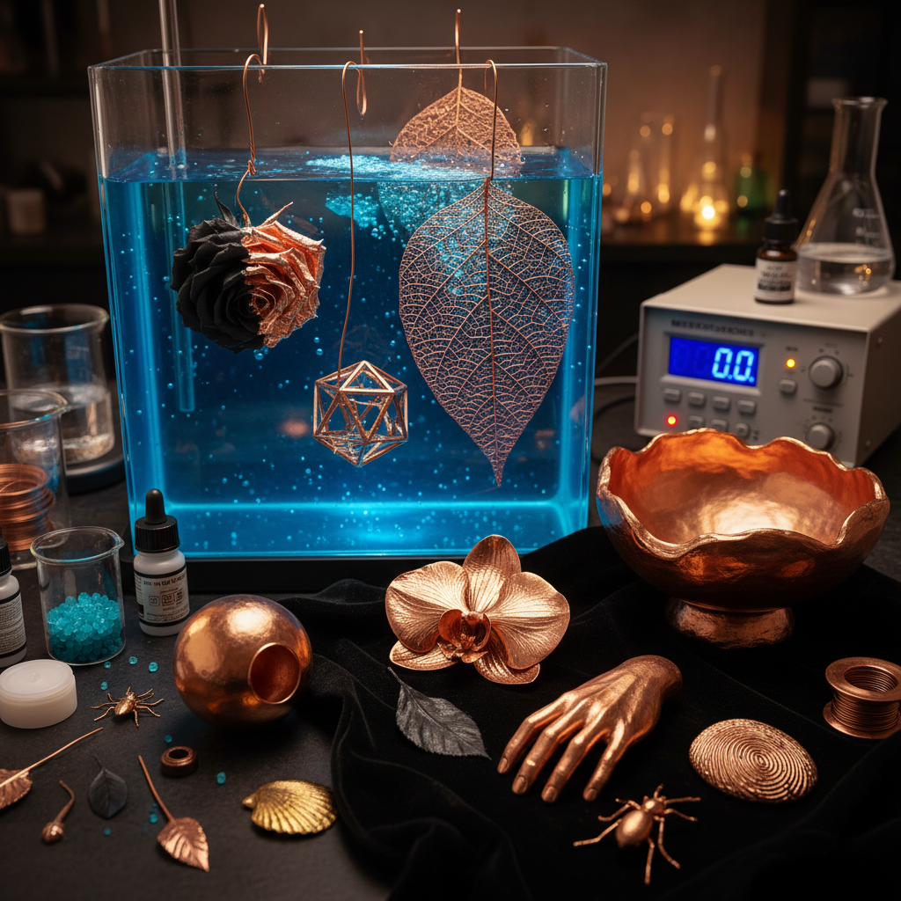

# Electroforming Art 电铸艺术

> "Electroforming grows metal the way nature grows crystals — atom by atom, layer by layer, a shell of copper or gold builds up around a form over hours and days until it becomes a self-supporting structure of impossible delicacy. The electroformer can capture the texture of a leaf, the curve of a seashell, or the geometry of a 3D-printed form in solid metal, creating objects that could never be cast, forged, or fabricated by any other means." — Unknown

## 概述

电铸艺术（Electroforming Art）是利用电镀原理在模具或基体表面沉积金属层，形成独立金属制品的工艺艺术——与普通电镀不同，电铸的金属层足够厚，可以从基体上剥离成为独立的金属壳体。电铸可以精确复制极其精细的表面细节，创造出传统铸造和锻造无法实现的精密金属制品。

电铸艺术的实践包括：1）珠宝电铸——在有机物（花朵、昆虫等）表面电铸金属；2）雕塑电铸——大型金属雕塑的电铸制作；3）工业电铸——精密模具和零件的电铸；4）艺术电铸——将电铸作为艺术创作媒介；5）混合媒介——电铸与其他材料的结合；6）3D打印电铸——在3D打印基体上电铸金属。

## 核心特征

| 特征 | 描述 |
|------|------|
| 精密 | 极其精密的细节复制 |
| 生长 | 金属逐原子生长 |
| 轻薄 | 可制作极薄金属壳 |
| 复杂 | 可实现复杂形态 |
| 有机 | 可复制有机形态 |
| 独特 | 无法用其他方法实现 |

## 视觉特征

- **精细**：极其精细的表面细节
- **有机**：自然物体的金属化
- **光泽**：金属的自然光泽
- **纹理**：复制的微观纹理
- **轻盈**：薄壁结构的轻盈感
- **对比**：金属与有机形态的对比

## 代表作品

| 作品 | 艺术家/文化 | 年代 | 意义 |
|------|-------------|------|------|
| *Electroformed jewelry* | 当代珠宝 | 1970s至今 | 电铸珠宝 |
| *Nature electroforms* | 当代工艺 | 当代 | 自然物电铸 |
| *Industrial molds* | 工业应用 | 1940s至今 | 精密模具 |
| *Sculpture electroforms* | 当代雕塑 | 当代 | 电铸雕塑 |
| *3D print electroforming* | 当代技术 | 2010s至今 | 3D打印电铸 |

## 历史时间线

| 时期 | 事件 |
|------|------|
| 1838年 | 电铸工艺发明 |
| 19世纪 | 工业电铸的发展 |
| 20世纪中期 | 精密电铸技术成熟 |
| 1970年代 | 珠宝和艺术领域的应用 |
| 当代 | 与3D打印结合的新发展 |

## 中国语境

电铸艺术在中国有重要的工业和艺术应用。中国的电铸工业在精密模具制造领域处于世界前列——光盘模具、全息防伪标识等都依赖电铸技术。中国的一些珠宝设计师开始探索电铸在首饰创作中的可能性——将真实的花朵、树叶等自然物电铸成金属首饰。中国的当代艺术家也在实验电铸作为创作媒介——利用其独特的"金属化"效果创造超现实的艺术品。中国的创客运动中，电铸是一种受欢迎的DIY技术——因为设备相对简单，可以在家庭工作室中进行。中国的一些艺术院校开始将电铸纳入金属工艺课程——作为传统铸造和锻造的补充。中国的3D打印行业与电铸技术的结合正在创造新的可能性——先3D打印塑料原型，再电铸金属外壳。

## AI生成概念图

## 与其他风格的关系

- **Anodizing** → 阳极氧化艺术
- **Electroplating** → 电镀艺术
- **Jewelry Art** → 珠宝艺术
- **Sculpture** → 雕塑
- **3D Printing** → 3D打印
- **Metal Art** → 金属艺术

---

*浮光艺志 | Chronicle of Artistry*
