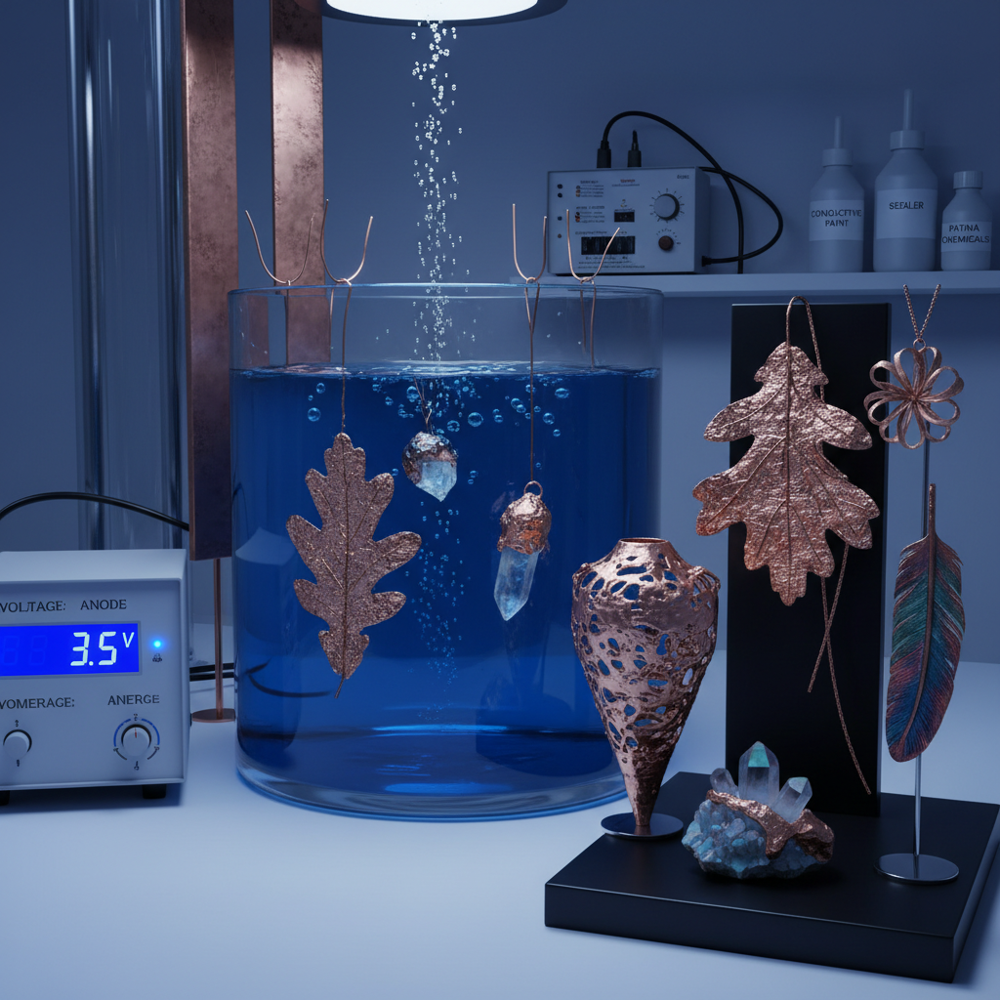

# Electroforming 电铸

> "Electroforming is patience crystallized — atom by atom, copper builds itself around a form in the dark bath, creating metal shells of impossible delicacy that no hammer or press could achieve." — Unknown

## 概述

电铸（Electroforming）是利用电镀原理在模具或物体表面沉积厚层金属，然后将金属层从模具上剥离（或保留在物体上）的工艺。与普通电镀（electroplating）不同，电铸沉积的金属层足够厚（通常0.5-5mm），可以作为独立的结构件使用。

电铸的基本原理是：将要被金属覆盖的物体（必须导电，或先涂导电层）浸入含有金属离子的电解液中，通电后金属离子在物体表面还原沉积。电铸最常用的金属是铜——铜电铸可以精确复制极其精细的表面细节。电铸在当代首饰制作中极其流行——艺术家将树叶、花朵、昆虫、晶体等自然物体电铸上铜，创造出保留了自然细节的金属首饰。

## 核心特征

| 特征 | 描述 |
|------|------|
| 电沉积 | 电化学沉积金属 |
| 厚层 | 足够厚的金属层 |
| 精确 | 精确复制表面细节 |
| 自然 | 可电铸自然物体 |
| 铜 | 最常用铜 |
| 首饰 | 当代首饰的热门技法 |

## 视觉特征

- **有机**：保留自然物体的形态
- **细节**：极精细的表面细节
- **铜色**：铜的暖色调
- **质感**：独特的电铸质感
- **轻盈**：中空的轻盈结构
- **自然**：自然与金属的结合

## 代表作品

| 作品 | 艺术家 | 年代 | 意义 |
|------|--------|------|------|
| *Electroformed leaves* | Various | 当代 | 电铸树叶首饰 |
| *Electroformed crystals* | Various | 当代 | 电铸水晶 |
| *Industrial electroforms* | Various | 现代 | 工业电铸件 |
| *Electroformed sculptures* | Various | 当代 | 电铸雕塑 |
| *Electroformed flowers* | Various | 当代 | 电铸花朵首饰 |

## 历史时间线

| 时期 | 事件 |
|------|------|
| 1838 | Moritz von Jacobi发明电铸 |
| 19世纪 | 电铸在印刷和雕塑复制中的应用 |
| 20世纪 | 工业电铸的发展 |
| 1960s | 电铸在电子工业中的应用 |
| 2000s | 电铸首饰的流行 |
| 当代 | 电铸作为当代艺术和首饰技法 |

## 中国语境

电铸在中国主要有两个应用领域：工业电铸和艺术首饰电铸。工业方面，中国的电铸技术广泛应用于模具制造、电子元件、光学反射镜等领域。艺术方面，电铸首饰在中国的手工首饰爱好者中越来越流行——社交媒体上有大量的铜电铸首饰教程和作品分享。中国的一些独立首饰品牌以电铸自然物体（树叶、花朵、蝴蝶等）为特色。中国的电商平台上有丰富的电铸设备和材料供应。

## AI生成概念图

## 与其他风格的关系

- **Electroplating** → 电镀
- **Copper Work** → 铜工艺
- **Jewelry Making** → 首饰制作
- **Nature Casting** → 自然铸造
- **Galvanism** → 电化学
- **Sculpture** → 雕塑

---

*浮光艺志 | Chronicle of Artistry*
