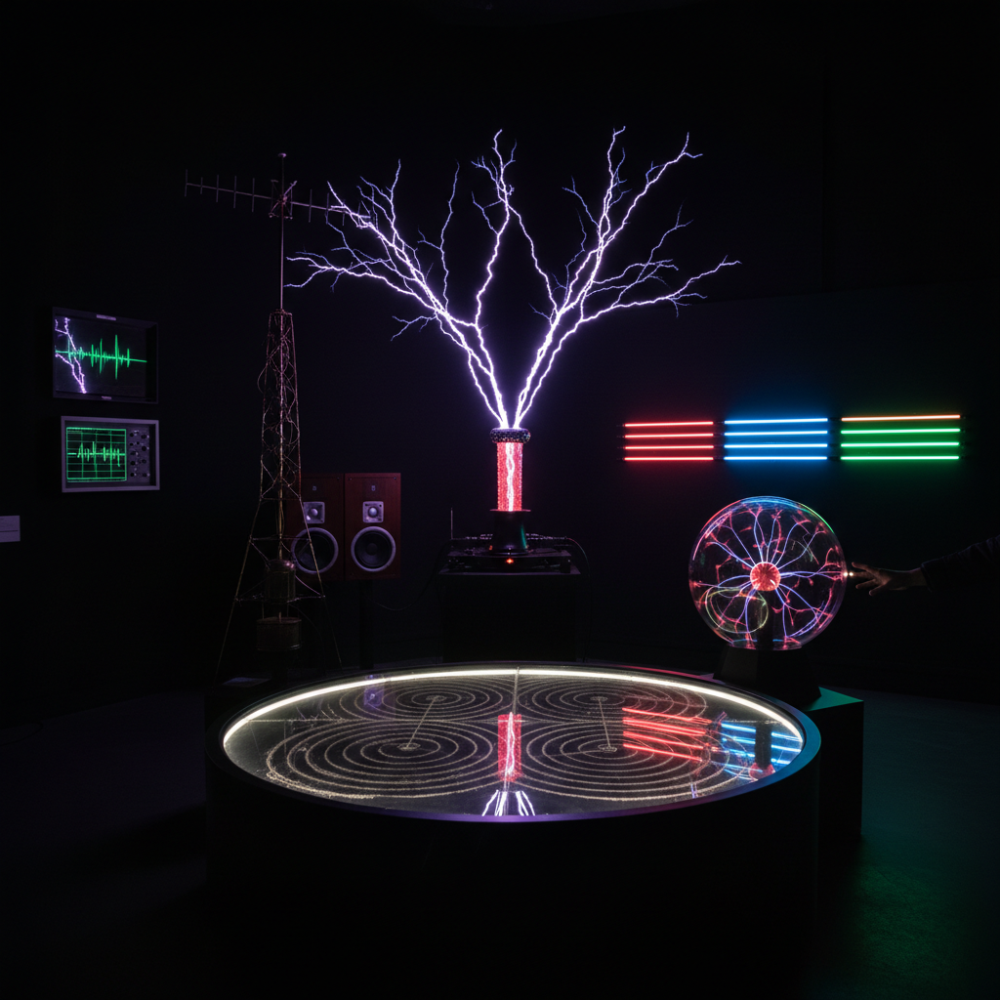

# Electromagnetic Art 电磁艺术

> "Electromagnetic art makes visible the invisible ocean of fields and waves in which we are perpetually immersed — radio waves passing through our bodies, magnetic fields aligning compass needles, electric currents flowing through wires, and the entire electromagnetic spectrum from gamma rays to radio waves that fills every cubic centimeter of space. We live inside an electromagnetic universe and never see it; the electromagnetic artist builds instruments to reveal this hidden reality." — Unknown

## 概述

电磁艺术（Electromagnetic Art）是以电磁现象——电场、磁场、电磁波、电磁感应等——为创作媒介和灵感的艺术实践。电磁力是自然界四种基本力之一，它支配着从原子到星系的几乎所有日常物理现象。

电磁艺术的实践包括：1）电磁场可视化——让不可见的电磁场变得可见（铁粉图案、等离子体）；2）无线电艺术——利用无线电波进行创作和传播；3）电磁干扰艺术——利用电磁干扰（EMI）产生的视觉和听觉效果；4）特斯拉线圈艺术——用特斯拉线圈产生壮观的电弧放电；5）电磁频谱艺术——将不同频率的电磁波转化为可感知的艺术体验；6）感应艺术——利用电磁感应原理创造互动装置。

## 核心特征

| 特征 | 描述 |
|------|------|
| 不可见 | 不可见的场和波 |
| 频谱 | 电磁频谱 |
| 感应 | 电磁感应 |
| 能量 | 电磁能量 |
| 无线 | 无线传播 |
| 普遍 | 无处不在 |

## 视觉特征

- **电弧**：特斯拉线圈的电弧
- **等离子**：等离子体的光芒
- **力线**：电磁力线图案
- **干扰**：电磁干扰的视觉噪声
- **光谱**：电磁频谱的色彩
- **辉光**：气体放电的辉光

## 代表作品

| 作品 | 艺术家 | 年代 | 意义 |
|------|--------|------|------|
| *Tesla coil performances* | Various | 2000年代 | 特斯拉线圈表演 |
| *Radio art* | Various | 1920年代至今 | 无线电艺术 |
| *EMF detection art* | Various | 2010年代 | 电磁场探测艺术 |
| *Plasma sculptures* | Various | 2000年代 | 等离子体雕塑 |
| *Electromagnetic installations* | Various | 当代 | 电磁装置 |

## 历史时间线

| 时期 | 事件 |
|------|------|
| 1820年代 | 电磁学的建立 |
| 1890年代 | Tesla的高频实验 |
| 1920年代 | 无线电艺术的开始 |
| 2000年代 | 特斯拉线圈音乐 |
| 当代 | 电磁频谱艺术 |

## 中国语境

电磁艺术在中国有独特的技术和文化背景。中国在电磁技术领域有大量投入——从5G通信到量子通信、从电磁弹射到磁悬浮列车。中国传统文化中对"气"的理解——气的流动和场的概念——与电磁场有某种哲学上的对应。中国古代对磁石的发现和指南针的发明是人类最早认识电磁现象的里程碑。中国当代的一些艺术家在探索电磁艺术：用电磁场探测器"听"中国城市的电磁环境、将中国5G基站的电磁辐射模式可视化、以及将中国传统的"气场"概念与当代电磁场艺术结合。

## AI生成概念图

## 与其他风格的关系

- **Magnetism Art** → 磁力艺术
- **Light Art** → 光艺术
- **Sound Art** → 声音艺术
- **Science Art** → 科学艺术
- **Radio Art** → 无线电艺术
- **Plasma Art** → 等离子体艺术

---

*浮光艺志 | Chronicle of Artistry*
