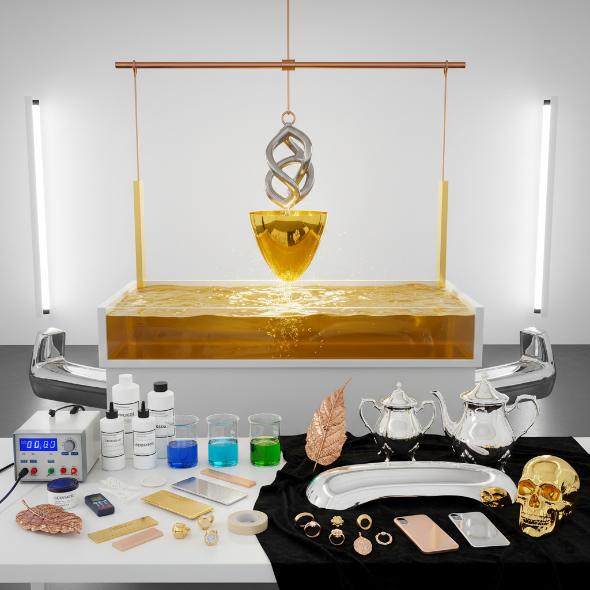

# Electroplating Art 电镀艺术

> "Electroplating is alchemy realized — base metals clothed in gold, silver, or copper through the invisible force of electricity. In an electroplating bath, ions of precious metal migrate through solution and deposit themselves atom by atom onto the surface of another object, building up a skin of gold or silver so thin it can be measured in microns, yet so perfect it transforms the appearance and properties of whatever it touches." — Unknown

## 概述

电镀艺术（Electroplating Art）是利用电化学原理在物体表面沉积一层金属薄膜的表面处理艺术——通过将物体浸入含有金属离子的电解液中并通电，使金属离子在物体表面还原沉积形成均匀的金属镀层。电镀可以赋予物体金、银、铜、铬等金属的外观和性能。

电镀艺术的实践包括：1）镀金——在物体表面镀上金层；2）镀银——在物体表面镀上银层；3）镀铜——在物体表面镀上铜层；4）镀铬——在物体表面镀上铬层；5）选择性电镀——通过遮蔽实现局部电镀；6）艺术电镀——将电镀作为艺术创作媒介；7）有机物电镀——在有机物表面电镀金属。

## 核心特征

| 特征 | 描述 |
|------|------|
| 薄膜 | 极薄的金属镀层 |
| 均匀 | 极其均匀的覆盖 |
| 光泽 | 金属的完美光泽 |
| 保护 | 防腐蚀保护 |
| 装饰 | 强大的装饰效果 |
| 经济 | 用少量贵金属达到效果 |

## 视觉特征

- **光泽**：完美的金属光泽
- **均匀**：极其均匀的表面
- **反射**：镜面般的反射效果
- **色彩**：各种金属的色彩
- **对比**：镀层与基体的对比
- **精致**：精致的表面质感

## 代表作品

| 作品 | 艺术家/文化 | 年代 | 意义 |
|------|-------------|------|------|
| *Gold-plated jewelry* | 珠宝行业 | 1840s至今 | 镀金首饰 |
| *Silver-plated tableware* | 餐具行业 | 1840s至今 | 镀银餐具 |
| *Chrome-plated automotive* | 汽车行业 | 1920s至今 | 镀铬汽车配件 |
| *Jeff Koons sculptures* | Jeff Koons | 当代 | 镀面艺术雕塑 |
| *Electroplated organic art* | 当代 | 当代 | 有机物电镀艺术 |

## 历史时间线

| 时期 | 事件 |
|------|------|
| 1805年 | 电镀原理的发现 |
| 1840年代 | 商业电镀的开始 |
| 19世纪末 | 电镀工业的成熟 |
| 20世纪 | 镀铬和装饰电镀的繁荣 |
| 当代 | 电镀在艺术和科技中的应用 |

## 中国语境

电镀艺术在中国有广泛的工业和装饰应用。中国是全球最大的电镀加工国——电镀行业涉及汽车、电子、珠宝、建筑等众多领域。中国传统的"鎏金"技术是电镀的前身——古代中国使用汞齐法在铜器表面镀金，是世界上最早的金属镀覆技术之一。中国的珠宝行业大量使用电镀——镀金、镀银、镀铑等工艺使首饰获得理想的外观。中国的汽车和电子行业是电镀的主要应用领域——从手机外壳到汽车装饰件。中国当代的一些艺术家将电镀作为创作媒介——在有机物（如花朵、昆虫）表面电镀金属创造超现实的艺术品。中国的电镀行业也面临环保挑战——传统电镀产生的废水和重金属污染促使行业向绿色电镀技术转型。

## AI生成概念图

## 与其他风格的关系

- **Electroforming** → 电铸艺术
- **Anodizing** → 阳极氧化艺术
- **Gold Art** → 黄金艺术
- **Jewelry Art** → 珠宝艺术
- **Industrial Design** → 工业设计
- **Surface Design** → 表面设计

---

*浮光艺志 | Chronicle of Artistry*
