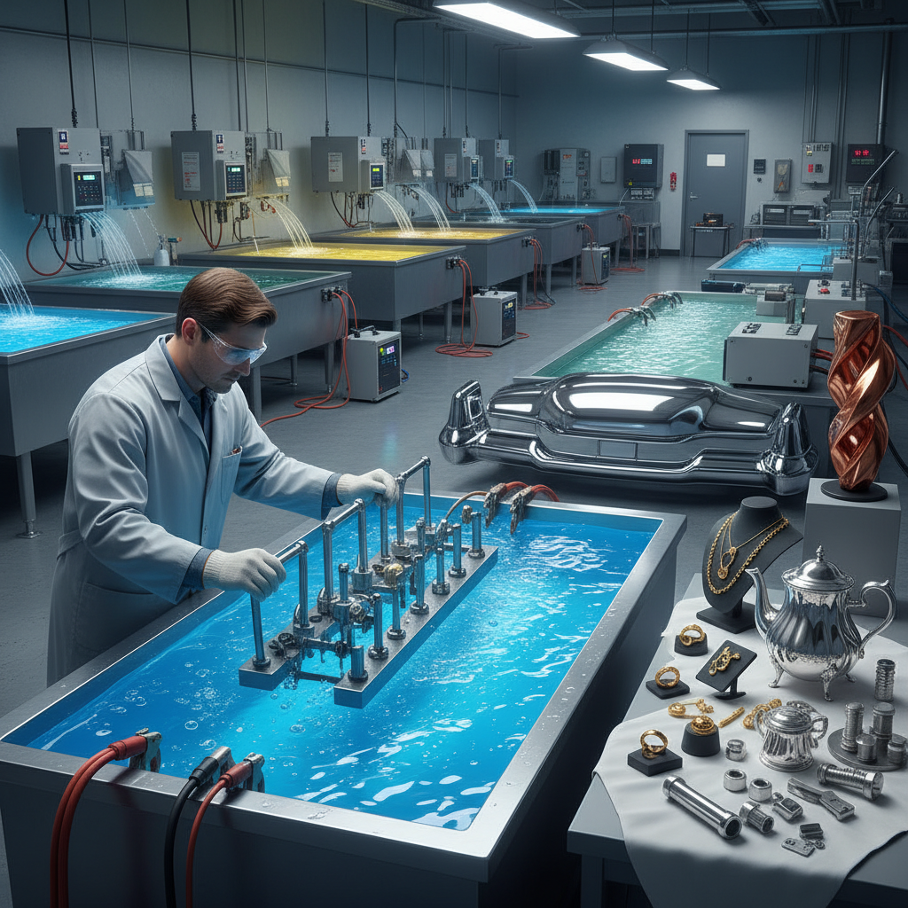

# Electroplating 电镀

> "Electroplating is transformation by immersion — base metals emerge from the bath wearing coats of silver, gold, or chrome, their surfaces reborn with the luster and protection of nobler elements." — Unknown

## 概述

电镀（Electroplating）是利用电化学原理在物体表面沉积一层薄金属膜的工艺。基本原理是：将要镀覆的物体（工件）作为阴极浸入含有镀层金属离子的电解液中，通电后金属离子在工件表面还原沉积，形成均匀的金属薄膜。

电镀是现代工业中最重要的表面处理技术之一——几乎所有金属制品都可能经过电镀处理。常见的电镀类型包括：镀铬（chrome plating，提供光亮耐磨的表面）、镀镍（nickel plating，防腐蚀）、镀金（gold plating，装饰和导电）、镀银（silver plating，装饰和导电）、镀锌（zinc plating，防锈）、镀铜（copper plating，打底和装饰）等。电镀在首饰、汽车、电子、建筑、家居等领域无处不在。

## 核心特征

| 特征 | 描述 |
|------|------|
| 电化学 | 电化学沉积 |
| 薄膜 | 形成薄金属膜 |
| 多金属 | 可镀多种金属 |
| 保护 | 防腐蚀保护 |
| 装饰 | 装饰性极强 |
| 工业 | 工业规模应用 |

## 视觉特征

- **光亮**：镜面般的光亮
- **均匀**：均匀的金属层
- **色彩**：不同金属的色彩
- **反射**：强烈的反射
- **光滑**：极其光滑的表面
- **金属**：纯正的金属质感

## 代表作品

| 作品 | 艺术家 | 年代 | 意义 |
|------|--------|------|------|
| *Chrome-plated car parts* | Various | 20世纪 | 镀铬汽车零件 |
| *Gold-plated jewelry* | Various | 各时期 | 镀金首饰 |
| *Silver-plated tableware* | Various | 19世纪起 | 镀银餐具 |
| *Electroplated sculptures* | Various | 当代 | 电镀雕塑 |
| *Chrome-plated furniture* | Various | 当代 | 镀铬家具 |

## 历史时间线

| 时期 | 事件 |
|------|------|
| 1805 | Luigi Brugnatelli首次电镀金 |
| 1840 | Elkington兄弟获得电镀专利 |
| 1850s | 镀银餐具的商业化 |
| 1920s | 镀铬技术的发展 |
| 20世纪 | 电镀在工业中的全面普及 |
| 当代 | 环保电镀技术的开发 |

## 中国语境

电镀在中国有着巨大的工业规模——中国是全球最大的电镀加工国之一。中国的电镀行业涵盖：汽车零部件、电子产品、五金件、首饰、卫浴产品等几乎所有制造业领域。中国的电镀产业集中在珠三角、长三角等制造业密集区。近年来，中国的电镀行业面临严格的环保监管——推动了清洁电镀技术和替代工艺的发展。在艺术领域，一些中国的当代艺术家使用电镀作为雕塑和装置艺术的表面处理手法。

## AI生成概念图

## 与其他风格的关系

- **Electroforming** → 电铸
- **Anodizing** → 阳极氧化
- **Gilding** → 鎏金
- **Chrome Art** → 镀铬艺术
- **Metal Finishing** → 金属表面处理
- **Industrial Design** → 工业设计

---

*浮光艺志 | Chronicle of Artistry*
