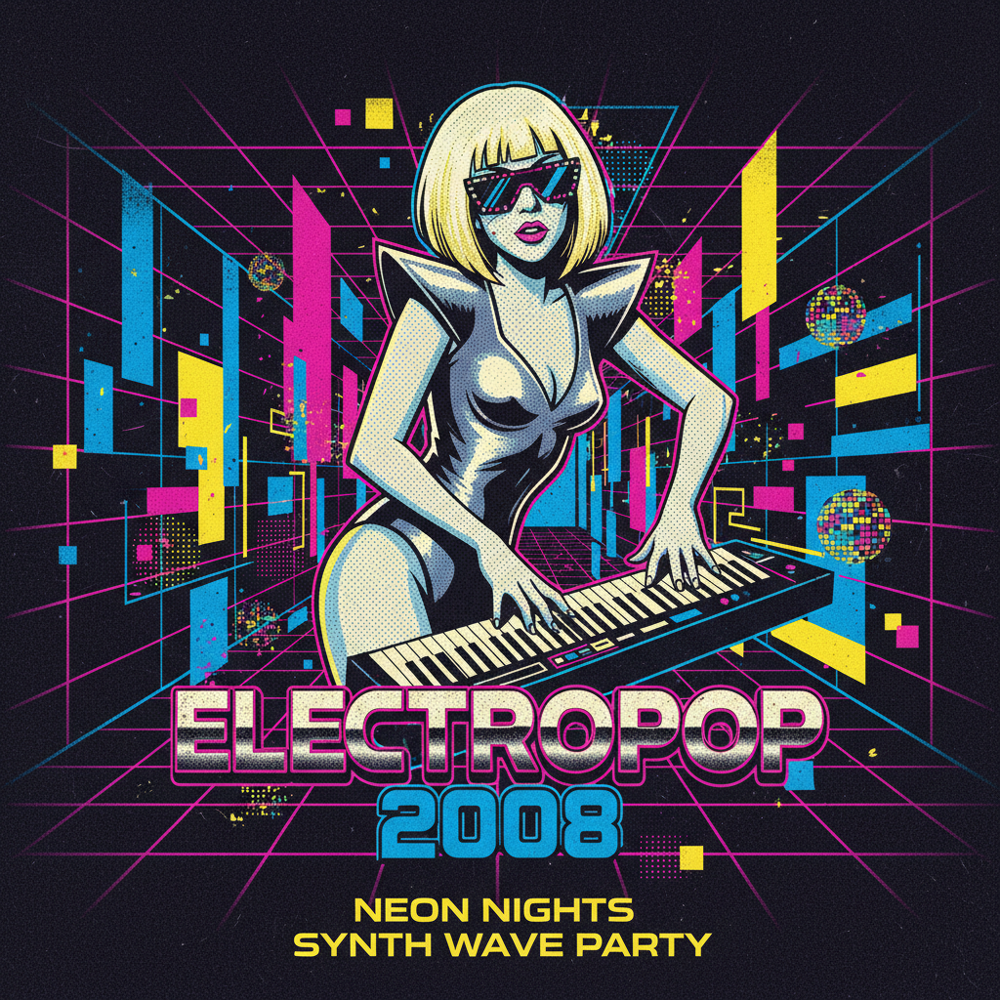

# Electropop 08 | 衰退流行美学

> 经济在崩塌，但舞池里的霓虹灯永远不会熄灭。



## 概述

Electropop 08（又称 **Recession Pop** / 衰退流行）是一种流行于 **2008–2013 年**的音乐与视觉设计美学。它诞生于全球金融危机的阴影下，却以极度高能、享乐主义和不顾一切的乐观主义作为回应——"世界在燃烧，那就跳舞吧。"

视觉上，它以**霓虹色、不对称前卫造型（Avantropop）、闪光材质和未来主义派对感**为标志，与 Frutiger Aero 时代部分重叠。

## 历史背景

- **2007**：Britney Spears 的《Blackout》专辑开启现代 Electropop 复兴
- **2008**：全球金融危机爆发，年轻人转向逃避主义的派对文化
- **2008–2010**：Lady Gaga、Ke$ha、Black Eyed Peas 统治流行乐坛
- **2010–2013**：EDM 浪潮兴起，Electropop 逐渐融入更广泛的电子舞曲
- **2013 后**：被 Tropical House 和极简流行取代

## 视觉特征

| 维度 | 典型元素 |
|------|----------|
| 色彩 | 霓虹粉、电光蓝、荧光绿、紫色、黑色底色 |
| 材质 | PVC、金属片、全息材质、LED、镜面 |
| 造型 | 不对称剪裁、夸张肩部、几何廓形、面具/墨镜 |
| 平面设计 | Avantropop 风格——大胆几何、霓虹渐变、故障效果 |
| 空间 | 夜店、舞池、LED 墙、激光灯阵 |
| 字体 | 粗体无衬线、霓虹发光效果、像素化 |

### Avantropop 设计风格

Avantropop（avant-garde + electropop 的合成词）特指这一时期的平面设计语言：
- Cartoon Network 的 "Noods" 时期 (2008–2010) 和 "CHECK it" 时期 (2010–2016)
- 大量使用不规则几何形状和霓虹配色
- 故障艺术（Glitch Art）元素的早期商业化应用

## 代表人物

### 音乐人
- **Lady Gaga** — 视觉与音乐的双重革命者，肉裙、泡泡裙、Poker Face
- **Ke$ha** — "派对动物"人设，闪粉妆容，Dollar Sign 美学
- **Britney Spears** — 《Blackout》开创者
- **Black Eyed Peas** — 《Boom Boom Pow》的未来主义 MV
- **David Guetta** — EDM 与流行的桥梁
- **LMFAO** — Party Rock Anthem，将 Electropop 推向极致

### 视觉创作者
- Nicola Formichetti — Lady Gaga 的造型师
- 各大唱片公司的 MV 导演团队

## 与其他风格的关系

```
Frutiger Aero (2004-2013) ← 清透自然的数字乐观
    ↕ 时代重叠
Electropop 08 (2008-2013) ← 霓虹派对的逃避主义
    ↓
Indie Sleaze (2006-2014) ← 地下版本的派对文化
```

- **vs Frutiger Aero**：同时代但情绪不同——Aero 是白天的清新，Electropop 08 是夜晚的狂欢
- **vs Synthwave**：都用霓虹和合成器，但 Synthwave 怀旧 80s，Electropop 08 面向当下
- **vs Indie Sleaze**：共享派对基因，但 Electropop 08 更主流、更精致、更"大制作"

## 中国语境

- 2008–2012 年中国夜店文化的黄金期
- 各大选秀节目中的舞台视觉设计
- QQ 音乐/酷狗上的"电音流行"分类
- 快乐大本营等综艺的舞台灯光美学

## 图库

> 🖼️ 待补充图片

**推荐图片来源（需手动下载）：**
- https://aesthetics.fandom.com/wiki/Electropop_08
- https://www.are.na/steves-peeps/electropop-08
- Pinterest 搜索 "electropop 08 aesthetic neon 2008"
- Lady Gaga 2008-2012 MV 截图
- Cartoon Network Noods/CHECK it 时期视觉

## 参考链接

- [Aesthetics Wiki: Electropop 08](https://aesthetics.fandom.com/wiki/Electropop_08)
- [Aesthetics Wiki: Recession Pop](https://aesthetics.fandom.com/wiki/Recession_Pop)
- [Are.na: Electropop 08](https://www.are.na/steves-peeps/electropop-08)

---

[← Cassette Futurism](cassette-futurism.md) | [→ Gen X Soft Club](gen-x-soft-club.md) | [↑ 返回目录](README.md)
