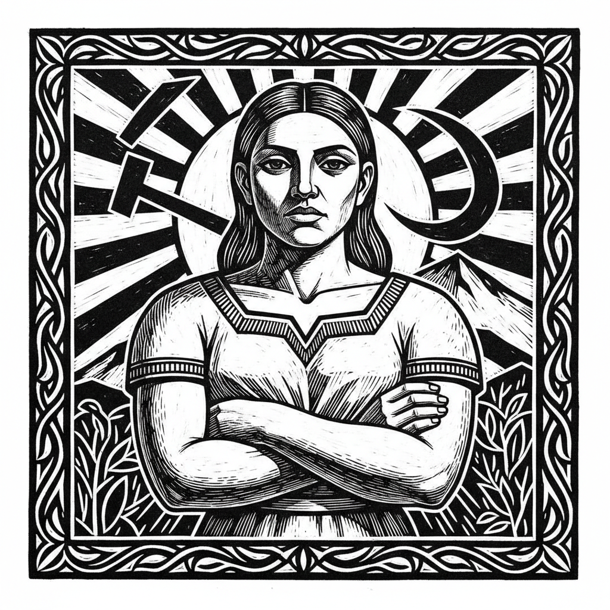

# Elizabeth Catlett 伊丽莎白·卡特利特

> **时期：** 1915–2012  
> **关键词：** 黑人女性力量、版画与雕塑、墨西哥壁画运动、社会正义

## 概述

Elizabeth Catlett 是美国裔墨西哥雕塑家和版画家，以描绘黑人女性的力量、尊严和抗争而闻名。她师从Grant Wood，后赴墨西哥与壁画运动艺术家合作，将墨西哥社会现实主义与非裔美国经验结合，创造出兼具纪念碑性和亲密感的作品。

## 风格特征

- **纪念碑性女性形象**：黑人女性被塑造为具有雕塑般力量的英雄
- **简化的体量**：人物形态被简化为强有力的几何体量，保持有机感
- **版画的图形力量**：木刻和石版画以强烈的黑白对比传达政治信息
- **墨西哥影响**：从里维拉和奥罗斯科处学到的社会叙事和纪念碑性
- **触觉表面**：雕塑作品强调光滑与粗糙的对比，邀请触摸

## 代表作品

- *Sharecropper*（1952/1968）
- *Black Unity*（1968）
- *Homage to My Young Black Sisters*（1968）
- *Mother and Child*（1956）

## 历史意义

Catlett 是20世纪最重要的非裔美国雕塑家之一，她的作品将艺术与社会正义不可分割地结合在一起。她证明了版画和雕塑可以同时是高度精炼的形式探索和有效的政治工具。

## 概念图

