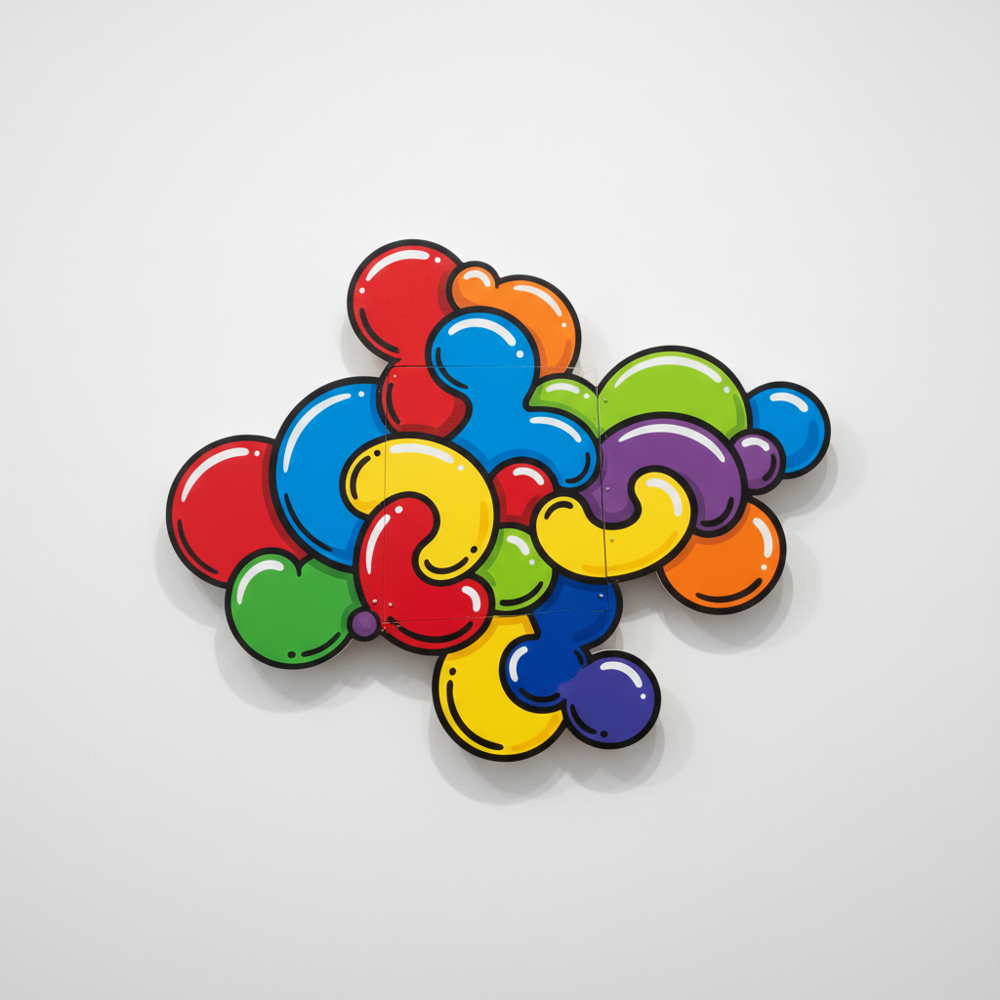

# Elizabeth Murray 伊丽莎白·默里

> **时期：** 1940–2007  
> **关键词：** 异形画布、卡通抽象、色彩爆炸、后极简主义绘画

## 概述

Elizabeth Murray 是美国画家，以打破矩形画布限制的异形绘画闻名。她将卡通般的有机形态、鲜艳色彩和日常物品（杯子、桌子、画笔）的变形融入大尺幅的多面板作品中，创造出既幽默又严肃、既抽象又叙事的独特绘画语言。她是少数在极简主义和观念艺术主导的时代坚持绘画并获得最高认可的女性艺术家。

## 风格特征

- **异形画布**：画布被切割、弯曲、多层叠加，打破传统矩形边界
- **卡通有机形态**：形状如同膨胀的气球或变形的日常物品
- **鲜艳色彩**：大胆的纯色对比，具有波普艺术的活力
- **日常物品变形**：杯子、勺子、桌子等家庭物品被抽象化为宇宙般的形态
- **多面板构成**：多块画布组合为一个整体，创造出浮雕般的空间感

## 代表作品

- *More Than You Know*（1983）
- *Dis Pair*（1989–1990）
- *Do the Dance*（2005）
- *Bop*（2002–2003）

## 历史意义

Murray 证明了绘画在后现代时代仍然可以创新和激进。她将抽象表现主义的能量、波普的色彩和女性主义的日常关注融为一体，为21世纪的绘画复兴铺平了道路。

## 概念图

