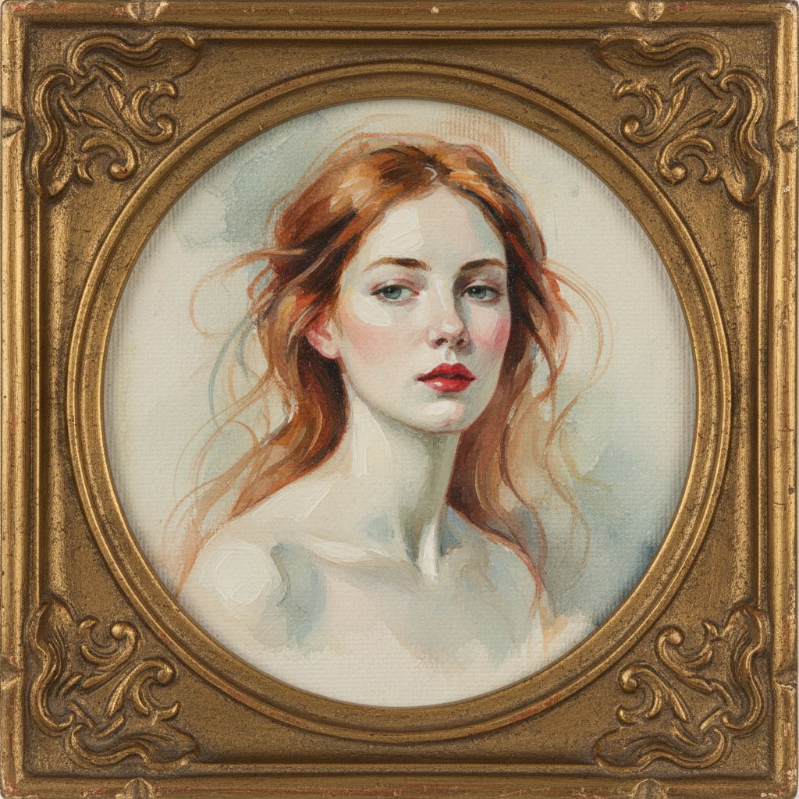

# Elizabeth Peyton 伊丽莎白·佩顿

> **时期：** 1965–至今  
> **关键词：** 亲密肖像、名人崇拜、薄涂油画、浪漫主义回响

## 概述

Elizabeth Peyton 是美国当代画家，以小幅、薄涂的亲密肖像画闻名。她描绘的对象横跨历史人物（拿破仑、路德维希二世）和当代名人（Kurt Cobain、Leonardo DiCaprio），以及身边的朋友和爱人，用一种近乎迷恋的目光赋予每个对象青春的光晕。

## 风格特征

- **小尺幅亲密感**：多数作品不超过40厘米，需要观者靠近凝视
- **薄涂透明**：油彩稀薄如水彩，画布纹理透出，光线从内部发散
- **红唇与苍白**：人物面部常呈现贵族式的苍白，嘴唇和眼眶带有玫瑰色
- **浪漫化处理**：无论对象是谁，都被赋予一种理想化的青春美感
- **松散线条**：轮廓以流畅的单线勾勒，不追求体积感

## 代表作品

- *Kurt Cobain*（1995）
- *Napoleon*（1991）
- *Craig*（1997）
- *Liam Gallagher*（1996）

## 历史意义

Peyton 在1990年代概念艺术主导的纽约艺术界重新确立了绘画和美的合法性，她证明了"好看"本身可以是一种严肃的艺术立场，而非肤浅的妥协。

## 概念图

