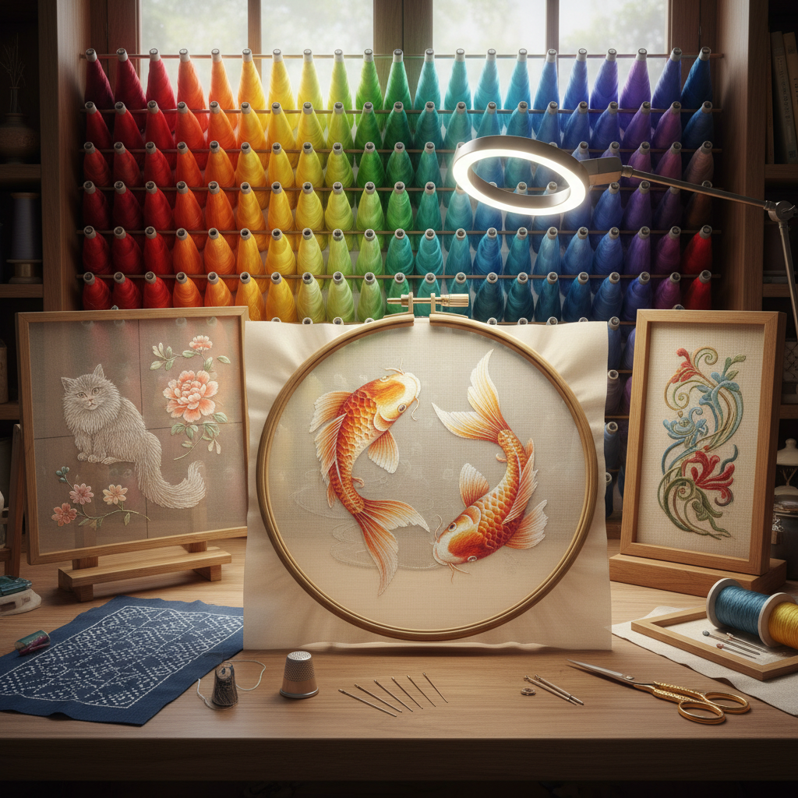

# Embroidery Art 刺绣艺术

> "Embroidery is painting with thread — each stitch a brushstroke, each color change a decision about light and shadow, each finished piece containing thousands of individual gestures accumulated over hours, days, sometimes years of patient work. It is art that carries time within it, art that records the rhythm of the maker's hand in every loop and knot, art that transforms flat fabric into landscapes of texture and color." — Unknown

## 概述

刺绣艺术（Embroidery Art）是用针和线在织物上创造装饰性图案和图像的艺术形式——通过各种针法将彩色丝线、棉线或毛线绣在布料上，创造出从简单图案到复杂画面的各种作品。刺绣是世界上最古老和最广泛分布的纺织装饰艺术之一。

刺绣艺术的实践包括：1）传统刺绣——各文化的传统刺绣技法；2）丝绣——用丝线进行的精细刺绣；3）十字绣——按网格图案的计数刺绣；4）自由刺绣——不受图案限制的自由创作；5）机绣——用缝纫机进行的刺绣；6）当代刺绣——将刺绣作为当代艺术媒介的创作；7）立体刺绣——创造三维效果的刺绣技法。

## 核心特征

| 特征 | 描述 |
|------|------|
| 针线 | 以针和线为工具 |
| 耐心 | 需要极大的耐心 |
| 精细 | 极其精细的工艺 |
| 色彩 | 丰富的线色选择 |
| 纹理 | 独特的线条纹理 |
| 传统 | 深厚的文化传统 |

## 视觉特征

- **针迹**：可见的针迹纹理
- **色彩**：丝线的丰富色彩
- **光泽**：丝线的光泽感
- **层次**：针法叠加的层次
- **细节**：极其精细的细节
- **立体**：某些针法的立体效果

## 代表作品

| 作品 | 艺术家/传统 | 年代 | 意义 |
|------|-------------|------|------|
| *Bayeux Tapestry* | 中世纪 | 约1070年 | 叙事性刺绣经典 |
| *Chinese silk embroidery* | 中国传统 | 古代至今 | 中国丝绣 |
| *Japanese sashiko* | 日本传统 | 古代至今 | 日本刺子绣 |
| *Contemporary embroidery* | Various | 当代 | 当代刺绣艺术 |
| *Embroidered portraits* | Cayce Zavaglia | 当代 | 超写实刺绣肖像 |

## 历史时间线

| 时期 | 事件 |
|------|------|
| 古代 | 世界各文明的刺绣传统 |
| 中世纪 | 欧洲宗教刺绣和贝叶挂毯 |
| 明清 | 中国刺绣的黄金时代 |
| 19世纪 | 工艺美术运动中的刺绣复兴 |
| 当代 | 刺绣的当代艺术化 |

## 中国语境

刺绣艺术在中国有极其辉煌的传统——中国是世界上刺绣历史最悠久、技艺最精湛的国家之一。中国的四大名绣——苏绣、湘绣、蜀绣、粤绣——各有特色，代表了中国刺绣的最高水平。苏绣以精细著称——双面绣可以在一块薄纱的两面绣出不同的图案。中国的刺绣传统与丝绸文化密不可分——丝线的光泽和柔韧性使中国刺绣具有独特的美感。中国的刺绣被列入国家级非物质文化遗产——各地都有刺绣传承人在努力保护和发展这一技艺。中国当代的一些艺术家将刺绣作为当代艺术媒介——探索传统工艺与现代表达的结合。中国的刺绣产业在苏州、长沙等地仍然活跃——从高端艺术品到旅游纪念品都有生产。

## AI生成概念图

## 与其他风格的关系

- **Textile Art** → 纺织艺术
- **Needlework** → 针线工艺
- **Cross Stitch** → 十字绣
- **Tapestry** → 挂毯艺术
- **Fiber Art** → 纤维艺术
- **Folk Art** → 民间艺术

---

*浮光艺志 | Chronicle of Artistry*
