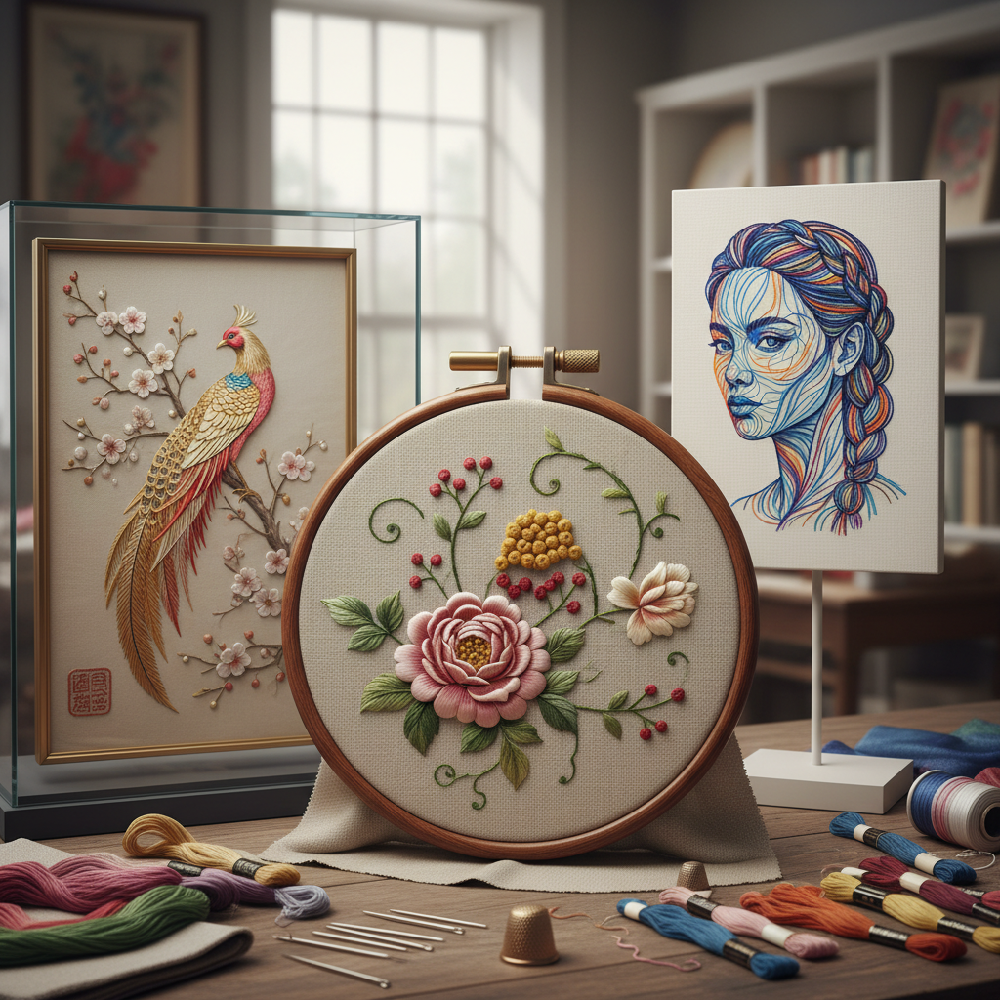

# Embroidery 刺绣

> "Embroidery is painting with thread — each stitch a brushstroke, each color a whisper of silk against fabric." — Unknown

## 概述

刺绣（Embroidery）是使用针和线在织物上缝制装饰图案的艺术。这是人类最古老、最普遍的装饰艺术之一——从中国的苏绣到印度的扎尔多兹，从日本的刺子绣到欧洲的十字绣，几乎每个文化都有自己独特的刺绣传统。刺绣的魅力在于它的无限可能性——数百种针法、无数种线材、任何图案都可以通过针线在布上实现。

刺绣的哲学在于：以线为墨——一针一线，如同书写，将时间、耐心和情感缝入织物，创造出比绘画更有温度的图像。

## 核心特征

| 特征 | 描述 |
|------|------|
| 针线 | 使用针和线 |
| 底布 | 在织物上工作 |
| 针法 | 数百种针法 |
| 装饰 | 装饰性的艺术 |
| 普遍 | 全球普遍的传统 |
| 耐心 | 需要极大耐心 |

## 视觉特征

- **质感**：线的质感和光泽
- **色彩**：丰富的色彩表现
- **细节**：精细的图案细节
- **层次**：针法的层次变化
- **光泽**：丝线的光泽效果
- **立体**：某些针法的立体感

## 代表作品

| 作品 | 艺术家 | 年代 | 意义 |
|------|--------|------|------|
| *Bayeux Tapestry* | 匿名 | 11世纪 | 贝叶挂毯（实为刺绣） |
| *Chinese silk embroidery* | 匿名 | 传统 | 中国丝绸刺绣 |
| *Opus Anglicanum* | 匿名 | 13-14世纪 | 英国教会刺绣 |
| *William Morris designs* | William Morris | 19世纪 | 工艺美术运动 |
| *Contemporary embroidery* | Various | 当代 | 当代刺绣艺术 |

## 历史时间线

| 时期 | 事件 |
|------|------|
| 公元前3000年 | 最早的刺绣证据 |
| 古代 | 各文明的刺绣发展 |
| 中世纪 | 欧洲教会刺绣的巅峰 |
| 16-18世纪 | 宫廷刺绣的黄金时代 |
| 19世纪 | 工艺美术运动的复兴 |
| 当代 | 当代刺绣艺术的繁荣 |

## 中国语境

中国是世界刺绣艺术的重要发源地和最高成就者之一。中国四大名绣——苏绣、湘绣、蜀绣、粤绣——各有特色，都是国家级非物质文化遗产。苏绣的双面绣可以在一块薄纱上绣出正反两面不同的图案；湘绣的狮虎栩栩如生；蜀绣的锦鲤灵动自然；粤绣的金银线辉煌华丽。此外还有顾绣、京绣、汴绣等众多流派。中国刺绣不仅是装饰艺术，更是文化传承和女性智慧的结晶。

## AI生成概念图

## 与其他风格的关系

- **Cross Stitch** → 十字绣
- **Needle Lace** → 针蕾丝（从刺绣演化）
- **Textile Art** → 纺织艺术
- **Sashiko** → 日本刺子绣
- **Crewelwork** → 毛线刺绣
- **Fashion** → 时装刺绣

---

*浮光艺志 | Chronicle of Artistry*
