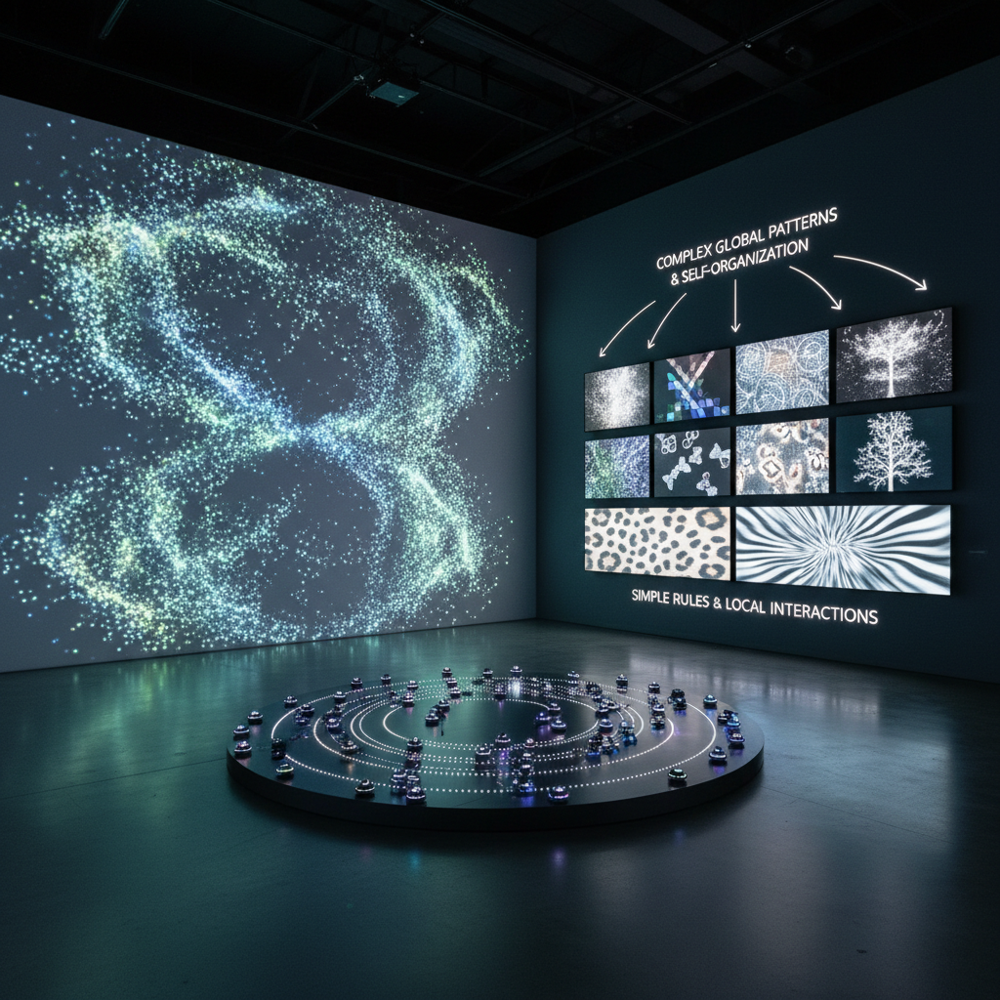

# Emergent Art 涌现艺术

> "Emergent art proves that the whole is not merely greater than the sum of its parts — it is qualitatively different from anything the parts could predict. When a thousand simple agents follow simple rules, complexity emerges that no single agent intended or foresaw: flocking patterns from birds that only know three rules, consciousness from neurons that only know how to fire, cities from humans that only know how to trade and talk. Emergent art harnesses this miracle of complexity arising from simplicity, creating works where the artist designs the conditions but cannot predict the outcome." — Steven Johnson

## 概述

涌现艺术（Emergent Art）是利用"涌现"（emergence）现象——简单规则产生复杂行为——进行创作的艺术实践。涌现是复杂系统科学的核心概念：当大量简单元素按照简单规则相互作用时，会在宏观层面产生全新的、不可预测的复杂模式和行为。

涌现艺术的实践包括：1）多智能体系统——设计大量简单"智能体"（agents），让它们的集体行为产生复杂的视觉模式；2）元胞自动机——使用简单的局部规则产生全局的复杂图案；3）自组织系统——创造能够自发形成有序结构的系统；4）反馈循环——利用正反馈和负反馈产生动态的复杂行为；5）不可预测性——拥抱系统行为的不可预测性作为创作的一部分。

## 核心特征

| 特征 | 描述 |
|------|------|
| 简单 | 简单规则 |
| 复杂 | 复杂行为 |
| 涌现 | 涌现现象 |
| 自组织 | 自组织 |
| 不可预测 | 不可预测 |
| 集体 | 集体行为 |

## 视觉特征

- **群体**：大量元素的集体运动
- **模式**：自发形成的模式
- **流动**：流体般的运动
- **分形**：自相似的结构
- **动态**：持续变化的状态
- **有机**：有机的形态

## 代表作品

| 作品 | 艺术家 | 年代 | 意义 |
|------|--------|------|------|
| *Boids* | Craig Reynolds | 1987 | 群体行为模拟 |
| *Game of Life art* | Various | 1970年代至今 | 生命游戏艺术 |
| *Swarm art* | Various | 2000年代 | 群体智能艺术 |
| *Reaction-diffusion* | Various | 2010年代 | 反应扩散艺术 |
| *Neural cellular automata* | Various | 2020年代 | 神经元胞自动机 |

## 历史时间线

| 时期 | 事件 |
|------|------|
| 1970 | Conway的生命游戏 |
| 1987 | Craig Reynolds的Boids |
| 1990年代 | 复杂系统科学的发展 |
| 2000年代 | 涌现艺术的成熟 |
| 当代 | AI与涌现的结合 |

## 中国语境

涌现艺术在中国有独特的哲学共鸣。中国传统思想中的"道生一，一生二，二生三，三生万物"——从简单到复杂的生成过程——与涌现的概念有深刻的对应。中国传统的围棋——简单的规则产生无穷的复杂性——是涌现的完美例证。中国传统哲学中的"无为而治"——不直接控制而让秩序自发涌现——也与涌现艺术的方法论相呼应。中国当代的一些艺术家和程序员在探索涌现艺术：创造基于简单规则的复杂视觉系统、利用群体智能算法生成艺术、以及将中国传统的"生生不息"观念与计算涌现结合。

## AI生成概念图

## 与其他风格的关系

- **Generative Art** → 生成艺术
- **Systems Art** → 系统艺术
- **Swarm Art** → 群体艺术
- **Cellular Automata Art** → 元胞自动机艺术
- **Complexity Art** → 复杂性艺术
- **Procedural Art** → 程序化艺术

---

*浮光艺志 | Chronicle of Artistry*
