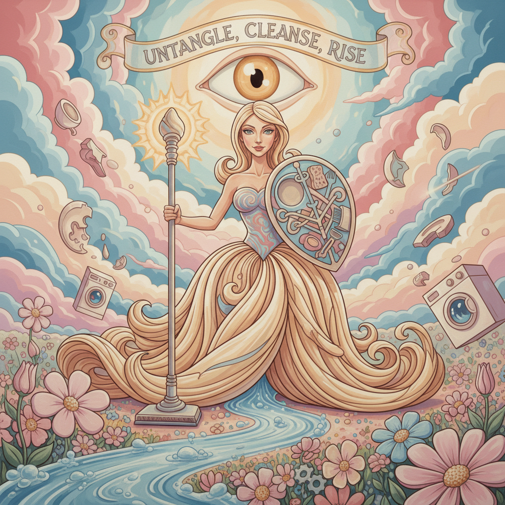

# Emily Mae Smith 艾米丽·梅·史密斯

> **时期：** 1979–至今  
> **关键词：** 女性主义寓言、扫帚图腾、波普超现实、精密技法

## 概述

Emily Mae Smith 是美国当代画家，以精密的技法和女性主义寓言叙事闻名。她的标志性形象是一把拟人化的扫帚——既是家务劳动的象征，也是女巫权力的隐喻。她的作品融合了波普艺术的清晰轮廓、超现实主义的梦境逻辑和文艺复兴的构图智慧。

## 风格特征

- **精密表面**：颜料均匀光滑，笔触不可见，如同数字插画的物理版本
- **扫帚图腾**：反复出现的拟人化扫帚形象，承载多重女性主义隐喻
- **波普轮廓**：清晰的边缘线和平涂色块，继承利希滕斯坦的视觉语言
- **寓言叙事**：每幅画都是一个可解读的故事，充满象征和引用
- **柔和色调**：以粉色、淡蓝、米色为主，营造看似无害的甜美表面

## 代表作品

- *Broom Life*（2014）
- *A Banquet*（2019）
- *The Harvest*（2017）
- *Medusa's Muse*（2020）

## 历史意义

Smith 代表了当代绘画中"精密叙事"的回归——在抽象和概念艺术主导数十年后，她证明了具有明确含义的图像绘画仍然可以在智识上具有深度，同时在视觉上令人愉悦。

## 概念图

