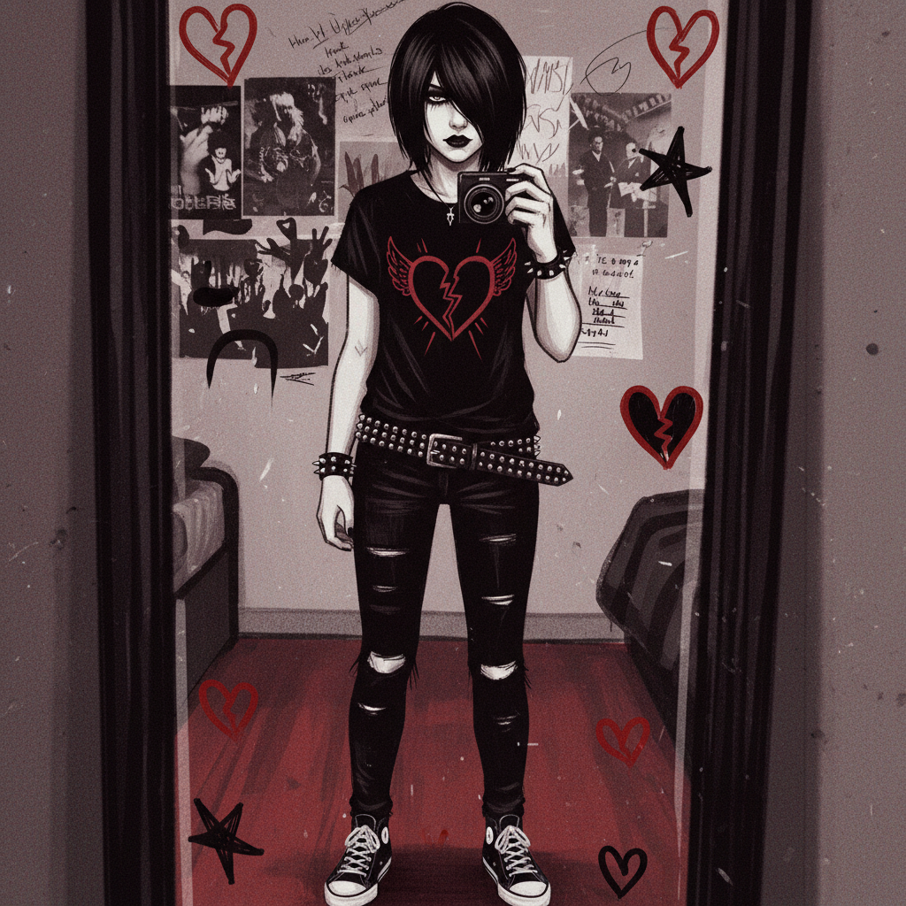
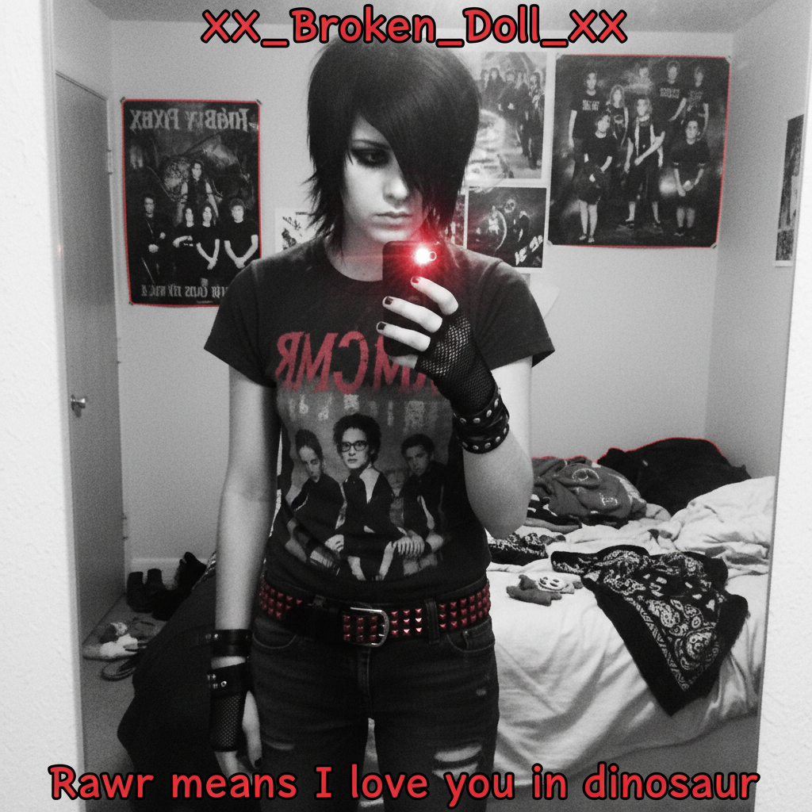

# Emo (Visual Aesthetic)

> **别名**：Emo Style, Emo Fashion, MySpace Emo  
> **活跃年代**：2003 – 2012（巅峰期）；2020s 回潮  
> **核心平台**：MySpace、LiveJournal、Photobucket、DeviantArt

---

## 一句话定义

Emo 作为视觉美学，是 2000 年代最具辨识度的青年亚文化形象之一——以**遮眼斜刘海、黑色紧身裤、乐队 T 恤和浓重眼线**为标志，通过外在形象表达内在的情感强度和脆弱性。

---

## 视觉语言

| 元素 | 描述 |
|------|------|
| 发型 | 厚重斜刘海遮住一只眼睛、黑色或黑+彩色挑染 |
| 服装 | 黑色紧身牛仔裤、乐队 T 恤、帆布鞋（Converse/Vans） |
| 配饰 | 铆钉腰带、手环、唇环/眉环、黑色指甲油 |
| 妆容 | 浓重黑色眼线（不分性别）、苍白肤色 |
| 色彩 | 黑色为主，搭配红色、紫色或荧光色点缀 |
| 图案 | 骷髅、碎心、星星、剪刀、X 标记 |
| 摄影 | 高对比度自拍、俯拍角度、MySpace 镜子自拍 |

### "MySpace 角度"：一种摄影语法

Emo 时代发展出了一套极其标准化的自拍语法：

| 技巧 | 目的 |
|------|------|
| 俯拍 45° | 让眼睛显大、脸显小 |
| 镜子自拍 | 展示全身穿搭 |
| 高对比度/去饱和 | 营造戏剧性情绪 |
| 遮住半张脸 | 神秘感 + 展示刘海 |
| 侧脸 + 低头 | 忧郁姿态 |
| 闪光灯直射 | 苍白肤色 + 眼线突出 |

这套语法如此标准化，以至于"MySpace angle"成为了一个独立的文化 meme——它是人类历史上第一套**大规模传播的自拍美学规范**。

---

## 历史时间线

| 时期 | 事件 |
|------|------|
| 1984-1986 | Emo 作为音乐流派在华盛顿 D.C. 硬核朋克圈诞生（Rites of Spring、Embrace） |
| 1990s | 第二波 Emo（Sunny Day Real Estate、American Football、Cap'n Jazz） |
| 2001 | Jimmy Eat World *Bleed American* 进入主流 |
| 2001-2003 | Dashboard Confessional 将 Emo 带入 MTV；视觉风格开始形成 |
| 2004 | My Chemical Romance *Three Cheers for Sweet Revenge*；Emo 视觉爆发 |
| 2005 | Fall Out Boy *From Under the Cork Tree*；MySpace 成为 Emo 的数字家园 |
| 2006 | **文化巅峰**：My Chemical Romance *The Black Parade*；Panic! At The Disco 走红 |
| 2006-2007 | "Emo"成为主流媒体热词；引发道德恐慌和校园禁令 |
| 2007 | Paramore *Riot!*；Emo 开始与 Pop Punk 融合 |
| 2008-2009 | Scene 文化从 Emo 中分化；两者开始混合 |
| 2010-2012 | Emo 逐渐退出主流；被 Tumblr 文化和 Indie 取代 |
| 2012-2016 | "Emo Revival"：Modern Baseball、The World Is a Beautiful Place |
| 2019-2020 | My Chemical Romance 重组；TikTok "emo revival" |
| 2020-2022 | Machine Gun Kelly 转型 Pop Punk/Emo；Olivia Rodrigo 带有 Emo 元素 |
| 2023+ | Emo 元素融入主流时尚（黑色眼线、乐队 T 恤作为"复古"单品） |

---

## 文化内核

### 情感作为身份

Emo 的核心主张是：**感受强烈的情感不是软弱，而是一种勇气**。在一个要求男孩"坚强"、女孩"乖巧"的文化中，Emo 提供了一个允许所有人公开表达悲伤、焦虑和脆弱的空间。

这种情感政治在当时是激进的：
- 男性哭泣被接受甚至被鼓励
- 心理健康话题被公开讨论
- "不酷"（uncool）的真诚被视为一种美德
- 日记式的歌词取代了传统摇滚的"硬汉"叙事

### MySpace 作为舞台

MySpace 对 Emo 美学的传播至关重要：

**个人主页自定义**：
- 黑色背景 + 星星/心形装饰
- 乐队音乐自动播放（通常是 MCR 或 FOB）
- 自定义 CSS 皮肤
- 大量嵌入式 Flash 小部件

**社交功能**：
- **Top 8 好友**：社交关系的公开展示和戏剧性来源
- **照片文化**：浴室镜自拍成为标准姿势
- **乐队发现**：Fall Out Boy、Panic! At The Disco 都通过 MySpace 走红
- **留言板**：公开的情感表达和社交互动

**MySpace 的消亡与 Emo 的衰落几乎同步**——这不是巧合。Emo 需要一个允许深度自定义和情感表达的平台，而 Facebook/Instagram 的标准化界面无法承载这种文化。

### 与 Scene 的区别与融合

| 维度 | Emo | Scene |
|------|-----|-------|
| 情绪 | 忧郁、内省、脆弱 | 欢快、外向、自信 |
| 色彩 | 黑色为主 | 荧光色、彩虹 |
| 音乐 | Post-hardcore、Screamo | Crunkcore、Electronica |
| 态度 | "没人理解我" | "看看我多酷" |
| 发型 | 黑色斜刘海 | 彩色蓬松造型 |
| 品牌 | Converse、Hot Topic | Hello Kitty、Tokidoki |
| 平台 | LiveJournal → MySpace | MySpace → Stickam |

实际上两者在 2006-2010 年间高度重叠，很多人同时具有两种风格的元素。Scene 可以被理解为"Emo 的欢快表亲"——保留了视觉框架（刘海、紧身裤、配饰），但替换了情绪内核。

---

## 视觉艺术风格

Emo 时代发展出一种独特的插画和平面设计风格：

### 插画特征
- 大眼睛、小嘴巴的卡通人物（受日本动漫影响）
- 黑色轮廓线 + 有限色彩（黑、红、白）
- 碎心、星星、音符等装饰元素
- 手写体文字（歌词、诗句）
- 常见于 DeviantArt 和 LiveJournal 头像

### 专辑美术
- My Chemical Romance 的 Gerard Way 本人是漫画家（后创作 *The Umbrella Academy*）
- *The Black Parade* 的维多利亚哥特视觉
- Fall Out Boy 专辑封面的摄影风格
- Panic! At The Disco 的马戏团/巴洛克美学

### 乐队 Logo 设计
- 手写体/涂鸦风格
- 心形、星星、骷髅融入字母
- 黑白为主，偶尔加红色
- 贴纸化——设计为可以贴在书包、吉他盒上

---

## 争议与误解

### "Emo = 自残"的刻板印象

2006-2008 年间，主流媒体（特别是英国小报）大肆渲染"Emo 导致青少年自残"的叙事：
- Daily Mail 称 Emo 为"自残邪教"
- 多所学校禁止 Emo 着装
- 俄罗斯甚至考虑立法限制 Emo 文化

这是一种有害的简化。虽然 Emo 文化确实讨论心理健康话题，但：
- 将整个亚文化病理化忽视了它作为**情感支持社区**的积极功能
- 许多 Emo 青少年表示，这个社区是他们唯一可以谈论心理健康的地方
- 研究表明，亚文化归属感实际上可以**降低**孤立感和自杀风险

### 性别流动性的先驱

Emo 美学在 2000 年代就模糊了性别界限：
- 男性化妆（眼线）被接受甚至被期待
- 紧身裤不分性别
- 情感表达不受"男子气概"约束
- 中性化的瘦削身材审美
- 男性之间的身体亲密（拥抱、亲吻脸颊）被接受

这使得 Emo 成为许多 LGBTQ+ 青少年的早期安全空间。2020 年代的回顾性研究发现，Emo 社区中 LGBTQ+ 比例显著高于一般人群。

### 阶级维度

Emo 时尚看似"反主流"，但实际上需要一定的经济基础：
- Hot Topic 的商品并不便宜
- 染发和维护需要持续投入
- 乐队 T 恤和演唱会门票是身份标记
- 这使得 Emo 在某种程度上是一种**中产阶级亚文化**

---

## 中国语境

Emo 在中国有独特的传播路径：

### 2005-2010：非主流时代
- "非主流"文化与 Emo/Scene 高度重叠
- QQ 空间的黑色皮肤和伤感签名
- 45° 角自拍 + 高对比度滤镜
- "杀马特"中的 Emo 元素（虽然杀马特更接近 Scene/Visual Kei）

### 2020s：Emo 的中文互联网含义转变
- "emo 了"成为流行网络用语，意为"情绪低落"
- 与原始 Emo 亚文化脱钩，成为通用情绪表达
- 这种语义漂移本身就是文化传播的有趣案例

---

## 当代回响

| 现象 | 与 Emo 的关系 |
|------|--------------|
| **Emo Revival**（2012-2016） | Modern Baseball、The World Is a Beautiful Place——音乐回归 |
| **TikTok Emo**（2020s） | 年轻一代重新发现 2000s Emo 音乐和时尚 |
| **E-girl/E-boy** | 继承了 Emo 的部分视觉元素（眼线、黑色、情感表达） |
| **Hyperpop** | 音乐上融合了 Emo 的情感强度和电子制作 |
| **Olivia Rodrigo** | *SOUR* 专辑的 Emo/Pop Punk 回归 |
| **Machine Gun Kelly** | 从说唱转型 Pop Punk/Emo |
| **Wednesday** (Netflix) | 哥特/Emo 美学的主流化 |

---

## 代表性视觉参考

- MySpace 个人主页截图（2005-2008）
- My Chemical Romance 专辑美术（*Three Cheers*、*The Black Parade*）
- Fall Out Boy、Panic! At The Disco MV 视觉
- DeviantArt Emo 插画存档
- Hot Topic 店铺视觉陈列
- Warped Tour 现场摄影

---

## 延伸阅读

- [Aesthetics Wiki - Emo](https://aesthetics.fandom.com/wiki/Emo)
- *Nothing Feels Good: Punk Rock, Teenagers, and Emo*（Andy Greenwald, 2003）
- *Sellout: The Major-Label Feeding Frenzy That Swept Punk, Emo, and Hardcore*（Dan Ozzi, 2021）
- Gerard Way — *The Umbrella Academy*（漫画，Emo 视觉美学的延续）
- 本项目相关：[Scene](scene.md) | [Mall Goth](mall-goth.md) | [Glitter Graphics](glitter-graphics.md) | [Webcore](webcore.md)
