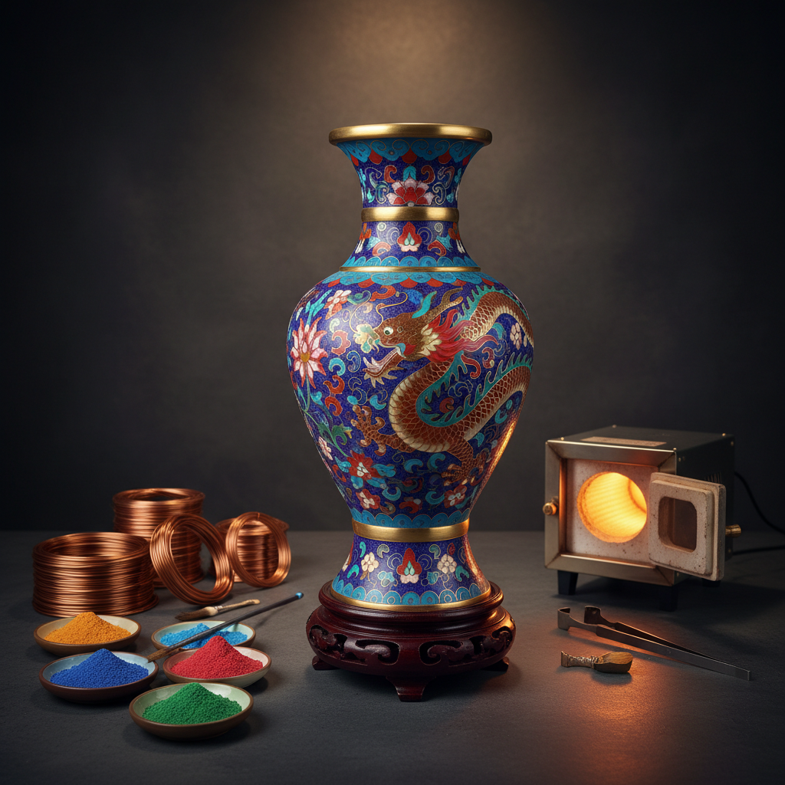

# Enamel Art 珐琅艺术

> "Enamel is glass fused to metal — fire transforms powder into jewel." — 传统珐琅工匠

## 概述

珐琅艺术（Enamel Art）是将玻璃粉末熔融到金属表面的装饰艺术形式。通过高温烧制，玻璃粉与金属基底永久结合，形成色彩鲜艳、光泽持久的表面。珐琅技法包括掐丝珐琅（Cloisonné）、画珐琅（Painted Enamel）、内填珐琅（Champlevé）等多种形式。

珐琅的独特之处在于它结合了金属的坚固和玻璃的色彩——创造出既耐久又华丽的艺术品。

## 核心特征

| 特征 | 描述 |
|------|------|
| 玻璃+金属 | 玻璃粉熔融在金属基底上 |
| 高温烧制 | 需要800°C左右的高温 |
| 极耐久 | 色彩永不褪色 |
| 色彩鲜艳 | 玻璃质的宝石般色彩 |
| 多技法 | 掐丝、画珐琅、内填等多种技法 |
| 精密性 | 需要极高的工艺精度 |

## 视觉特征

- **色彩**：宝石般的透明或不透明色彩
- **光泽**：玻璃质的光滑光泽
- **金属**：金属线条或基底的闪光
- **图案**：精细的花卉、几何或叙事图案
- **层次**：多次烧制的色彩层次
- **质感**：光滑如镜的表面

## 代表作品

| 作品/传统 | 地区 | 年代 | 意义 |
|-----------|------|------|------|
| 拜占庭珐琅 | 东罗马帝国 | 6-12世纪 | 早期珐琅的巅峰 |
| 利摩日珐琅 | 法国 | 12-16世纪 | 欧洲画珐琅的中心 |
| 景泰蓝 | 中国 | 明代-至今 | 掐丝珐琅的中国传统 |
| Fabergé彩蛋 | 俄罗斯 | 1885-1917 | 珐琅工艺的极致奢华 |
| 七宝烧 | 日本 | 江户-明治 | 日本珐琅的精致 |
| 广珐琅 | 中国广州 | 清代 | 画珐琅的中国传统 |

## 历史时间线

| 时期 | 事件 |
|------|------|
| 公元前13世纪 | 最早的珐琅——迈锡尼 |
| 6-12世纪 | 拜占庭珐琅的黄金时代 |
| 12-16世纪 | 利摩日——欧洲珐琅中心 |
| 14世纪 | 掐丝珐琅传入中国 |
| 明景泰年间 | 景泰蓝得名——中国珐琅的高峰 |
| 18世纪 | 画珐琅在中国和欧洲的繁荣 |
| 20世纪-至今 | 珐琅作为当代艺术媒介 |

## 中国语境

中国的珐琅艺术以景泰蓝（掐丝珐琅）最为著名——它是中国工艺美术的国宝级代表。北京景泰蓝、广州画珐琅是两大传统。景泰蓝在2006年被列入国家级非物质文化遗产。当代中国珐琅艺术家在传统技法基础上进行创新，将珐琅从实用器物提升为纯艺术表达。

## AI生成概念图

## 与其他风格的关系

- **Glass Art** → 珐琅本质上是玻璃与金属的结合
- **Decorative Arts** → 珐琅是装饰艺术的重要门类
- **Jewelry Art** → 珐琅广泛用于珠宝制作
- **Mosaic Art** → 掐丝珐琅与马赛克共享分格填色的逻辑
- **Stained Glass Art** → 彩色玻璃与珐琅共享玻璃着色原理
- **Lacquer Art** → 漆艺与珐琅都是表面装饰的极致

---

*浮光艺志 | Chronicle of Artistry*
