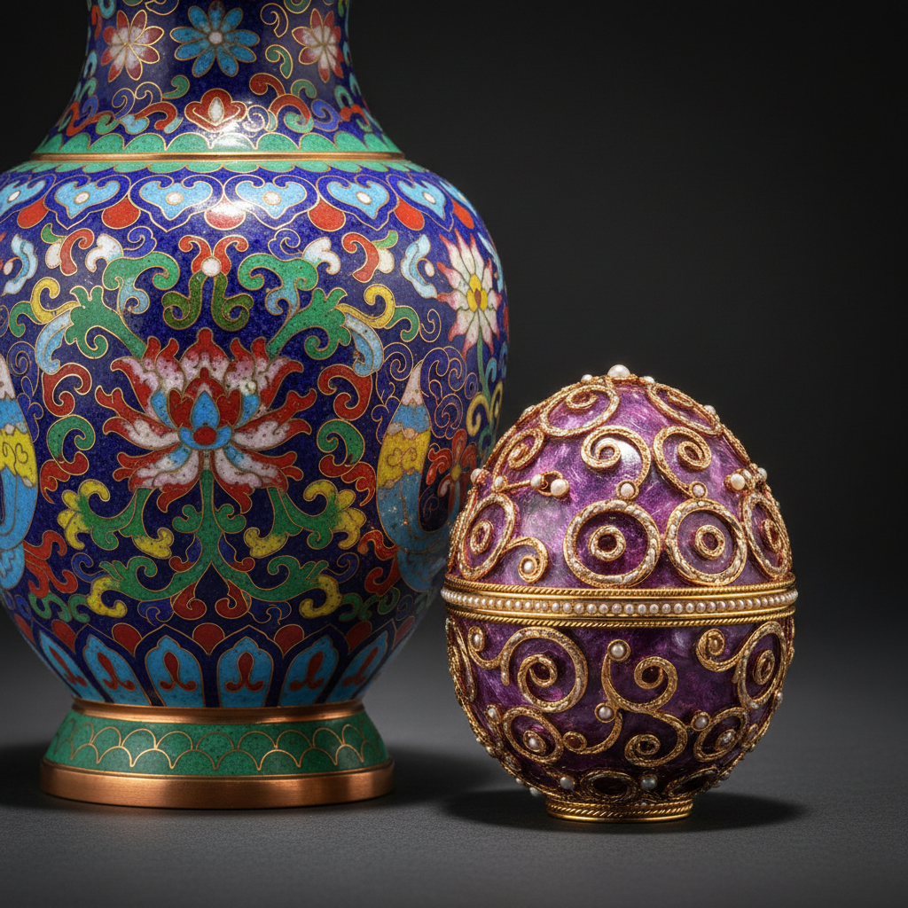

# Enamel 珐琅艺术

> "Enamel is painting with fire — glass fused to metal in an eternal embrace." — Unknown

## 概述

珐琅艺术（Enamel）是将玻璃质粉末熔融附着于金属表面的装饰工艺——通过高温烧制，玻璃与金属永久结合，创造出色彩鲜艳、经久不褪的艺术效果。从古埃及的珐琅首饰到拜占庭的圣像，从中国的景泰蓝到当代的珐琅艺术，这种"以火作画"的技艺跨越了数千年的文明史。珐琅的独特之处在于它兼具金属的坚固和玻璃的色彩——是冶金与绘画的完美结合。

珐琅的魅力在于：它是时间的证明——千年不褪的色彩，是人类对永恒之美的追求。

## 核心特征

| 特征 | 描述 |
|------|------|
| 玻璃质 | 玻璃粉末熔融于金属 |
| 色彩 | 鲜艳持久的色彩 |
| 金属 | 以金属为基底 |
| 高温 | 需要高温烧制 |
| 持久 | 色彩千年不褪 |
| 精细 | 极其精细的工艺 |

## 视觉特征

- **色彩**：鲜艳饱和的色彩
- **光泽**：玻璃质的光泽感
- **平滑**：光滑的表面质感
- **金属**：金属丝或金属底的衬托
- **细节**：精细的图案细节
- **层次**：多次烧制的色彩层次

## 代表作品

| 作品 | 艺术家 | 年代 | 意义 |
|------|--------|------|------|
| *图坦卡蒙面具* | 匿名 | 公元前1323年 | 古埃及珐琅 |
| *拜占庭圣像* | 匿名 | 中世纪 | 掐丝珐琅圣像 |
| *景泰蓝* | 匿名 | 明代 | 中国掐丝珐琅巅峰 |
| *Fabergé eggs* | Peter Carl Fabergé | 1885-1917 | 珐琅工艺的极致 |
| *Limoges enamel* | Various | 15-16世纪 | 法国画珐琅传统 |

## 历史时间线

| 时期 | 事件 |
|------|------|
| 公元前1500年 | 古埃及和迈锡尼的珐琅 |
| 拜占庭时期 | 掐丝珐琅的黄金时代 |
| 中世纪 | 欧洲各种珐琅技法发展 |
| 明代 | 中国景泰蓝的成熟 |
| 15-16世纪 | 法国利摩日画珐琅 |
| 19世纪 | Fabergé的珐琅杰作 |
| 当代 | 珐琅在当代艺术和设计中 |

## 中国语境

中国的珐琅艺术以景泰蓝（铜胎掐丝珐琅）最为著名——明代景泰年间达到巅峰，因此得名。景泰蓝是中国宫廷工艺的代表，2006年被列入国家级非物质文化遗产。此外还有画珐琅（广珐琅）、錾胎珐琅等多种技法。当代中国的珐琅艺术在传承传统的同时也在探索新的表达方式，北京、广州是主要的珐琅工艺中心。

## AI生成概念图

## 与其他风格的关系

- **Cloisonné** → 掐丝珐琅是珐琅的主要技法
- **Champlevé** → 凹雕珐琅是另一种技法
- **Plique-à-jour** → 透光珐琅
- **Jewelry** → 珐琅在珠宝中的应用
- **Metalwork** → 金属工艺的装饰分支
- **Miniature Painting** → 画珐琅与微型绘画

---

*浮光艺志 | Chronicle of Artistry*
