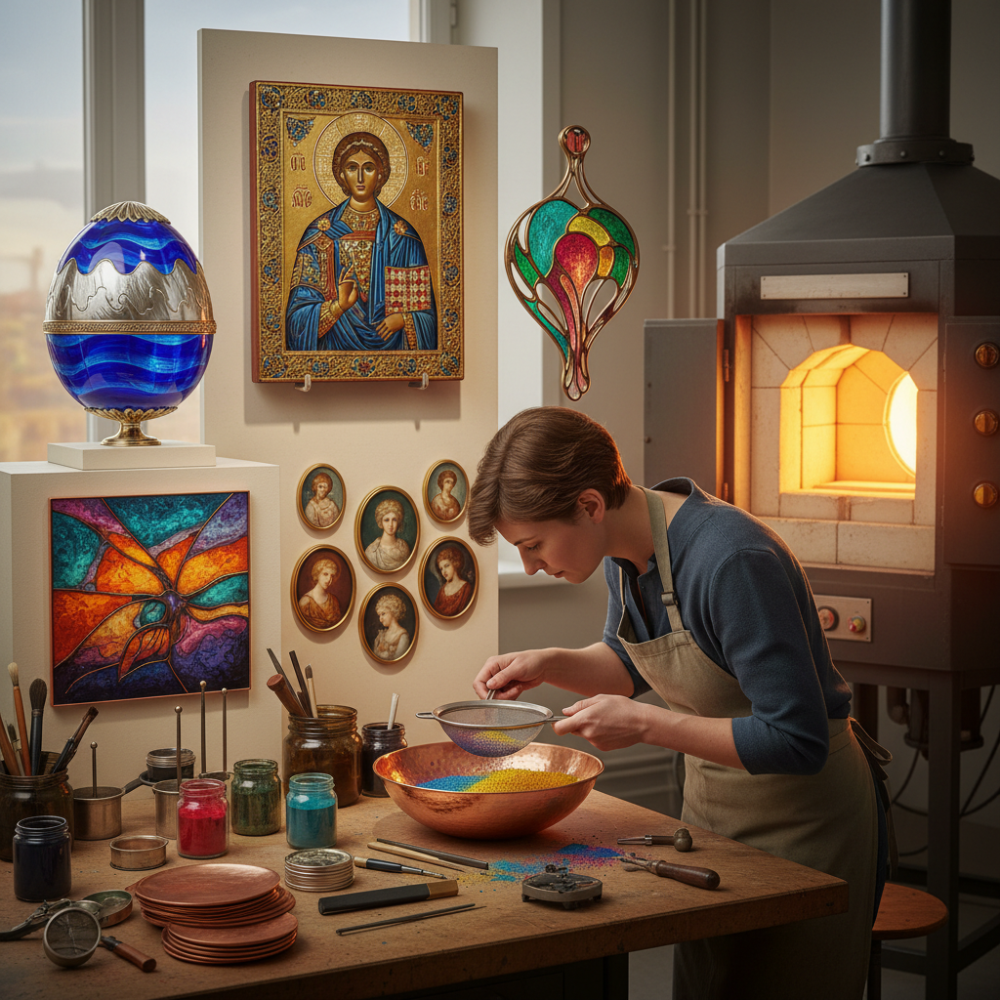

# Enameling Art 珐琅艺术

> "Enameling is painting with glass — powdered minerals fused by fire onto metal surfaces to create colors that never fade, surfaces that gleam like jewels, and images that survive centuries unchanged, each piece passing through the kiln multiple times as layer builds upon layer, the artist surrendering control to the alchemy of heat and hoping the fire will be kind." — Unknown

## 概述

珐琅艺术（Enameling）是一种将玻璃质粉末（珐琅釉料）熔融附着在金属（通常是铜、银或金）表面的装饰艺术。珐琅釉料本质上是含有金属氧化物着色剂的玻璃粉末——在高温（约750-850°C）下熔化并与金属表面融合，冷却后形成坚硬、光滑、色彩鲜艳且极其耐久的玻璃质表面。

珐琅艺术有多种技法：景泰蓝（Cloisonné）、凹雕珐琅（Champlevé）、画珐琅（Painted enamel/Limoges）、透明珐琅（Plique-à-jour）、基底珐琅（Basse-taille）等。珐琅的历史可以追溯到公元前13世纪的迈锡尼文明。珐琅艺术在拜占庭帝国、中世纪欧洲、中国明清时期都达到了极高的艺术水平。珐琅的最大优势是其色彩的永久性——珐琅的颜色不会褪色、不会氧化，可以保持数百年不变。

## 核心特征

| 特征 | 描述 |
|------|------|
| 玻璃质 | 玻璃粉末熔融 |
| 金属基 | 金属基底 |
| 高温 | 高温烧制 |
| 永久色 | 色彩永不褪色 |
| 光泽 | 珠宝般的光泽 |
| 多技法 | 多种技法变体 |

## 视觉特征

- **鲜艳**：极其鲜艳的色彩
- **光泽**：玻璃质的光泽
- **平滑**：平滑的表面
- **金属**：金属的框架或基底
- **透明**：可透明或不透明
- **永久**：永不褪色的色彩

## 代表作品

| 作品 | 艺术家 | 年代 | 意义 |
|------|--------|------|------|
| *Byzantine enamel icons* | 拜占庭工匠 | 6-12世纪 | 拜占庭珐琅圣像 |
| *Limoges painted enamels* | 利摩日工匠 | 12-16世纪 | 利摩日画珐琅 |
| *Fabergé eggs* | Peter Carl Fabergé | 19-20世纪 | 法贝热彩蛋 |
| *Art Nouveau enamel jewelry* | René Lalique | 19-20世纪 | 新艺术珐琅珠宝 |
| *Contemporary enamel art* | Various | 当代 | 当代珐琅艺术 |

## 历史时间线

| 时期 | 事件 |
|------|------|
| 公元前13世纪 | 迈锡尼珐琅的起源 |
| 拜占庭时期 | 拜占庭珐琅的鼎盛 |
| 中世纪 | 欧洲珐琅的发展 |
| 明清时期 | 中国珐琅的鼎盛 |
| 当代 | 珐琅的艺术化创新 |

## 中国语境

珐琅艺术在中国有极其重要的地位。中国的景泰蓝（铜胎掐丝珐琅）是世界闻名的工艺美术品类，以明代景泰年间的作品最为著名。中国的画珐琅（铜胎画珐琅）在清代康熙、雍正、乾隆时期达到鼎盛。中国的珐琅工艺是国家级非物质文化遗产。当代中国的珐琅艺术家在传统基础上不断创新。北京是中国景泰蓝的主要产地。中国的珐琅工艺在国际拍卖市场上价值极高。

## AI生成概念图

## 与其他风格的关系

- **Cloisonné** → 景泰蓝
- **Champlevé** → 凹雕珐琅
- **Jewelry Making** → 珠宝制作
- **Metalwork** → 金属工艺
- **Glass Art** → 玻璃艺术
- **Ceramics** → 陶瓷

---

*浮光艺志 | Chronicle of Artistry*
