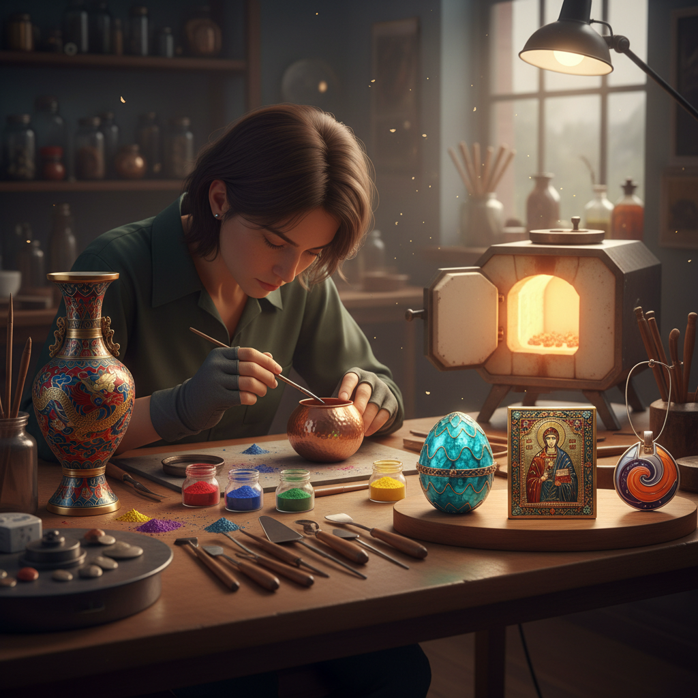

# Enameling 珐琅

> "Enameling is glass fused to metal by fire — color becomes permanent, brilliant, and indestructible, a marriage of fragility and strength." — Unknown

## 概述

珐琅（Enameling）是将玻璃质粉末（enamel）熔融到金属表面的装饰工艺。珐琅粉本质上是有色玻璃的粉末——将其施加在金属（铜、银、金）表面后，在750-850°C的高温下熔化，冷却后形成坚硬、光滑、色彩鲜艳的玻璃质涂层。珐琅的色彩极其鲜艳持久——不会褪色、不怕水洗、不受紫外线影响。珐琅工艺有多种技法：掐丝珐琅（cloisonné）、画珐琅（painted enamel）、内填珐琅（champlevé）、透明珐琅（plique-à-jour）等。从拜占庭的圣物箱到中国的景泰蓝，珐琅艺术跨越了东西方文明。

珐琅的哲学在于：永恒的色彩——通过火的洗礼，将脆弱的玻璃与坚固的金属合为一体，创造出永不褪色的美。

## 核心特征

| 特征 | 描述 |
|------|------|
| 玻璃质 | 玻璃粉熔融于金属 |
| 高温 | 750-850°C烧制 |
| 鲜艳 | 色彩极其鲜艳 |
| 永久 | 色彩永不褪色 |
| 光泽 | 玻璃般的光泽 |
| 精细 | 极其精细的工艺 |

## 视觉特征

- **鲜艳**：极其鲜艳的色彩
- **光泽**：玻璃般的光泽
- **平滑**：光滑的表面
- **精细**：精细的图案
- **金属**：金属的质感衬托
- **透明**：部分技法有透明效果

## 代表作品

| 作品 | 艺术家 | 年代 | 意义 |
|------|--------|------|------|
| *Byzantine reliquaries* | 匿名 | 6-12世纪 | 拜占庭珐琅 |
| *Limoges enamel* | Various | 12世纪+ | 法国利摩日珐琅 |
| *景泰蓝* | 匿名 | 明代+ | 中国掐丝珐琅 |
| *Fabergé eggs* | Fabergé | 1885-1917 | 俄罗斯珐琅巅峰 |
| *Contemporary enamel* | Various | 当代 | 当代珐琅艺术 |

## 历史时间线

| 时期 | 事件 |
|------|------|
| 公元前13世纪 | 最早的珐琅（塞浦路斯） |
| 6世纪+ | 拜占庭珐琅的辉煌 |
| 12世纪 | 利摩日珐琅的兴起 |
| 明代 | 中国景泰蓝的发展 |
| 19世纪 | Fabergé的珐琅杰作 |
| 当代 | 当代珐琅艺术的复兴 |

## 中国语境

珐琅在中国有极其重要的地位——景泰蓝（掐丝珐琅）是中国最著名的传统工艺之一，以明代景泰年间的蓝色珐琅最为著名而得名。景泰蓝被列为国家级非物质文化遗产。中国的珐琅工艺还包括画珐琅（广东珐琅）和内填珐琅。北京是景泰蓝的主要产地，至今仍有多家景泰蓝工厂和工作室。当代中国的珐琅艺术家在传承传统技法的同时，也在探索珐琅的当代艺术表达。故宫博物院收藏有大量精美的珐琅器。

## AI生成概念图

## 与其他风格的关系

- **Cloisonné** → 掐丝珐琅
- **Jewelry Making** → 珠宝制作
- **Metalwork** → 金属工艺
- **Glass Art** → 玻璃艺术
- **Miniature Painting** → 细密画
- **Ceramics** → 陶瓷（釉的类比）

---

*浮光艺志 | Chronicle of Artistry*
