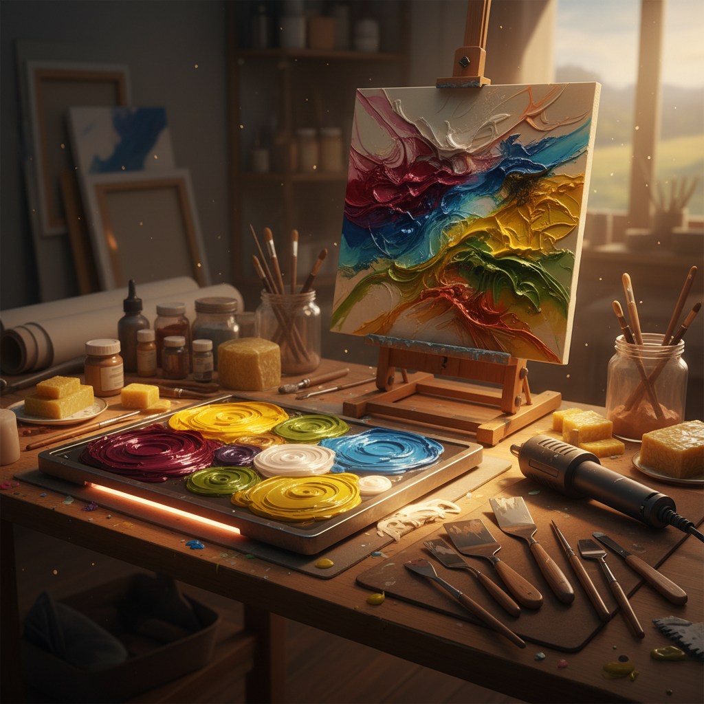

# Encaustic Art 蜡画艺术

> "Encaustic is the most ancient and the most modern of painting techniques." — Jasper Johns

## 概述

蜡画艺术（Encaustic Art）是使用加热的蜂蜡混合颜料作为绑定剂的绘画技法。这是人类最古老的绘画技术之一——古埃及的法尤姆肖像画（Fayum Mummy Portraits）使用蜡画技法创作于公元1-3世纪，至今色彩鲜艳如新。当代艺术家重新发现了蜡画的独特质感和表现力。

蜡画的魅力在于它的物质性——蜡的半透明层次、光泽的表面、可以雕刻和刮擦的厚度，创造出其他媒介无法复制的视觉效果。

## 核心特征

| 特征 | 描述 |
|------|------|
| 蜡基媒介 | 以加热蜂蜡为主要绑定剂 |
| 热工艺 | 需要加热才能使用 |
| 层次性 | 多层半透明蜡的叠加 |
| 持久性 | 极其耐久——千年不褪色 |
| 即时性 | 冷却后立即固定 |
| 可塑性 | 可以雕刻、刮擦、重新加热 |

## 视觉特征

- **光泽**：蜡的自然光泽和半透明感
- **层次**：多层蜡创造的深度
- **质感**：从光滑到粗糙的丰富表面
- **色彩**：蜡赋予颜料独特的饱和度
- **厚度**：可以堆积出浮雕般的厚度
- **温暖**：蜡的暖色调和有机质感

## 代表作品

| 作品 | 艺术家 | 年代 | 意义 |
|------|--------|------|------|
| *Fayum Mummy Portraits* | 匿名 | 1-3世纪 | 最古老的蜡画——惊人的保存 |
| *Flag* | Jasper Johns | 1954-55 | 蜡画在当代艺术中的复兴 |
| *Works* | Brice Marden | 1960s-70s | 蜡画的极简主义表达 |
| *Works* | Tony Scherman | 1990s+ | 大尺幅蜡画肖像 |
| *Works* | Judy Pfaff | 2000s+ | 蜡画与混合媒介的结合 |
| *Works* | Robin Hill | 2000s+ | 蜡画的抽象风景 |

## 历史时间线

| 时期 | 事件 |
|------|------|
| 公元前5世纪 | 古希腊文献记载蜡画技法 |
| 1-3世纪 | 法尤姆肖像画——蜡画的巅峰 |
| 中世纪 | 蜡画技法几乎失传 |
| 18世纪 | 学者尝试复原古代蜡画技法 |
| 1954 | Jasper Johns使用蜡画创作《Flag》 |
| 1990s | 蜡画在当代艺术中的复兴 |
| 2000s-至今 | 蜡画工作坊和社区的蓬勃发展 |

## 中国语境

蜡画在中国当代艺术中相对小众，但正在获得关注。中国传统的蜡染（batik）虽然也使用蜡，但技法和目的不同。一些中国当代艺术家开始探索蜡画的可能性，将其与中国传统的漆画、岩彩画等厚涂技法进行对话。

## AI生成概念图

## 与其他风格的关系

- **Tempera** → 蛋彩画是另一种古老的绑定剂技法
- **Mixed Media** → 蜡画常与拼贴和混合媒介结合
- **Abstract Expressionism** → 抽象表现主义的物质性与蜡画相通
- **Minimalism** → Brice Marden的蜡画极简主义
- **Realism** → 法尤姆肖像画的写实传统
- **Textile Art** → 蜡染是蜡在纺织中的应用

---

*浮光艺志 | Chronicle of Artistry*
