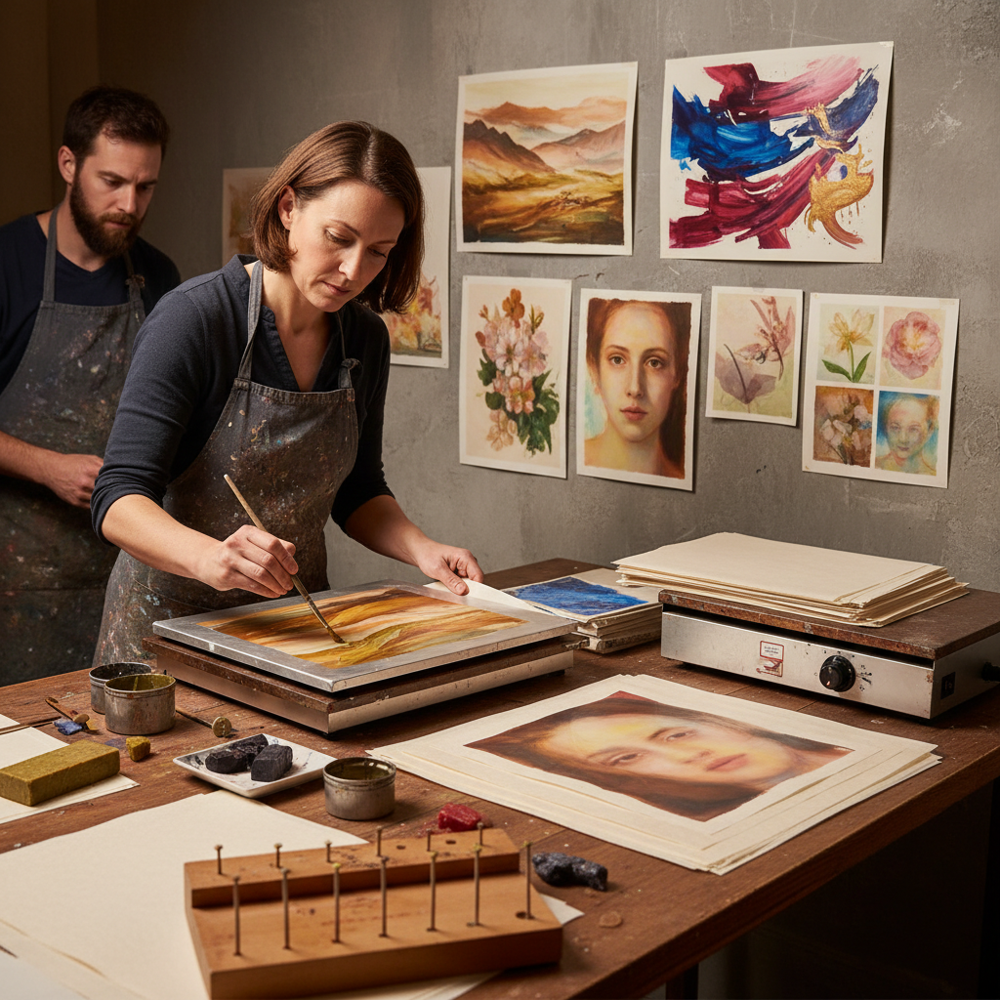

# Encaustic Monotype 蜡彩单版印刷

> "Encaustic monotype marries the ancient medium of hot wax with the spontaneity of monoprinting — molten pigmented beeswax painted onto a heated plate, then pressed to paper in a single unrepeatable transfer, each print a luminous ghost of the original gesture, glowing with the translucency that only wax can give." — Unknown

## 概述

蜡彩单版印刷（Encaustic Monotype）是将蜡彩画（encaustic painting，使用热蜡作为颜料媒介）与单版印刷（monoprint）结合的混合技法。艺术家在加热的金属板（通常是铝板或铜板）上用熔化的彩色蜡（蜂蜡混合树脂和颜料）绑定绘画，然后将纸张覆盖在蜡画上，通过压力将蜡转印到纸上。每次转印都是独一无二的——属于单版印刷。

蜡彩单版印刷的独特之处在于蜡的半透明性和光泽——转印到纸上的蜡层保留了蜡彩画特有的温暖光泽和半透明层次。艺术家可以在同一张纸上进行多次叠印，创造出丰富的色彩层次和深度。这种技法在1990年代由美国艺术家（如Paula Roland等）系统化发展，现已成为蜡彩画和版画领域的重要技法。

## 核心特征

| 特征 | 描述 |
|------|------|
| 热蜡 | 使用熔化的蜡 |
| 加热板 | 在加热板上绘画 |
| 转印 | 蜡转印到纸上 |
| 单版 | 每次印刷独特 |
| 半透明 | 蜡的半透明效果 |
| 叠印 | 可多次叠印 |

## 视觉特征

- **光泽**：蜡的温暖光泽
- **半透明**：半透明的层次
- **柔和**：柔和的色彩过渡
- **深度**：多层叠印的深度
- **质感**：蜡的独特质感
- **温暖**：温暖的视觉感受

## 代表作品

| 作品 | 艺术家 | 年代 | 意义 |
|------|--------|------|------|
| *Encaustic monotype landscapes* | Paula Roland | 1990s | 技法的系统化发展 |
| *Layered wax prints* | Various | 当代 | 多层蜡彩单版 |
| *Abstract encaustic monotypes* | Various | 当代 | 抽象蜡彩单版 |
| *Botanical wax prints* | Various | 当代 | 植物蜡彩单版 |
| *Mixed media encaustic prints* | Various | 当代 | 混合媒介蜡彩版 |

## 历史时间线

| 时期 | 事件 |
|------|------|
| 古代 | 蜡彩画的起源（法尤姆肖像） |
| 20世纪中期 | 蜡彩画的现代复兴 |
| 1990年代 | 蜡彩单版印刷的系统化 |
| 2000年代 | 技法的推广和教学 |
| 当代 | 蜡彩单版印刷的持续发展 |

## 中国语境

蜡彩单版印刷在中国尚属小众技法，但随着中国蜡彩画（encaustic painting）社区的发展，这种技法也开始受到关注。中国的一些版画工作室和蜡彩画艺术家开始探索蜡彩单版印刷。中国传统的蜡染（batik）虽然也使用蜡，但原理不同——蜡染是防染技法，而蜡彩单版是转印技法。中国的艺术院校中，蜡彩单版印刷作为实验性版画技法有逐步引入的趋势。

## AI生成概念图

## 与其他风格的关系

- **Encaustic Painting** → 蜡彩画
- **Monoprint** → 单版印刷
- **Wax Resist** → 蜡防染
- **Mixed Media** → 混合媒介
- **Printmaking** → 版画
- **Hot Wax Art** → 热蜡艺术

---

*浮光艺志 | Chronicle of Artistry*
