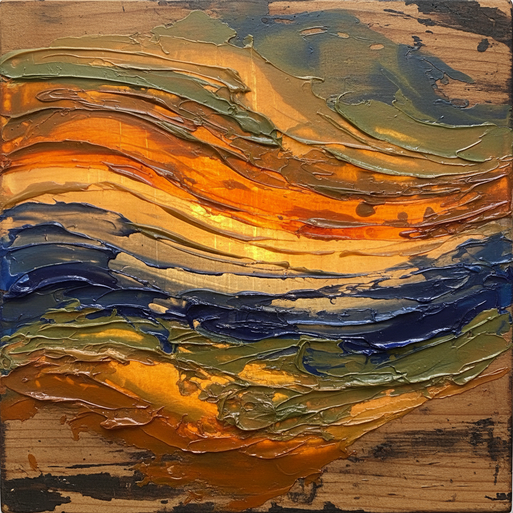

# Encaustic Painting Art 蜡画艺术

> "Encaustic is painting with fire — pigmented beeswax melted and fused to a surface with heat creates images of extraordinary luminosity and depth, the translucent wax layers glowing like stained glass. The ancient Fayum portraits survive two thousand years later with colors as fresh as the day they were painted, testament to wax's permanence and the medium's ability to capture light within its crystalline structure." — Unknown

## 概述

蜡画艺术（Encaustic Painting Art）是一种使用加热的蜂蜡与颜料混合物在表面上绘画的古老技法——通过加热使蜡融化，涂布在画面上，然后用热源（如热风枪或烙铁）将各层蜡融合在一起。蜡画以其独特的光泽、透明度和极高的耐久性著称，是人类最古老的绘画技法之一。

蜡画艺术的实践包括：1）蜡料准备——将蜂蜡与达玛树脂和颜料混合；2）加热涂布——用加热的工具将蜡涂布在表面；3）融合——用热源将各层蜡融合；4）刮刻——在蜡面上刮刻图案；5）拼贴——在蜡层中嵌入材料；6）抛光——将蜡面抛光至光泽；7）当代蜡画——将传统技法与现代创作结合。

## 核心特征

| 特征 | 描述 |
|------|------|
| 蜂蜡 | 使用蜂蜡为媒介 |
| 加热 | 需要加热操作 |
| 透明 | 蜡的透明光泽 |
| 耐久 | 极高的耐久性 |
| 层次 | 多层透明叠加 |
| 古老 | 最古老的绘画技法之一 |

## 视觉特征

- **光泽**：蜡的独特光泽
- **透明**：透明层次的深度
- **发光**：内部发光的效果
- **纹理**：丰富的蜡面纹理
- **色彩**：鲜艳持久的色彩
- **深度**：多层创造的深度

## 代表作品

| 作品 | 艺术家/文化 | 年代 | 意义 |
|------|-------------|------|------|
| *Fayum mummy portraits* | 埃及 | 1-3世纪 | 法尤姆木乃伊肖像 |
| *Jasper Johns encaustics* | 美国 | 1950年代起 | 贾斯珀·约翰斯的蜡画 |
| *Ancient Greek paintings* | 希腊 | 古代 | 古希腊蜡画 |
| *Contemporary encaustic* | 国际 | 当代 | 当代蜡画 |
| *Mixed media encaustic* | 国际 | 当代 | 混合媒体蜡画 |

## 历史时间线

| 时期 | 事件 |
|------|------|
| 古希腊 | 蜡画技法的起源 |
| 1-3世纪 | 法尤姆肖像的黄金时代 |
| 中世纪 | 蜡画的衰落 |
| 20世纪 | 蜡画的现代复兴 |
| 当代 | 蜡画的广泛实践 |

## 中国语境

蜡画在中国有一定的认知和实践。中国的蜡染（batik）虽然使用蜡但技法不同——是用蜡作为防染剂而非绘画媒介。中国当代的艺术家对蜡画技法有所探索——将其与中国传统美学结合。中国的美术教育中，蜡画作为一种特殊的绘画媒介——在综合材料课程中介绍。中国的一些艺术工作坊开始教授蜡画——作为一种创意绘画体验。中国当代的综合材料艺术家将蜡画与其他媒介结合——创造出具有独特质感的作品。中国的艺术市场中，蜡画作品——因其独特的视觉效果和材料特性而受到关注。

## AI生成概念图

## 与其他风格的关系

- **Oil Painting** → 油画
- **Tempera** → 蛋彩画
- **Mixed Media** → 混合媒体
- **Wax Art** → 蜡艺
- **Ancient Art** → 古代艺术
- **Abstract Art** → 抽象艺术

---

*浮光艺志 | Chronicle of Artistry*
