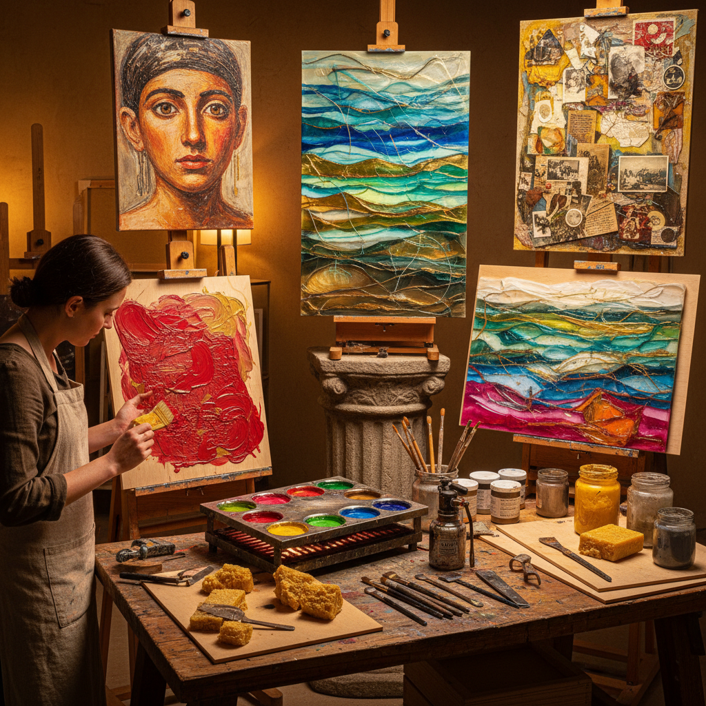

# Encaustic Painting 蜡画

> "Encaustic is painting with fire — pigmented beeswax melted and fused to a surface with heat, each layer burned into the one below, creating luminous depths that glow from within like stained glass, a medium so ancient it decorated Egyptian mummy portraits yet so vital it continues to challenge and inspire contemporary artists." — Unknown

## 概述

蜡画（Encaustic Painting）是一种使用加热的蜂蜡（beeswax）混合颜料（通常是干粉颜料）作为绑定剂的绘画技法。"Encaustic"来自希腊语"enkaustikos"（烧入）。蜡画的基本过程是：将蜂蜡和达玛树脂（damar resin）的混合物加热熔化，加入颜料，然后用刷子或其他工具将熔化的彩色蜡涂在木板或其他基底上，最后用热源（热风枪、烙铁或火焰）将各层蜡"烧入"（fuse）在一起。

蜡画是人类最古老的绘画技法之一——最著名的古代蜡画是埃及法尤姆肖像（Fayum mummy portraits，1-3世纪），这些肖像在2000年后仍然色彩鲜艳。蜡画在中世纪后几乎消失，直到20世纪才被重新发现和复兴。当代蜡画艺术家利用蜡的独特性质——透明性、可层叠性、可雕刻性——创造出其他媒介无法实现的效果。

## 核心特征

| 特征 | 描述 |
|------|------|
| 蜂蜡 | 使用蜂蜡为媒介 |
| 加热 | 需要加热操作 |
| 熔融 | 层层熔融结合 |
| 透明 | 蜡的半透明性 |
| 古老 | 极其古老的技法 |
| 耐久 | 极其耐久 |

## 视觉特征

- **光泽**：蜡的自然光泽
- **透明**：半透明的层次感
- **深度**：多层蜡的深度
- **纹理**：蜡的独特纹理
- **发光**：内部发光的效果
- **温暖**：蜂蜡的温暖色调

## 代表作品

| 作品 | 艺术家 | 年代 | 意义 |
|------|--------|------|------|
| *Fayum mummy portraits* | 埃及-罗马画家 | 1-3世纪 | 法尤姆肖像 |
| *Jasper Johns encaustics* | Jasper Johns | 1950s | 当代蜡画先驱 |
| *Contemporary encaustic art* | Various | 当代 | 当代蜡画艺术 |
| *Mixed media encaustic* | Various | 当代 | 混合媒介蜡画 |
| *Encaustic photography* | Various | 当代 | 蜡画摄影结合 |

## 历史时间线

| 时期 | 事件 |
|------|------|
| 古希腊-罗马 | 蜡画在古代的广泛使用 |
| 1-3世纪 | 法尤姆肖像的创作 |
| 中世纪 | 蜡画的衰落 |
| 20世纪中期 | 蜡画的现代复兴 |
| 当代 | 蜡画的多样化发展 |

## 中国语境

蜡画在中国有独特的传统——中国的"蜡染"（batik）虽然是不同的技法（用蜡作为防染剂），但都涉及蜡与艺术的结合。中国贵州等地的蜡染是国家级非物质文化遗产。当代中国的一些艺术家开始实践西方意义上的蜡画（encaustic painting）。中国的艺术院校中有蜡画课程。中国的当代艺术市场中偶尔可以看到蜡画作品。蜡画的"古老而当代"的特质吸引了中国的实验性艺术家。

## AI生成概念图

## 与其他风格的关系

- **Oil Painting** → 油画
- **Mixed Media** → 混合媒介
- **Batik** → 蜡染
- **Collage** → 拼贴
- **Abstract Art** → 抽象艺术
- **Ancient Art** → 古代艺术

---

*浮光艺志 | Chronicle of Artistry*
