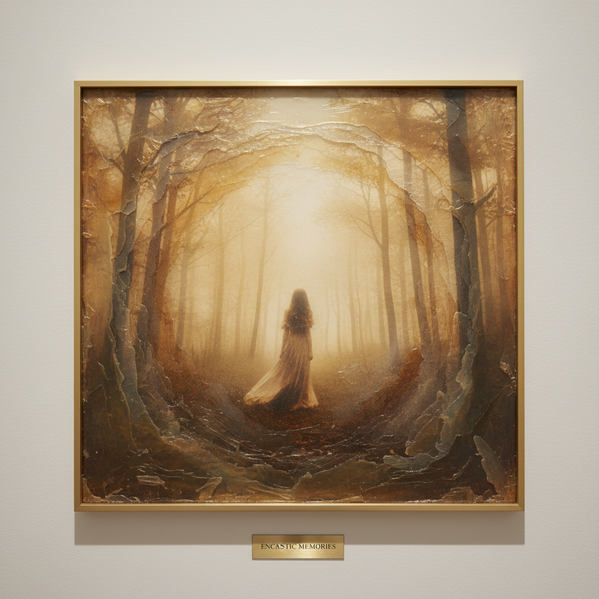

# Encaustic Photography 蜡彩摄影

> "Encaustic photography bridges the ancient and the modern — wax gives photographs the warmth of memory." — Unknown

## 概述

蜡彩摄影（Encaustic Photography）是将摄影图像与热蜡（蜂蜡和达玛树脂）结合的混合媒介艺术形式。将照片转印或嵌入蜡层中，再通过加热、刮擦、添加颜料和更多蜡层来创造具有深度、质感和时间感的作品。蜡的半透明性赋予照片一种梦幻般的、记忆般的品质——如同透过时间的薄雾看过去。

蜡彩摄影的魅力在于：它让照片不再是冰冷的记录，而是温暖的、有触感的、如记忆般模糊而珍贵的存在。

## 核心特征

| 特征 | 描述 |
|------|------|
| 蜡层 | 蜂蜡和树脂的覆盖 |
| 摄影 | 以摄影图像为基础 |
| 混合 | 混合媒介的创作 |
| 质感 | 蜡的独特质感 |
| 深度 | 多层蜡创造的深度 |
| 记忆感 | 如记忆般的模糊美感 |

## 视觉特征

- **半透明**：蜡层的半透明效果
- **质感**：蜡的表面质感
- **温暖**：蜡的温暖色调
- **模糊**：如记忆般的柔和模糊
- **层次**：多层蜡的深度感
- **触觉**：可以感受到的表面

## 代表作品

| 作品 | 艺术家 | 年代 | 意义 |
|------|--------|------|------|
| *Encaustic photo works* | Various | 1990s+ | 蜡彩摄影的发展 |
| *Memory series* | Various | 2000s+ | 记忆主题的蜡彩摄影 |
| *Mixed media encaustic* | Various | 2010s+ | 混合媒介蜡彩 |
| *Large-scale works* | Various | 2010s+ | 大尺度蜡彩摄影 |

## 历史时间线

| 时期 | 事件 |
|------|------|
| 古代 | 蜡彩画（Encaustic）的古老传统 |
| 1990s | 蜡彩与摄影的结合开始 |
| 2000s | 蜡彩摄影作为独立艺术形式 |
| 2010s+ | 蜡彩摄影的工作坊和教学 |
| 当代 | 蜡彩摄影的持续发展 |

## 中国语境

蜡彩摄影在中国是相对小众的艺术形式，主要在实验摄影和混合媒介艺术圈中有实践。中国的蜡彩画传统（热蜡画）为蜡彩摄影提供了技术基础。当代中国的实验摄影艺术家中有人探索蜡彩摄影，将其与中国的记忆和历史主题结合。

## AI生成概念图

## 与其他风格的关系

- **Encaustic Art** → 蜡彩画是蜡彩摄影的技术基础
- **Photography** → 摄影是蜡彩摄影的图像来源
- **Mixed Media** → 混合媒介的代表形式
- **Alternative Process** → 替代摄影工艺的一种
- **Memory Art** → 记忆主题的艺术
- **Texture Art** → 质感艺术的代表

---

*浮光艺志 | Chronicle of Artistry*
