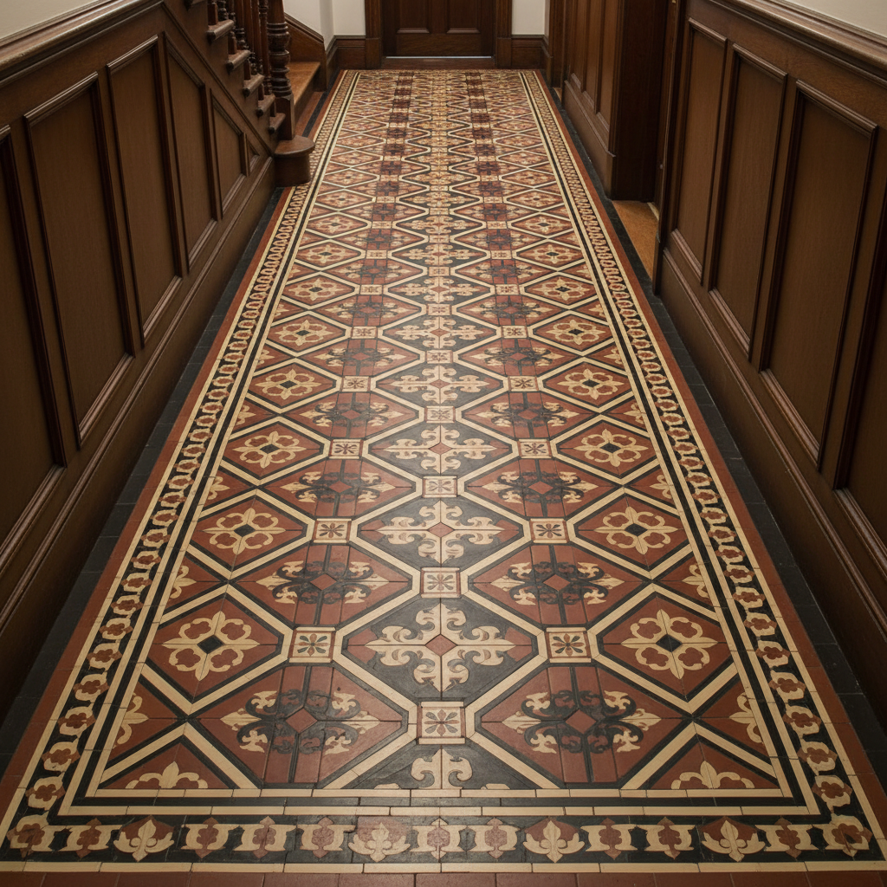

# Encaustic Tile Art 彩釉花砖艺术

> "Encaustic tiles are paintings fired into clay — different colored clays are inlaid into a tile body so that the pattern extends through the full thickness of the wear surface, creating floors that retain their design even after centuries of foot traffic. Medieval cathedrals and Victorian hallways alike display these geometric puzzles in earth tones of red, buff, black, and cream." — Unknown

## 概述

彩釉花砖艺术（Encaustic Tile Art）是一种使用不同颜色的粘土镶嵌在瓷砖体内创造图案的传统制砖技法——图案不是表面绘制的，而是由不同颜色的粘土贯穿整个磨损层，因此即使经过长期使用图案也不会磨损消失。彩釉花砖以其耐久性和精美的几何图案著称。

彩釉花砖艺术的实践包括：1）模具制作——制作图案模具；2）粘土填充——将不同颜色的粘土填入模具；3）压制——将瓷砖压制成型；4）干燥——缓慢干燥防止开裂；5）烧制——在窑中高温烧制；6）几何设计——设计可拼合的几何图案；7）当代彩釉花砖——将传统技法与现代设计结合的创作。

## 核心特征

| 特征 | 描述 |
|------|------|
| 镶嵌 | 不同颜色粘土镶嵌 |
| 贯穿 | 图案贯穿磨损层 |
| 耐久 | 极其耐久的图案 |
| 几何 | 几何化的图案设计 |
| 中世纪 | 中世纪的传统 |
| 地面 | 主要用于地面铺设 |

## 视觉特征

- **几何**：精美的几何图案
- **大地**：大地色系的色彩
- **重复**：可拼合的重复图案
- **耐久**：经久不变的图案
- **质朴**：质朴的粘土质感
- **规律**：规律的图案排列

## 代表作品

| 作品 | 艺术家/文化 | 年代 | 意义 |
|------|-------------|------|------|
| *Medieval abbey floors* | 英国/法国 | 13世纪 | 中世纪修道院地面 |
| *Minton encaustic tiles* | 英国 | 19世纪 | 明顿彩釉花砖 |
| *Victorian hallway tiles* | 英国 | 19世纪 | 维多利亚门厅花砖 |
| *Palace of Westminster* | 英国 | 1840年代 | 威斯敏斯特宫花砖 |
| *Contemporary encaustic tiles* | 国际 | 当代 | 当代彩釉花砖 |

## 历史时间线

| 时期 | 事件 |
|------|------|
| 13世纪 | 中世纪彩釉花砖的起源 |
| 14-15世纪 | 英国修道院花砖的黄金时代 |
| 16世纪 | 宗教改革后的衰落 |
| 19世纪 | 维多利亚时代的大规模复兴 |
| 当代 | 彩釉花砖的持续生产和使用 |

## 中国语境

彩釉花砖与中国的传统建筑陶瓷有一定的关联。中国的琉璃瓦和花砖——虽然技法不同但有相似的建筑装饰功能。中国的传统地砖（如金砖）——以其耐久性著称，与彩釉花砖的耐久理念相似。中国当代的室内设计中，彩釉花砖（水泥花砖）——作为一种复古装饰元素正在流行。中国的建材市场中，仿彩釉花砖的瓷砖产品——有较大的市场需求。中国的设计教育中，彩釉花砖作为建筑装饰的经典——在室内设计课程中介绍。中国的一些手工砖厂——开始生产传统工艺的彩釉花砖。

## AI生成概念图

## 与其他风格的关系

- **Mosaic** → 马赛克
- **Ceramic Art** → 陶瓷艺术
- **Gothic Architecture** → 哥特建筑
- **Victorian Design** → 维多利亚设计
- **Geometric Art** → 几何艺术
- **Floor Design** → 地面设计

---

*浮光艺志 | Chronicle of Artistry*
