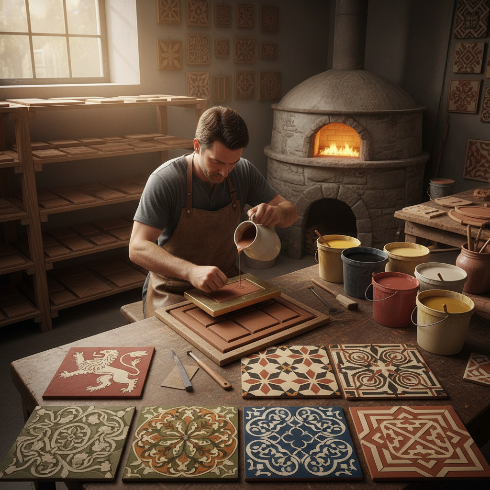

# Encaustic Tile Making 花砖制作

> "Encaustic tiles are paintings in clay — colors not applied to the surface but inlaid into the body of the tile itself, so that centuries of footsteps wear the surface down but never wear the pattern away, each tile a small eternity underfoot." — Unknown

## 概述

花砖制作（Encaustic Tile Making）是一种将不同颜色的粘土（通常是液态泥浆/slip）嵌入瓷砖表面形成图案的陶瓷装饰技法。与表面釉彩不同，花砖的图案是"嵌入"砖体的——颜色贯穿一定深度，因此即使表面磨损，图案依然可见。这种技法在中世纪欧洲（特别是英国和法国）的教堂和修道院地面中广泛使用。

花砖的制作过程：先制作瓷砖坯体，用模具在表面压出凹陷图案，然后将不同颜色的液态粘土（slip）填入凹陷处，干燥后刮平表面，最后烧制。维多利亚时代（19世纪）花砖经历了工业化的大规模复兴——Minton、Maw & Co等公司生产了大量精美的花砖用于公共建筑和住宅。当代花砖制作在手工陶瓷和建筑装饰领域持续发展。

## 核心特征

| 特征 | 描述 |
|------|------|
| 嵌入 | 颜色嵌入砖体 |
| 耐磨 | 图案不会磨损 |
| 粘土 | 不同颜色粘土 |
| 模具 | 使用压模技术 |
| 图案 | 几何和花卉图案 |
| 建筑 | 用于地面装饰 |

## 视觉特征

- **几何**：精确的几何图案
- **对称**：对称的设计
- **色彩**：泥土色调的色彩
- **重复**：重复的图案单元
- **平面**：平面的图案效果
- **古典**：古典的美感

## 代表作品

| 作品 | 艺术家 | 年代 | 意义 |
|------|--------|------|------|
| *Medieval abbey tiles* | Unknown | 13世纪 | 中世纪修道院花砖 |
| *Minton encaustic tiles* | Minton & Co | 19世纪 | 维多利亚时代工业花砖 |
| *Palace of Westminster tiles* | Minton | 1840s | 英国国会大厦花砖 |
| *Arts & Crafts tiles* | William Morris等 | 19世纪末 | 工艺美术运动花砖 |
| *Contemporary encaustic tiles* | Various | 当代 | 当代手工花砖 |

## 历史时间线

| 时期 | 事件 |
|------|------|
| 12-13世纪 | 中世纪欧洲花砖的起源 |
| 14-15世纪 | 花砖在教堂中的广泛使用 |
| 16-18世纪 | 花砖的衰落期 |
| 19世纪 | 维多利亚时代的工业化复兴 |
| 20世纪 | 现代建筑中的花砖 |
| 当代 | 手工花砖的艺术复兴 |

## 中国语境

花砖在中国有独特的发展——中国传统建筑中虽然没有西方意义上的encaustic tile，但有类似的装饰砖传统（如琉璃砖、花砖地面）。近代中国的殖民建筑和租界建筑中引入了西方花砖。中国南方（特别是福建、广东、台湾）的传统建筑中使用的"水泥花砖"（cement tile）与encaustic tile有相似的视觉效果。当代中国的室内设计中，复古花砖（包括水泥花砖和仿古花砖）非常流行。

## AI生成概念图

## 与其他风格的关系

- **Ceramic Art** → 陶瓷艺术
- **Mosaic** → 马赛克
- **Terrazzo** → 水磨石
- **Architecture** → 建筑装饰
- **Pattern Design** → 图案设计
- **Arts and Crafts Movement** → 工艺美术运动

---

*浮光艺志 | Chronicle of Artistry*
