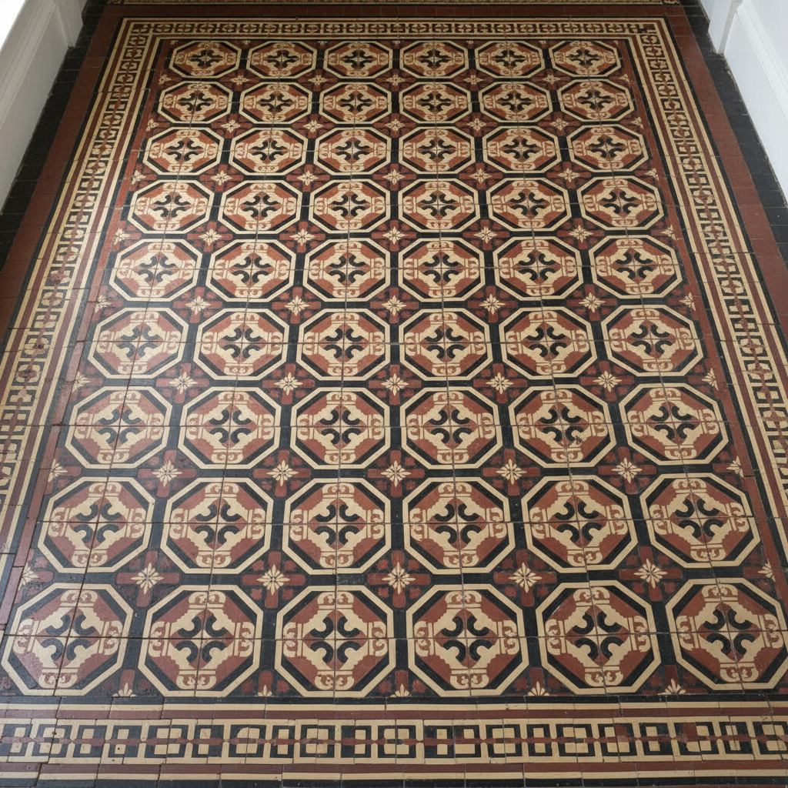

# Encaustic Tile 维多利亚瓷砖 | Carreau Encaustique

> **"脚下的中世纪——维多利亚人用工业技术复活了修道院地面的几何诗篇。"**

## 概述

维多利亚瓷砖（Encaustic Tile / Carreau Encaustique）是一种图案嵌入砖体内部（而非表面釉彩）的装饰地砖，图案由不同颜色的粘土嵌入模具压制而成，因此图案不会因磨损而消失。"Encaustic"源自希腊语"enkaustikos"（烧入）。这种技法起源于13世纪的中世纪修道院和教堂，19世纪维多利亚时代由Minton等工厂工业化生产，成为维多利亚建筑的标志性元素——从英国国会大厦到普通住宅的门廊。

## 历史演变

| 时期 | 特征 |
|------|------|
| 13世纪 | 中世纪修道院手工制作 |
| 14-15世纪 | 哥特式教堂地面 |
| 16-18世纪 | 技法几乎失传 |
| 1830s | Herbert Minton复兴 |
| 1850-1910 | 维多利亚时代大量生产 |
| 当代 | 复古设计复兴 |

## 核心特征

- **嵌入式图案**：图案在砖体内部
- **耐磨**：图案不因磨损消失
- **几何图案**：精确的几何拼花
- **多砖组合**：多块砖拼成大图案
- **有限色彩**：通常2-6种颜色
- **对称排列**：严格的对称构图

## 经典图案

| 图案 | 特征 |
|------|------|
| 百合花 Fleur-de-lis | 法国/英国皇室 |
| 四叶草 Quatrefoil | 哥特式 |
| 棋盘格 | 黑白经典 |
| 星形 | 伊斯兰影响 |
| 藤蔓卷草 | 中世纪 |
| 几何拼花 | 维多利亚 |

## 视觉特征

- 精确的几何图案
- 有限但和谐的色彩
- 多砖拼合的大图案
- 哑光的陶土质感
- 中世纪的庄严感
- 维多利亚的精致感

## 与其他风格的关系

| 风格 | 关系 |
|------|------|
| Zellij伊斯兰瓷砖 | 共享几何瓷砖传统 |
| Azulejo | 共享装饰瓷砖传统 |
| Arts & Crafts | 共享维多利亚时代 |
| Terrazzo水磨石 | 共享地面装饰传统 |
| 当代瓷砖设计 | Encaustic的现代复兴 |

## 概念图

---

*浮光艺志 | Chronicle of Artistry*
