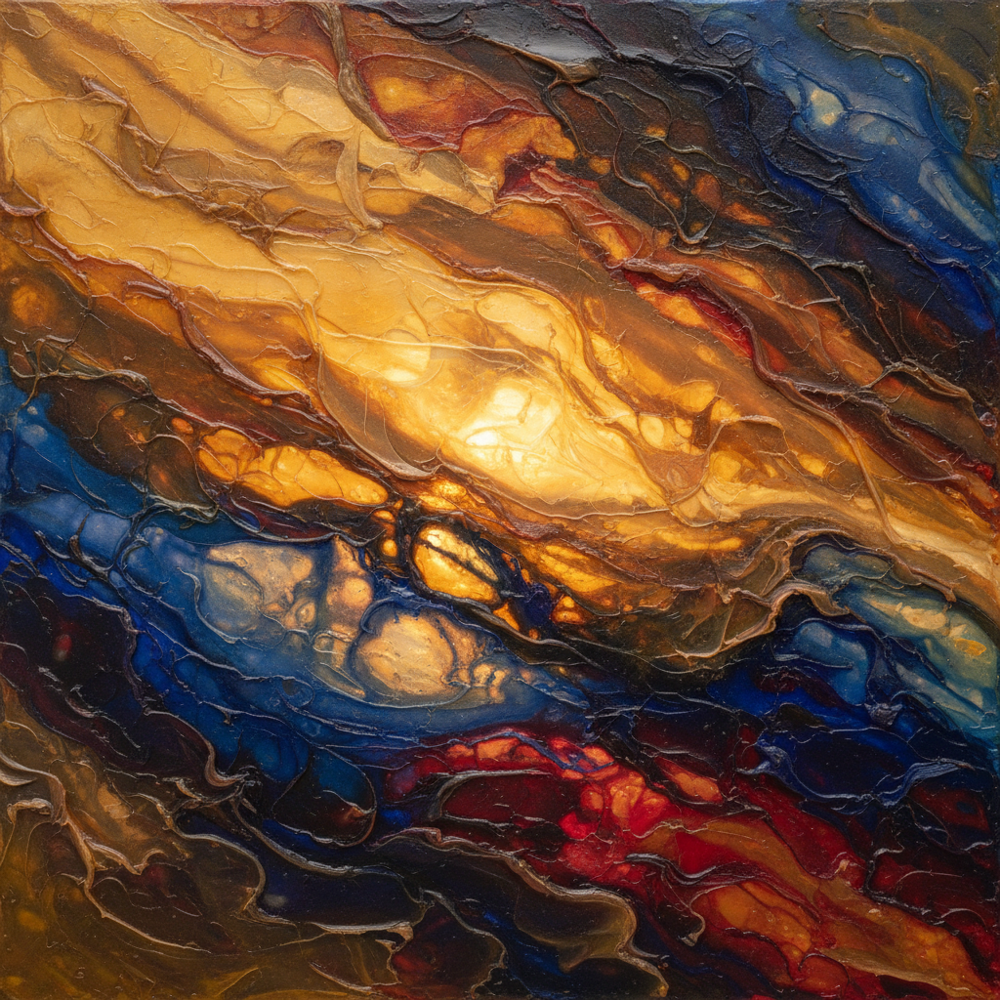

# Encaustic 蜡画法

> "Painting with fire." — 蜡画法的本质

## 概述

蜡画法（Encaustic，希腊语 enkaustikos"烧入"之意）是将蜂蜡与树脂和颜料混合，加热成液态后涂在表面上，再用热源（古代用烙铁，现代用热风枪）将各层融合在一起的古老绘画技法。

蜡画法是人类最古老的绘画技法之一——埃及法尤姆肖像（1-3世纪）使用蜡画法创作，至今色彩鲜艳如新，证明了这一技法惊人的持久性。20世纪以来，蜡画法在当代艺术中经历了强劲复兴。

## 核心特征

| 特征 | 描述 |
|------|------|
| 蜂蜡基底 | 蜂蜡 + 达玛树脂 + 颜料的混合物 |
| 热融合 | 用热源将各层蜡融合在一起 |
| 即时干燥 | 蜡冷却后立即固化——无需等待干燥 |
| 极度持久 | 蜡不会氧化变色——可保存数千年 |
| 半透明 | 蜡的半透明性产生独特的内发光效果 |
| 可重新加热 | 可以反复加热修改 |

## 视觉特征

- **光泽**：蜡的自然光泽——介于哑光和亮光之间
- **透明度**：半透明的蜡层产生深度和内发光
- **质感**：可以从光滑到极度粗糙
- **色彩**：鲜艳持久——蜡保护颜料不氧化
- **层次**：多层半透明蜡产生丰富的深度
- **温度**：蜡的温暖触感和有机质感

## 历史

| 时期 | 应用 | 代表 |
|------|------|------|
| 古希腊 | 船舶涂装和壁画 | 文献记载 |
| 古罗马/埃及 | 法尤姆肖像 | 1-3世纪木乃伊肖像 |
| 中世纪 | 圣像画 | 拜占庭圣像 |
| 20世纪 | 当代艺术复兴 | Jasper Johns |
| 当代 | 混合媒介 | 大量当代艺术家 |

## 代表人物

| 画家 | Encaustic 应用 | 时期 |
|------|---------------|------|
| 法尤姆肖像画家 | 木乃伊肖像 | 1-3世纪 |
| Jasper Johns | *Flag* (1954-55) | 当代——蜡画法复兴 |
| Diego Rivera | 部分壁画 | 20世纪 |
| Tony Scherman | 大型蜡画肖像 | 当代 |
| Betsy Eby | 抽象蜡画 | 当代 |

## 与其他技法的关系

- **Fresco** → 同为古老的持久绘画技法
- **Oil Painting** → 油画在15世纪取代了蜡画的主流地位
- **Glazing** → 蜡的半透明性类似油画罩染效果
- **Mixed Media** → 当代蜡画常与拼贴和混合媒介结合
- **Impasto** → 蜡可以堆积出极厚的浮雕质感

## 概念图

---

*浮光艺志 | Chronicle of Artistry*
