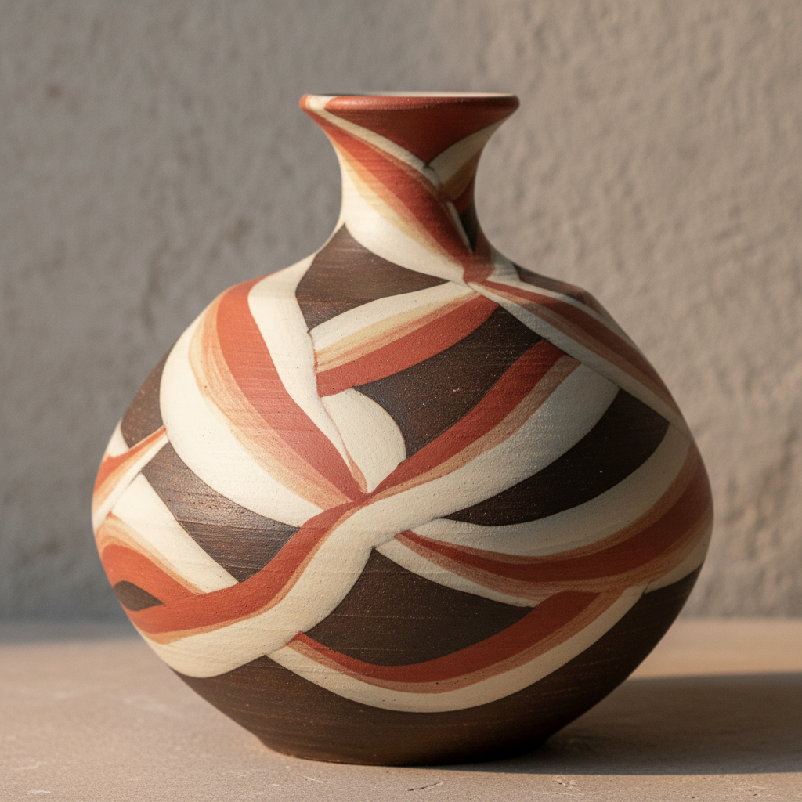

# Engobe Art 化妆土艺术

> "Engobe is a second skin for clay — a thin coating of colored slip applied to a pot before or after bisque firing, changing the surface color without the gloss of glaze, giving the potter a matte canvas of any hue on which to carve, stamp, or paint, the engobe layer thin enough to reveal texture yet opaque enough to transform a dark body into light or a light body into dark." — Unknown

## 概述

化妆土艺术（Engobe Art）是一种在陶瓷坯体表面施加一层有色泥浆（化妆土/engobe）来改变表面颜色和质感的装饰技法。化妆土是介于坯体和釉之间的装饰层——它比釉更接近粘土的质感，呈现哑光或半哑光效果。化妆土可以是白色的（用于遮盖深色坯体）或任何颜色的（通过添加氧化物着色），是陶瓷装饰中最基础也最多变的技法之一。

化妆土艺术的核心要素包括：1）有色泥浆——添加氧化物着色的液态粘土；2）表面涂层——在坯体表面形成薄层；3）哑光效果——不同于釉的哑光质感；4）颜色改变——改变坯体的表面颜色；5）装饰基础——作为其他装饰的基础层；6）多种施法——浸、浇、刷、喷等多种方法；7）与坯体结合——与坯体紧密结合不剥落。

## 核心特征

| 特征 | 描述 |
|------|------|
| 有色泥浆 | 着色的液态粘土涂层 |
| 哑光质感 | 不同于釉的哑光表面 |
| 颜色多变 | 可调配任何颜色 |
| 装饰基础 | 可作为其他装饰的底层 |
| 施法多样 | 浸、浇、刷、喷等方法 |
| 质感丰富 | 介于坯体和釉之间的质感 |

## 视觉特征

- **哑光表面**：柔和的哑光质感
- **均匀色彩**：均匀的表面颜色
- **泥土质感**：保留粘土的质感
- **多色可能**：丰富的色彩选择
- **层次感**：与坯体和釉的层次关系
- **温暖触感**：不同于釉的温暖触感

## 代表作品

| 作品 | 艺术家/文化 | 年代 | 意义 |
|------|-------------|------|------|
| *磁州窑白化妆土* | 中国磁州窑 | 宋-金 | 中国化妆土传统 |
| *韩国粉青沙器* | 韩国李朝 | 15-16世纪 | 韩国化妆土 |
| *当代化妆土陶瓷* | 各地陶艺家 | 当代 | 化妆土的现代应用 |
| *彩色化妆土作品* | 当代陶艺家 | 当代 | 多色化妆土探索 |
| *化妆土与刮花* | 当代陶艺家 | 当代 | 化妆土装饰组合 |

## 历史时间线

| 时期 | 事件 |
|------|------|
| 古代 | 最早的化妆土使用 |
| 宋代 | 中国磁州窑化妆土的成熟 |
| 李朝 | 韩国粉青沙器的发展 |
| 中世纪 | 欧洲化妆土陶器的传统 |
| 当代 | 化妆土在全球陶艺中的广泛应用 |

## 中国语境

化妆土在中国陶瓷史上有重要地位。中国北方的磁州窑系统是化妆土装饰的典范——在粗糙的深色坯体上施白色化妆土，再在化妆土上进行刻花、剔花、铁绘等装饰。磁州窑的化妆土技术影响了整个东亚——韩国的粉青沙器、日本的刷毛目和粉引都源于这一传统。中国当代陶艺中，化妆土作为最基础的装饰手段被广泛使用。中国陶瓷教育中，化妆土的配制和施用是釉料课程的重要内容。化妆土的"以白遮黑"功能使普通粘土也能呈现精美的装饰效果。

## AI生成概念图

## 与其他风格的关系

- **Hakeme** → 刷毛目
- **Kohiki** → 粉引
- **Sgraffito** → 刮花
- **Slip Decoration** → 泥浆装饰
- **Mishima** → 三岛手
- **Cizhou Ware** → 磁州窑

---

*浮光艺志 | Chronicle of Artistry*
