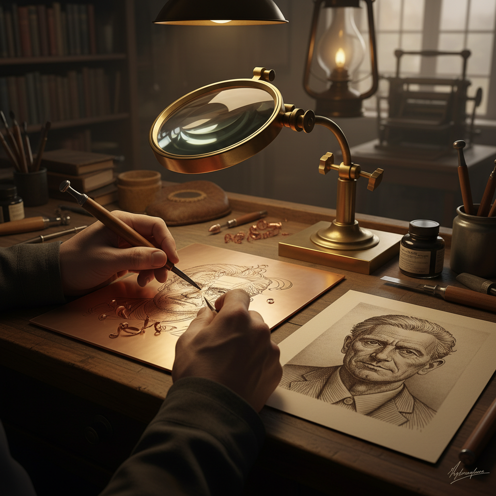

# Engraving 雕版/雕刻

> "Engraving is drawing with a knife — every line is a commitment, every cut irreversible." — Unknown

## 概述

雕刻（Engraving）是用尖锐的工具（刻刀/burin）在硬质表面（金属、木材、石材、玻璃）上切割出线条和图案的艺术。与蚀刻（用酸腐蚀）不同，雕刻完全依靠手的力量和精确控制。从古代的印章到文艺复兴的铜版画，从货币设计到枪械装饰，雕刻是人类最精密的手工技艺之一——每一条线都是不可撤销的决定。

雕刻的哲学在于：不可逆的承诺——没有"撤销"键，每一刀都必须精确，这种压力催生了极致的专注和技艺。

## 核心特征

| 特征 | 描述 |
|------|------|
| 切割 | 用刻刀切割表面 |
| 不可逆 | 每一刀不可撤销 |
| 精密 | 极其精密的线条 |
| 硬质 | 在硬质材料上工作 |
| 手工 | 完全依靠手的控制 |
| 多用途 | 印刷、装饰、标记 |

## 视觉特征

- **线条**：精细清晰的线条
- **交叉**：交叉线创造明暗
- **精密**：令人惊叹的精密度
- **深浅**：线条深浅的变化
- **光泽**：切割面的光泽
- **对比**：线条与表面的对比

## 代表作品

| 作品 | 艺术家 | 年代 | 意义 |
|------|--------|------|------|
| *Knight, Death and the Devil* | Albrecht Dürer | 1513 | 铜版雕刻巅峰 |
| *Melencolia I* | Albrecht Dürer | 1514 | 文艺复兴雕刻杰作 |
| *Bank note engravings* | Various | 18世纪+ | 货币雕刻艺术 |
| *Gun engraving* | Various | 传统-当代 | 枪械装饰雕刻 |
| *Glass engraving* | Various | 当代 | 玻璃雕刻艺术 |

## 历史时间线

| 时期 | 事件 |
|------|------|
| 史前 | 骨器和石器上的雕刻 |
| 古代 | 印章和宝石雕刻 |
| 15世纪 | 铜版雕刻印刷的发明 |
| 文艺复兴 | Dürer等大师的铜版画 |
| 18-19世纪 | 货币和邮票雕刻 |
| 当代 | 装饰雕刻和艺术雕刻 |

## 中国语境

中国的雕刻传统极其丰富——从商代的甲骨文到秦代的玉玺，从汉代的画像石到明清的篆刻，雕刻贯穿了中国艺术的全部历史。中国传统的篆刻（印章雕刻）是独立的艺术门类，与书法、绘画并列。木版雕刻（木刻版画）在中国有悠久传统。当代中国的雕刻艺术在传统篆刻、玉雕、木雕等领域继续发展。

## AI生成概念图

## 与其他风格的关系

- **Etching** → 蚀刻是化学版的雕刻
- **Printmaking** → 版画的基础技法
- **Intaglio** → 凹版印刷
- **Seal Carving** → 篆刻
- **Niello** → 雕刻后填充黑金
- **Damascening** → 雕刻后镶嵌金属

---

*浮光艺志 | Chronicle of Artistry*
