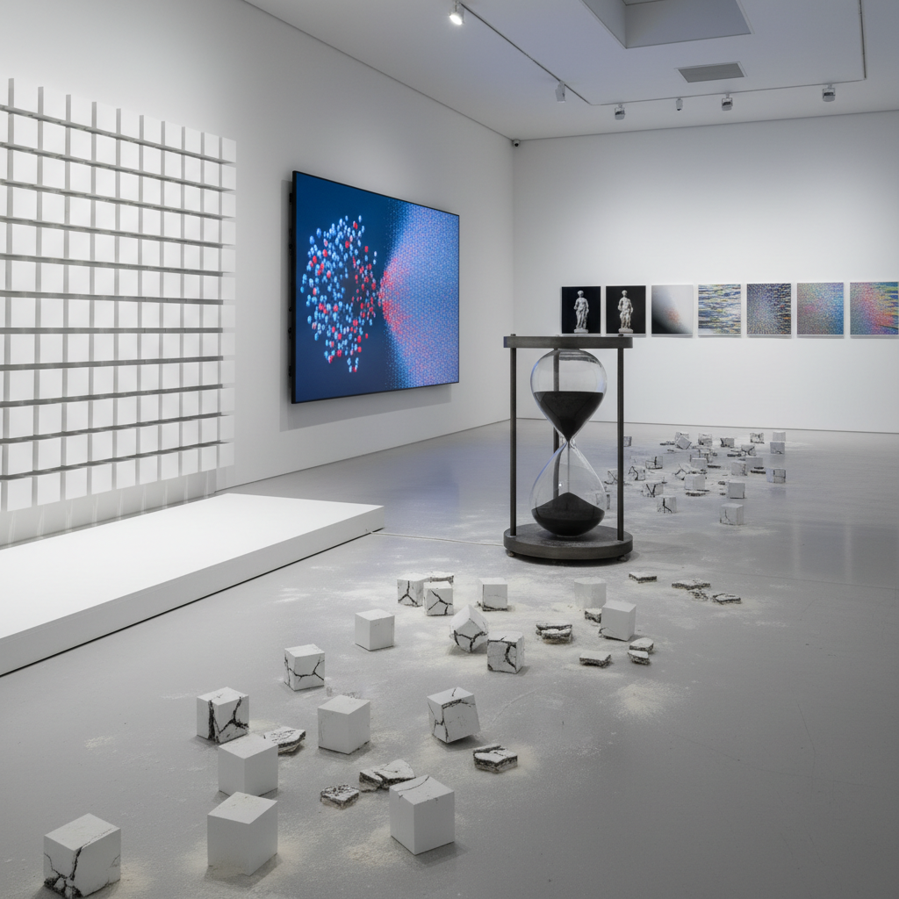

# Entropy Art 熵艺术

> "Entropy art embraces the second law of thermodynamics as an aesthetic principle — the understanding that all ordered systems tend toward disorder, that all energy dissipates, that all structures eventually crumble, and that this universal tendency is not a flaw in the universe but its deepest truth. The entropy artist does not fight this tendency but illuminates it, makes it visible, even beautiful, showing that the arrow of time points in only one direction and that every moment of order is a temporary miracle against the cosmic tide of chaos." — Unknown

## 概述

熵艺术（Entropy Art）是以热力学第二定律——熵增原理（封闭系统的无序度总是增加）——为核心概念的艺术实践。熵是物理学中衡量系统无序程度的量，熵增意味着宇宙不可逆转地从有序走向无序。

熵艺术的实践包括：1）有序到无序——展示系统从有序状态逐渐走向无序的过程；2）不可逆过程——强调时间的不可逆性和过程的单向性；3）信息熵——探索信息的降解、噪声和信号的关系；4）热力学美学——将热力学概念（热平衡、能量耗散）可视化；5）混沌系统——展示混沌理论中的敏感依赖性和不可预测性；6）宇宙热寂——以宇宙最终的热寂（heat death）为主题的思辨艺术。

## 核心特征

| 特征 | 描述 |
|------|------|
| 无序 | 从有序到无序 |
| 不可逆 | 不可逆过程 |
| 时间 | 时间之箭 |
| 耗散 | 能量耗散 |
| 概率 | 统计概率 |
| 宇宙 | 宇宙尺度 |

## 视觉特征

- **散乱**：从整齐到散乱
- **模糊**：从清晰到模糊
- **噪声**：信号中的噪声
- **碎片**：完整物的碎片化
- **混合**：不同物质的混合
- **均匀**：最终的均匀状态

## 代表作品

| 作品 | 艺术家 | 年代 | 意义 |
|------|--------|------|------|
| *Entropy and Art* | Rudolf Arnheim | 1971 | 熵与艺术理论 |
| *Entropy installations* | Robert Smithson | 1960年代 | 熵的物质化 |
| *Information decay* | Various | 2010年代 | 信息熵艺术 |
| *Chaos visualizations* | Various | 2000年代 | 混沌可视化 |
| *Heat death art* | Various | 当代 | 热寂主题艺术 |

## 历史时间线

| 时期 | 事件 |
|------|------|
| 1865 | Clausius提出熵概念 |
| 1960年代 | Smithson的熵艺术实践 |
| 1971 | Arnheim《熵与艺术》出版 |
| 2000年代 | 数字信息熵艺术 |
| 当代 | 熵与气候/文明衰退的结合 |

## 中国语境

熵艺术在中国有独特的哲学共鸣。中国传统哲学中的"气"的概念——气的聚散、升降、清浊——与热力学中能量的耗散和转化有深刻的对应。道家的"道生一，一生二，二生三，三生万物"描述了从简单到复杂的过程，而"万物归于道"则暗示了最终的回归和均匀化。中国传统文化中"盛极必衰"的历史观——朝代的兴衰循环——是一种宏观的熵增叙事。中国当代的一些艺术家在探索熵艺术：用中国传统的"气散"概念来理解熵增、将中国历史的兴衰循环作为熵艺术的叙事框架、以及将中国传统的"无常"观念与当代热力学美学结合。

## AI生成概念图

## 与其他风格的关系

- **Decay Art** → 衰变艺术
- **Process Art** → 过程艺术
- **Conceptual Art** → 观念艺术
- **Science Art** → 科学艺术
- **Time-Based Art** → 时基艺术
- **Chaos Art** → 混沌艺术

---

*浮光艺志 | Chronicle of Artistry*
