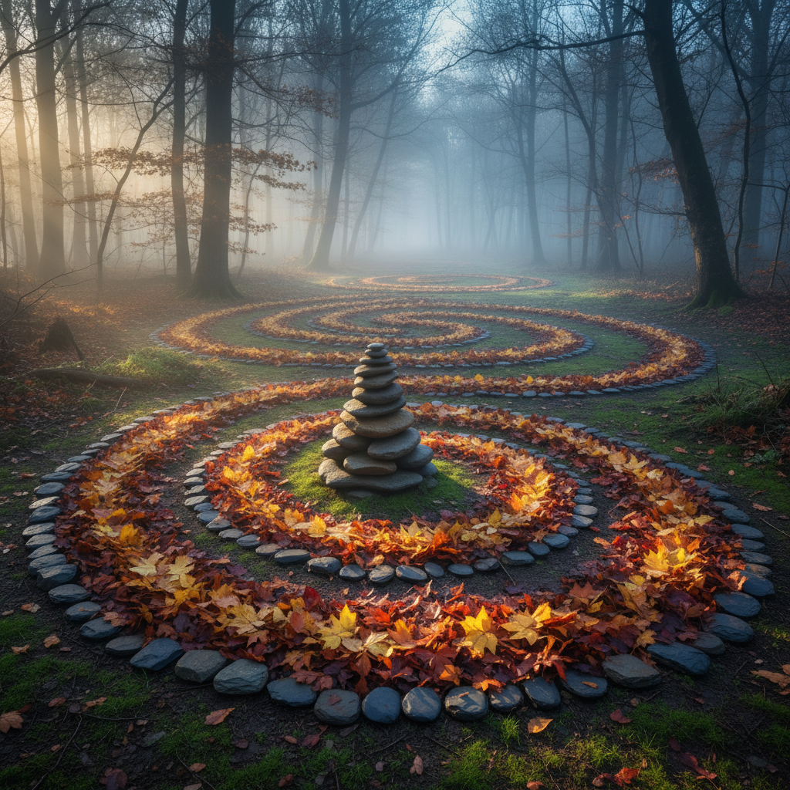

# Environmental Art 环境艺术

> "I think the biggest thing that art can do is to help you notice." — Andy Goldsworthy

## 概述

环境艺术（Environmental Art）是在自然或人造环境中创作的、与环境融为一体的艺术形式。它不是放置在环境中的物品，而是将环境本身作为媒介和主题的创作。从克里斯托（Christo）包裹海岸线到安迪·戈德沃西（Andy Goldsworthy）用树叶和石头创作的短暂雕塑，环境艺术重新定义了艺术与自然的关系。

环境艺术与大地艺术（Land Art）有重叠，但范围更广——它也包括城市环境中的创作，以及对生态问题的艺术回应。

## 核心特征

| 特征 | 描述 |
|------|------|
| 场域融合 | 作品与环境不可分离 |
| 自然材料 | 使用环境中的现有材料 |
| 短暂性 | 许多作品会自然消逝 |
| 生态意识 | 对环境问题的关注和回应 |
| 体验性 | 需要身临其境才能完整体验 |
| 尺度 | 从微型到景观尺度 |

## 视觉特征

- **材料**：石头、树叶、冰、泥土、水——自然材料
- **色彩**：自然的色彩——随季节和天气变化
- **形态**：有机的、与地形呼应的
- **时间**：随时间变化、生长、腐烂、消失
- **尺度**：从手掌大小到覆盖整个山谷
- **记录**：摄影是许多短暂作品的唯一留存

## 代表作品

| 作品 | 艺术家 | 年代 | 意义 |
|------|--------|------|------|
| *Surrounded Islands* | Christo & Jeanne-Claude | 1983 | 用粉色织物包围11个岛屿 |
| *Rain, Steam and Speed* | Andy Goldsworthy | 1980s+ | 自然材料的短暂雕塑 |
| *Wheatfield - A Confrontation* | Agnes Denes | 1982 | 在曼哈顿种两英亩小麦 |
| *7000 Oaks* | Joseph Beuys | 1982 | 在卡塞尔种7000棵橡树 |
| *The Lightning Field* | Walter De Maria | 1977 | 400根不锈钢杆的闪电场 |
| *Spiral Jetty* | Robert Smithson | 1970 | 大盐湖中的螺旋形堤坝 |

## 历史时间线

| 时期 | 事件 |
|------|------|
| 1960s | 大地艺术兴起——Smithson、Heizer |
| 1970 | Smithson的*Spiral Jetty* |
| 1970s | Christo开始大型包裹项目 |
| 1977 | De Maria的*Lightning Field* |
| 1980s | Goldsworthy——自然材料的诗意 |
| 1982 | Denes的*Wheatfield*——生态艺术先驱 |
| 1990s | 生态艺术（Eco-Art）兴起 |
| 2000s | 气候变化成为环境艺术的核心主题 |
| 2010s-至今 | 人类世艺术、可持续艺术 |

## 子类型

| 子类型 | 特征 |
|--------|------|
| 大地艺术 | Smithson——改变地形的大型作品 |
| 包裹艺术 | Christo——用织物包裹环境 |
| 自然雕塑 | Goldsworthy——自然材料的短暂作品 |
| 生态艺术 | Denes——对生态问题的艺术回应 |
| 种植艺术 | Beuys——种植作为艺术行为 |
| 气候艺术 | 对气候变化的艺术回应 |

## 中国语境

环境艺术在中国有独特的发展。中国传统园林本身就是最精致的环境艺术——将自然和人工融为一体的空间创作。当代中国的环境艺术面临快速城市化和环境问题的双重语境。艺术家如蔡国强的火药爆破、林璎（Maya Lin）的地形雕塑、以及各地的艺术乡建项目都是中国环境艺术的代表。中国的"山水"传统为环境艺术提供了独特的哲学基础。

## AI生成概念图

## 与其他风格的关系

- **Land Art** → 大地艺术是环境艺术的核心分支
- **Installation Art** → 装置艺术的空间性延伸到自然环境
- **Public Art** → 公共艺术与环境艺术共享公共空间
- **Social Practice Art** → 生态艺术项目是社会实践的一种
- **Minimalism** → 极简主义的纯粹性影响了环境艺术的简约
- **Conceptual Art** → 概念艺术的去物质化在短暂环境作品中实现

---

*浮光艺志 | Chronicle of Artistry*
